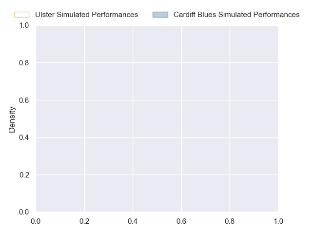
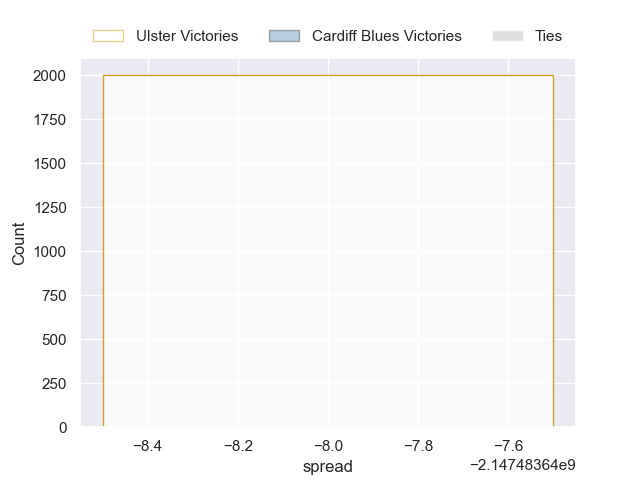

---  
layout: page  
title: Ulster at Cardiff Blues  
date: 2024-10-26 18:00:00 -0500  
categories: "United Rugby Championship 2024" match projection  
---
# Ulster at Cardiff Blues

# Club Level Predictions

The first set of predictions treats a club as the smallest object, as the club develops its members, organizes a gameplan, and deploys its players as needed for each match. This club model has a prediction of 0.306, which translates to predicting Ulster to win by 3.7.

Our Over/Under is 47.5 - and combined with the spread above, we have a predicted scoreline of 26 to 22

Each club has a rating and a rating deviation (similar to a Glicko rating), and expected performances can be generated. This allows for simulated matches and spreads like the ones below.
## Projected Performances - Club Model

## Projected Spreads - Club Model

## Projected Results - Club Model

# Player Level Predictions

Treating teams instead as an entity made up of the currently active players, I have ratings for each player in an altogether different system. These can be combined to form team ratings once teamsheets are announced, weighting starters a bit higher than the reserves. After the match is played, players can be weighted by their minutes on the field, allowing for an accurate measure of the team's composition. With these compiled team ratings, we can make predictions, measure inaccuracy, and update the individual player ratings.
## Prediction without Player Minutes: Ulster by nan

Ulster by 6.9 on a neutral pitch

## Projected Performances - Player Model

## Projected Spreads - Player Model

## Projected Results - Player Model

| Away Player        |   Away Percentile |   Number |   Home Percentile | Home Player       |
|:-------------------|------------------:|---------:|------------------:|:------------------|
| Eric O'Sullivan    |            nan    |        1 |            nan    | Ed Byrne          |
| James McCormick    |            nan    |        2 |             44    | Evan Lloyd        |
| Tom O'Toole        |            nan    |        3 |            nan    | Keiron Assiratti  |
| Iain Henderson     |            nan    |        4 |            nan    | Josh McNally      |
| Kieran Treadwell   |            nan    |        5 |            nan    | Teddy Williams    |
| Cormac Izuchukwu   |            nan    |        6 |            nan    | Ben Donnell       |
| Nick Timoney       |            nan    |        7 |            nan    | Dan Thomas        |
| David McCann       |            nan    |        8 |            nan    | Alun Lawrence     |
| Nathan Doak        |            nan    |        9 |            nan    | Aled Davies       |
| Aidan Morgan       |            nan    |       10 |            nan    | Callum Sheedy     |
| Mike Lowry         |            nan    |       11 |            nan    | Iwan Stephens     |
| Stuart McCloskey   |            nan    |       12 |            nan    | Ben Thomas        |
| Jude Postlethwaite |            nan    |       13 |            nan    | Rey Lee-Lo        |
| Werner Kok         |            nan    |       14 |            nan    | Mason Grady       |
| Ethan McIlroy      |            nan    |       15 |            nan    | Cameron Winnett   |
| John Andrew        |            nan    |       16 |            nan    | Dafydd Hughes     |
| Andrew Warwick     |            nan    |       17 |            nan    | Corey Domachowski |
| Scott Wilson       |             51.75 |       18 |            nan    | Rhys Litterick    |
| Harry Sheridan     |            nan    |       19 |              7.98 | Rory Thornton     |
| Marcus Rea         |            nan    |       20 |            nan    | James Botham      |
| John Cooney        |            nan    |       21 |            nan    | Thomas Young      |
| Ben Carson         |            nan    |       22 |            nan    | Johan Mulder      |
| Ben Moxham         |             75.8  |       23 |            nan    | Rory Jennings     |

