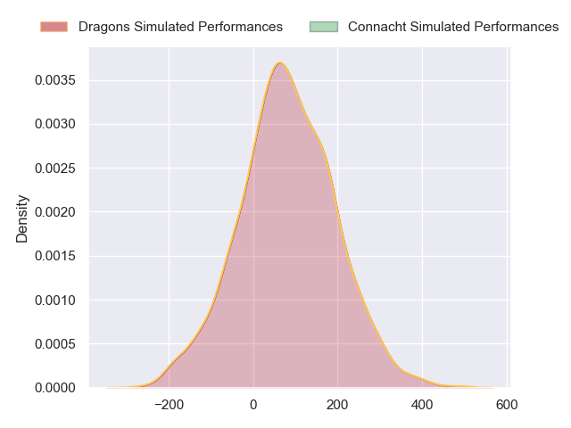
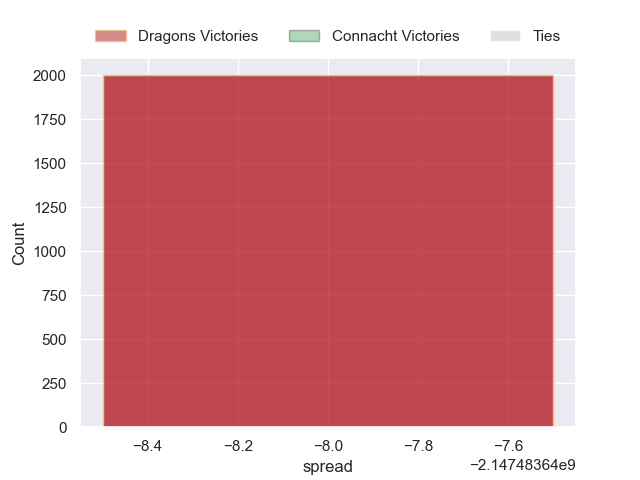

---  
layout: page  
title: Dragons at Connacht  
date: 2024-10-26 18:00:00 -0500  
categories: "United Rugby Championship 2024" match projection  
---
# Dragons at Connacht

# Club Level Predictions

The first set of predictions treats a club as the smallest object, as the club develops its members, organizes a gameplan, and deploys its players as needed for each match. This club model has a prediction of 0.75, which translates to predicting Connacht to win by 12.6.

Our Over/Under is 52.5 - and combined with the spread above, we have a predicted scoreline of 20 to 33

Each club has a rating and a rating deviation (similar to a Glicko rating), and expected performances can be generated. This allows for simulated matches and spreads like the ones below.
## Projected Performances - Club Model

## Projected Spreads - Club Model

## Projected Results - Club Model

# Player Level Predictions

Treating teams instead as an entity made up of the currently active players, I have ratings for each player in an altogether different system. These can be combined to form team ratings once teamsheets are announced, weighting starters a bit higher than the reserves. After the match is played, players can be weighted by their minutes on the field, allowing for an accurate measure of the team's composition. With these compiled team ratings, we can make predictions, measure inaccuracy, and update the individual player ratings.
## Prediction without Player Minutes: Dragons by nan

Connacht by 16.8 on a neutral pitch

## Projected Performances - Player Model

## Projected Spreads - Player Model

## Projected Results - Player Model

| Away Player        |   Away Percentile |   Number |   Home Percentile | Home Player          |
|:-------------------|------------------:|---------:|------------------:|:---------------------|
| Cameron Jones      |            nan    |        1 |             98.48 | Peter Dooley         |
| Oli Burrows        |            nan    |        2 |             70.46 | Dylan Tierney-Martin |
| Chris Coleman      |            nan    |        3 |            nan    | Finlay Bealham       |
| Ben Carter         |            nan    |        4 |            nan    | Joe Joyce            |
| Matthew Screech    |            nan    |        5 |            nan    | Niall Murray         |
| Shane Lewis-Hughes |            nan    |        6 |            nan    | Cian Prendergast     |
| Harrison Keddie    |            nan    |        7 |            nan    | Sean O'Brien         |
| Aaron Wainwright   |             89.17 |        8 |            nan    | Paul Boyle           |
| Dane Blacker       |             13.27 |        9 |             81.88 | Caolin Blade         |
| Angus O'Brien      |            nan    |       10 |            nan    | Jack Carty           |
| Ewan Rosser        |             60.95 |       11 |            nan    | Santiago Cordero     |
| Aneurin Owen       |            nan    |       12 |            nan    | Bundee Aki           |
| Joe Westwood       |            nan    |       13 |            nan    | Cathal Forde         |
| Rio Dyer           |            nan    |       14 |            nan    | Shayne Bolton        |
| Cai Evans          |             15.62 |       15 |            nan    | Piers O'Conor        |
| Brodie Coghlan     |            nan    |       16 |            nan    | Eoin de Buitlear     |
| Aki Seiuli         |            nan    |       17 |            nan    | Denis Buckley        |
| Luke Yendle        |             56.75 |       18 |             67.22 | Jack Aungier         |
| Steven Cummins     |            nan    |       19 |            nan    | Darragh Murray       |
| Taine Basham       |            nan    |       20 |             18.33 | Sean Jansen          |
| Rhodri Williams    |            nan    |       21 |             53.72 | Matthew Devine       |
| Lloyd Evans        |            nan    |       22 |            nan    | Josh Ioane           |
| Harry Wilson       |            nan    |       23 |            nan    | Hugh Gavin           |

