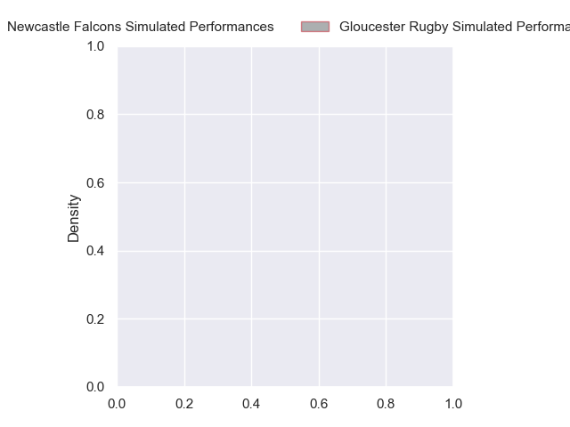
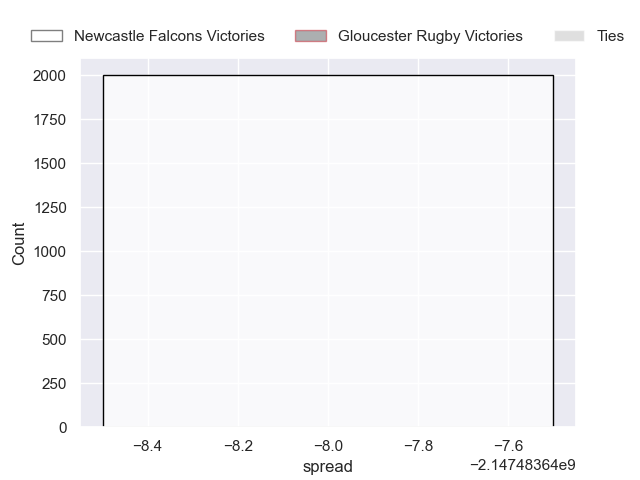

---  
layout: page  
title: Newcastle Falcons at Gloucester Rugby  
date: 2024-10-26 18:00:00 -0500  
categories: "Gallagher Premiership 2024" match projection  
---
# Newcastle Falcons at Gloucester Rugby

# Club Level Predictions

The first set of predictions treats a club as the smallest object, as the club develops its members, organizes a gameplan, and deploys its players as needed for each match. This club model has a prediction of 0.729, which translates to predicting Gloucester Rugby to win by 11.7.

Our Over/Under is 48.5 - and combined with the spread above, we have a predicted scoreline of 19 to 30

Each club has a rating and a rating deviation (similar to a Glicko rating), and expected performances can be generated. This allows for simulated matches and spreads like the ones below.
## Projected Performances - Club Model

## Projected Spreads - Club Model

## Projected Results - Club Model

# Player Level Predictions

Treating teams instead as an entity made up of the currently active players, I have ratings for each player in an altogether different system. These can be combined to form team ratings once teamsheets are announced, weighting starters a bit higher than the reserves. After the match is played, players can be weighted by their minutes on the field, allowing for an accurate measure of the team's composition. With these compiled team ratings, we can make predictions, measure inaccuracy, and update the individual player ratings.
## Prediction without Player Minutes: Newcastle Falcons by nan

Gloucester Rugby by 6.5 on a neutral pitch

## Projected Performances - Player Model

## Projected Spreads - Player Model

## Projected Results - Player Model

| Away Player         |   Away Percentile |   Number |   Home Percentile | Home Player          |
|:--------------------|------------------:|---------:|------------------:|:---------------------|
| Adam Brocklebank    |            nan    |        1 |            nan    | Val Rapava-Ruskin    |
| Jamie Blamire       |            nan    |        2 |            nan    | Jack Singleton       |
| Richard Palframan   |            nan    |        3 |            nan    | Afolabi Fasogban     |
| Pedro Rubiolo       |            nan    |        4 |            nan    | Arthur Clark         |
| John Hawkins        |            nan    |        5 |            nan    | Freddie Thomas       |
| Philip van der Walt |            nan    |        6 |            nan    | Jack Clement         |
| Tom Gordon          |            nan    |        7 |            nan    | Lewis Ludlow         |
| Callum Chick        |            nan    |        8 |            nan    | Zach Mercer          |
| Sam Stuart          |            nan    |        9 |            nan    | Tomos Williams       |
| Ethan Grayson       |            nan    |       10 |            nan    | Gareth Anscombe      |
| Alex Hearle         |             52.3  |       11 |            nan    | Ollie Thorley        |
| Sammy Arnold        |            nan    |       12 |            nan    | Charlie Atkinson     |
| Connor Doherty      |            nan    |       13 |            nan    | Max Llewellyn        |
| Adam Radwan         |            nan    |       14 |            nan    | Christian Wade       |
| Ben Redshaw         |            nan    |       15 |            nan    | Josh Hathaway        |
| Ollie Fletcher      |            nan    |       16 |            nan    | Seb Blake            |
| Luan de Bruin       |             23.98 |       17 |             35.05 | Jamal Ford-Robinson  |
| Murray McCallum     |             82.25 |       18 |            nan    | Ciaran Knight        |
| Sebastian de Chaves |              8.78 |       19 |            nan    | Matias Alemanno      |
| Freddie Lockwood    |             25.36 |       20 |            nan    | Harry Taylor         |
| Joe Davis           |            nan    |       21 |             89.32 | Caolan Englefield    |
| Brett Connon        |              6.25 |       22 |             45.47 | Louis Hillman-Cooper |
| Ben Stevenson       |            nan    |       23 |            nan    | Ioan Jones           |

