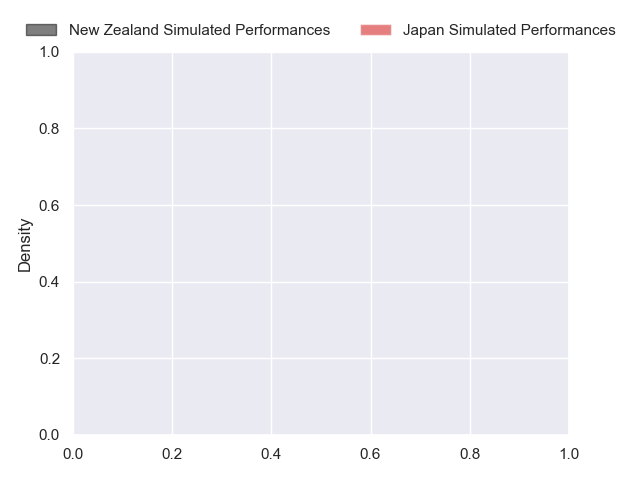
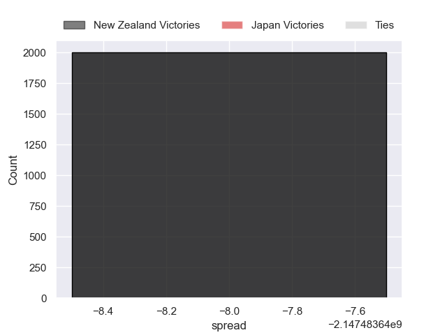

---  
layout: page  
title: New Zealand at Japan  
date: 2024-10-26 18:00:00 -0500  
categories: "Tests Matchs 2024" match projection  
---
# New Zealand at Japan

# Club Level Predictions

The first set of predictions treats a club as the smallest object, as the club develops its members, organizes a gameplan, and deploys its players as needed for each match. This club model has a prediction of 0.111, which translates to predicting New Zealand to win by 14.9.

Our Over/Under is 61.5 - and combined with the spread above, we have a predicted scoreline of 38 to 23

Each club has a rating and a rating deviation (similar to a Glicko rating), and expected performances can be generated. This allows for simulated matches and spreads like the ones below.
## Projected Performances - Club Model

## Projected Spreads - Club Model

## Projected Results - Club Model

# Player Level Predictions

Treating teams instead as an entity made up of the currently active players, I have ratings for each player in an altogether different system. These can be combined to form team ratings once teamsheets are announced, weighting starters a bit higher than the reserves. After the match is played, players can be weighted by their minutes on the field, allowing for an accurate measure of the team's composition. With these compiled team ratings, we can make predictions, measure inaccuracy, and update the individual player ratings.
## Prediction without Player Minutes: New Zealand by nan

New Zealand by 16.4 on a neutral pitch

## Projected Performances - Player Model

## Projected Spreads - Player Model

## Projected Results - Player Model

| Away Player         |   Away Percentile |   Number |   Home Percentile | Home Player        |
|:--------------------|------------------:|---------:|------------------:|:-------------------|
| Tamaiti Williams    |               nan |        1 |            nan    | Takato Okabe       |
| Asafo Aumua         |               nan |        2 |            nan    | Atsushi Sakate     |
| Pasilio Tosi        |               nan |        3 |            nan    | Shuhei Takeuchi    |
| Sam Darry           |               nan |        4 |            nan    | Junior Waqa        |
| Patrick Tuipulotu   |               nan |        5 |            nan    | Warner Dearns      |
| Samipeni Finau      |               nan |        6 |            nan    | Amato Fakatava     |
| Sam Cane            |               nan |        7 |             77.55 | Kazuki Himeno      |
| Wallace Sititi      |               nan |        8 |            nan    | Faulua Makisi      |
| Cam Roigard         |               nan |        9 |            nan    | Shinobu Fujiwara   |
| Damian McKenzie     |               nan |       10 |            nan    | Harumichi Tatekawa |
| Mark Tele'a         |               nan |       11 |            nan    | Malo Tuitama       |
| Anton Lienert-Brown |               nan |       12 |            nan    | Nik Mccurran       |
| Billy Proctor       |               nan |       13 |            nan    | Dylan Riley        |
| Sevu Reece          |               nan |       14 |            nan    | Jone Naikabula     |
| Stephen Perofeta    |               nan |       15 |            nan    | Yoshitaka Yazaki   |
| George Bell         |               nan |       16 |            nan    | Mamoru Harada      |
| Ofa Tu'ungafasi     |               100 |       17 |             21.24 | Takayoshi Mohara   |
| Fletcher Newell     |               nan |       18 |            nan    | Opeti Helu         |
| Josh Lord           |               nan |       19 |            nan    | Epineri Uluiviti   |
| Peter Lakai         |               nan |       20 |            nan    | Kanji Shimokawa    |
| TJ Perenara         |               nan |       21 |             96.44 | Taiki Koyama       |
| David Havili        |               nan |       22 |            nan    | Tomoki Osada       |
| Ruben Love          |               nan |       23 |            nan    | Takuro Matsunaga   |

