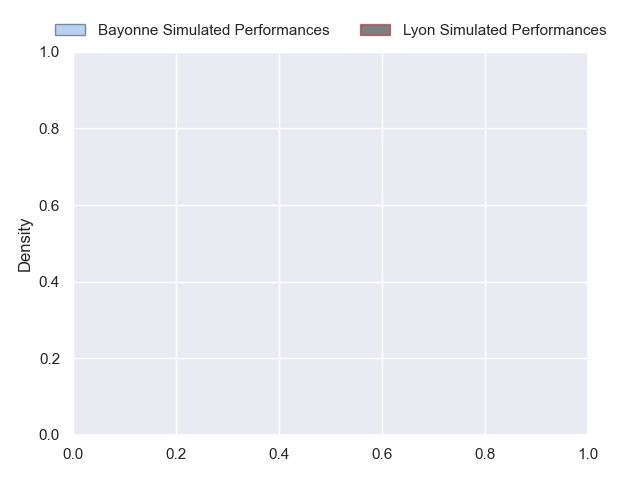
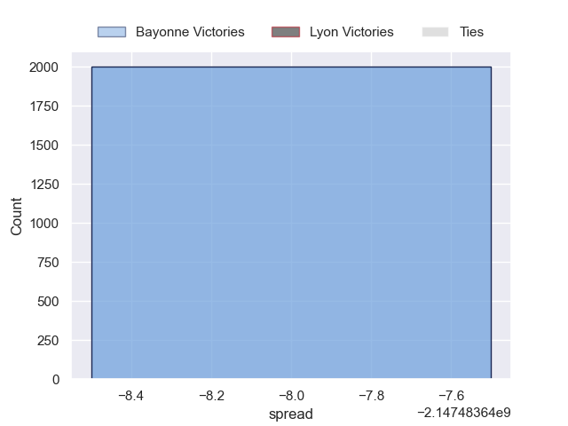
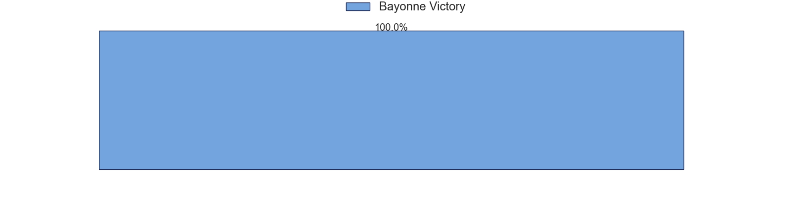

---  
layout: page  
title: Bayonne at Lyon  
date: 2024-10-26 18:00:00 -0500  
categories: "Top 14 Orange 2024" match projection  
---
# Bayonne at Lyon

# Club Level Predictions

The first set of predictions treats a club as the smallest object, as the club develops its members, organizes a gameplan, and deploys its players as needed for each match. This club model has a prediction of 0.546, which translates to predicting Lyon to win by 5.1.

Our Over/Under is 45.5 - and combined with the spread above, we have a predicted scoreline of 20 to 25

Each club has a rating and a rating deviation (similar to a Glicko rating), and expected performances can be generated. This allows for simulated matches and spreads like the ones below.
## Projected Performances - Club Model

## Projected Spreads - Club Model

## Projected Results - Club Model

# Player Level Predictions

Treating teams instead as an entity made up of the currently active players, I have ratings for each player in an altogether different system. These can be combined to form team ratings once teamsheets are announced, weighting starters a bit higher than the reserves. After the match is played, players can be weighted by their minutes on the field, allowing for an accurate measure of the team's composition. With these compiled team ratings, we can make predictions, measure inaccuracy, and update the individual player ratings.
## Prediction without Player Minutes: Bayonne by nan

Bayonne by nan on a neutral pitch

## Projected Performances - Player Model

## Projected Spreads - Player Model

## Projected Results - Player Model

| Away Player        |   Away Percentile |   Number |   Home Percentile | Home Player          |
|:-------------------|------------------:|---------:|------------------:|:---------------------|
| Andy Bordelai      |             nan   |        1 |            nan    | Sebastien Taofifenua |
| Lucas Martin       |             nan   |        2 |            nan    | Sam Matavesi         |
| Luke Tagi          |             nan   |        3 |            nan    | Jermaine Ainsley     |
| Veikoso Poloniati  |             nan   |        4 |            nan    | Theo William         |
| Alex Moon          |             nan   |        5 |            nan    | Mickael Guillard     |
| Rodrigo Bruni      |             nan   |        6 |            nan    | Steeve Blanc-Mappaz  |
| Baptiste Heguy     |             nan   |        7 |            nan    | Dylan Cretin         |
| Uzair Cassiem      |             nan   |        8 |            nan    | Arno Botha           |
| Baptiste Germain   |             nan   |        9 |            nan    | Baptiste Couilloud   |
| Camille Lopez      |             nan   |       10 |            nan    | Leo Berdeu           |
| Xan Mousques       |             nan   |       11 |            nan    | Vincent Rattez       |
| Manu Tuilagi       |             nan   |       12 |            nan    | Josiah Maraku        |
| Guillaume Martocq  |             nan   |       13 |            nan    | Semi Radradra        |
| Tom Spring         |             nan   |       14 |            nan    | Ethan Dumortier      |
| Yohan Orabe        |             nan   |       15 |            nan    | Davit Niniashvili    |
| Vincent Giudicelli |             nan   |       16 |             55.08 | Yanis Charcosset     |
| Pierre Castillon   |             nan   |       17 |            nan    | Jerome Rey           |
| Denis Marchois     |              97.6 |       18 |            nan    | Felix Lambey         |
| Arthur Iturria     |             nan   |       19 |             42.5  | Maxime Gouzou        |
| Maxime Machenaud   |             nan   |       20 |            nan    | Martin Page-Relo     |
| Joris Segonds      |             nan   |       21 |            nan    | Martin Meliande      |
| Cheikh Tiberghien  |             nan   |       22 |            nan    | Alfred Parisien      |
| Pascal Cotet       |             nan   |       23 |            nan    | Irakli Aptsiauri     |

