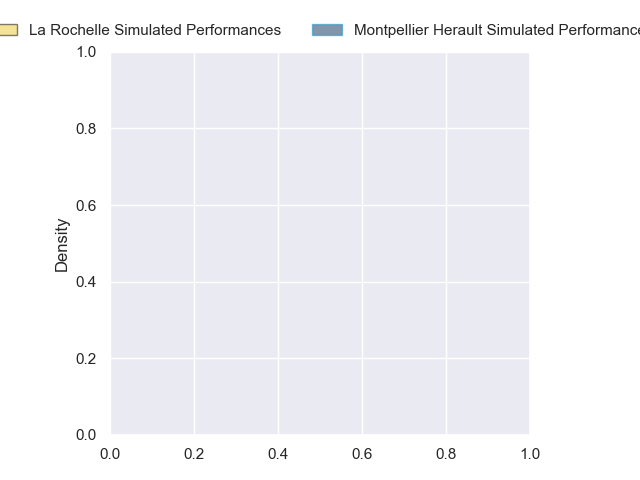
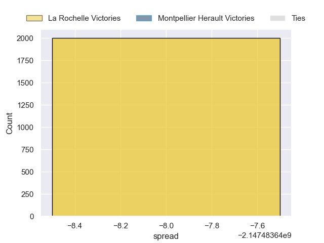

---  
layout: page  
title: La Rochelle at Montpellier Herault  
date: 2024-10-26 18:00:00 -0500  
categories: "Top 14 Orange 2024" match projection  
---
# La Rochelle at Montpellier Herault

# Club Level Predictions

The first set of predictions treats a club as the smallest object, as the club develops its members, organizes a gameplan, and deploys its players as needed for each match. This club model has a prediction of 0.335, which translates to predicting La Rochelle to win by 2.6.

Our Over/Under is 55.5 - and combined with the spread above, we have a predicted scoreline of 29 to 27

Each club has a rating and a rating deviation (similar to a Glicko rating), and expected performances can be generated. This allows for simulated matches and spreads like the ones below.
## Projected Performances - Club Model

## Projected Spreads - Club Model

## Projected Results - Club Model

# Player Level Predictions

Treating teams instead as an entity made up of the currently active players, I have ratings for each player in an altogether different system. These can be combined to form team ratings once teamsheets are announced, weighting starters a bit higher than the reserves. After the match is played, players can be weighted by their minutes on the field, allowing for an accurate measure of the team's composition. With these compiled team ratings, we can make predictions, measure inaccuracy, and update the individual player ratings.
## Prediction without Player Minutes: La Rochelle by nan

La Rochelle by nan on a neutral pitch

## Projected Performances - Player Model

## Projected Spreads - Player Model

## Projected Results - Player Model

| Away Player        |   Away Percentile |   Number |   Home Percentile | Home Player                 |
|:-------------------|------------------:|---------:|------------------:|:----------------------------|
| Reda Wardi         |               nan |        1 |             92.72 | Nika Abuladze               |
| Tolu Latu          |               nan |        2 |             33.85 | Jordan Uelese               |
| Uini Atonio        |               nan |        3 |            nan    | Luka Japaridze              |
| Thomas Lavault     |               nan |        4 |            nan    | Yacouba Camara              |
| Will Skelton       |               nan |        5 |            nan    | Bastien Chalureau           |
| Judicael Cancoriet |               nan |        6 |            nan    | Nicolaas Janse van Rensburg |
| Paul Boudehent     |               nan |        7 |            nan    | Sam Simmonds                |
| Gregory Alldritt   |               nan |        8 |            nan    | Billy Vunipola              |
| Tawera Kerr-Barlow |               nan |        9 |            nan    | Cobus Reinach               |
| Antoine Hastoy     |               nan |       10 |            nan    | Stuart Hogg                 |
| Dillyn Leyds       |               nan |       11 |            nan    | Gabriel Ngandebe            |
| Jonathan Danty     |               nan |       12 |            nan    | Arthur Vincent              |
| Teddy Thomas       |               nan |       13 |            nan    | Madosh Tambwe               |
| Jules Favre        |               nan |       14 |            nan    | Mael Moustin                |
| Brice Dulin        |               nan |       15 |            nan    | Julien Tisseron             |
| Quentin Lespiaucq  |               nan |       16 |            nan    | Christopher Tolofua         |
| Louis Penverne     |               nan |       17 |            nan    | Enzo Forletta               |
| Kane Douglas       |               nan |       18 |            nan    | Marco Tauleigne             |
| Ultan Dillane      |               nan |       19 |            nan    | Lenni Nouchi                |
| Edouard Richer     |               nan |       20 |            nan    | Alexandre Becognee          |
| Thomas Berjon      |               nan |       21 |            nan    | Alexis Bernadet             |
| Simeli Daunivucu   |               nan |       22 |            nan    | Thomas Vincent              |
| Joel Sclavi        |               nan |       23 |             80.88 | Mohamed Haouas              |

