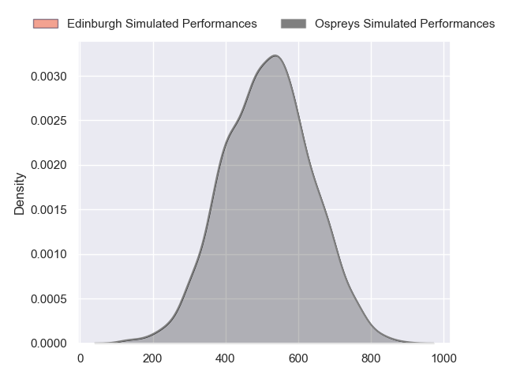
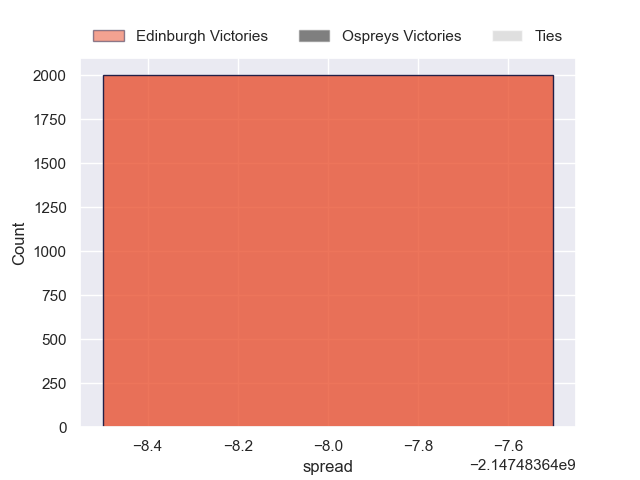

---  
layout: page  
title: Edinburgh at Ospreys  
date: 2024-10-26 18:00:00 -0500  
categories: "United Rugby Championship 2024" match projection  
---
# Edinburgh at Ospreys

# Club Level Predictions

The first set of predictions treats a club as the smallest object, as the club develops its members, organizes a gameplan, and deploys its players as needed for each match. This club model has a prediction of 0.409, which translates to predicting Edinburgh to win by -0.2.

Our Over/Under is 44.5 - and combined with the spread above, we have a predicted scoreline of 22 to 22

Each club has a rating and a rating deviation (similar to a Glicko rating), and expected performances can be generated. This allows for simulated matches and spreads like the ones below.
## Projected Performances - Club Model

## Projected Spreads - Club Model

## Projected Results - Club Model

# Player Level Predictions

Treating teams instead as an entity made up of the currently active players, I have ratings for each player in an altogether different system. These can be combined to form team ratings once teamsheets are announced, weighting starters a bit higher than the reserves. After the match is played, players can be weighted by their minutes on the field, allowing for an accurate measure of the team's composition. With these compiled team ratings, we can make predictions, measure inaccuracy, and update the individual player ratings.
## Prediction without Player Minutes: Ospreys by 10.1

Ospreys by 4.2 on a neutral pitch

## Projected Performances - Player Model

## Projected Spreads - Player Model

## Projected Results - Player Model

| Away Player         |   Away Percentile |   Number |   Home Percentile | Home Player            |
|:--------------------|------------------:|---------:|------------------:|:-----------------------|
| Boan Venter         |             nan   |        1 |            nan    | Gareth Thomas          |
| Ewan Ashman         |             nan   |        2 |            nan    | Dewi Lake              |
| D'Arcy Rae          |             nan   |        3 |            nan    | Ben Warren             |
| Marshall Sykes      |             nan   |        4 |            nan    | William Greatbanks     |
| Jamie Hodgson       |             nan   |        5 |            nan    | Adam Beard             |
| Jamie Ritchie       |             nan   |        6 |            nan    | Jac Morgan             |
| Hamish Watson       |             nan   |        7 |            nan    | Justin Tipuric         |
| Ben Muncaster       |             nan   |        8 |            nan    | Morgan Morris          |
| Ben Vellacott       |             nan   |        9 |            nan    | Reuben Morgan-Williams |
| Ross Thompson       |             nan   |       10 |            nan    | Owen Williams          |
| Duhan van der Merwe |             nan   |       11 |            nan    | Keelan Giles           |
| Matt Scott          |             nan   |       12 |            nan    | Keiran Williams        |
| Matt Currie         |             nan   |       13 |            nan    | Owen Watkin            |
| Wes Goosen          |             nan   |       14 |            nan    | Daniel Kasende         |
| Harry Paterson      |             nan   |       15 |            nan    | Jack Walsh             |
| Dave Cherry         |              60   |       16 |            nan    | Sam Parry              |
| Angus Williams      |             nan   |       17 |             71.32 | Garyn Phillips         |
| Paul Hill           |             nan   |       18 |            nan    | Tom Botha              |
| Glen Young          |             nan   |       19 |            nan    | Lewis Jones            |
| Luke Crosbie        |             nan   |       20 |            nan    | Lewis Lloyd            |
| Charlie Shiel       |              46.6 |       21 |            nan    | Kieran Hardy           |
| Ben Healy           |             nan   |       22 |             46.91 | Tom Florence           |
| Mosese Tuipulotu    |             nan   |       23 |            nan    | Iestyn Hopkins         |

