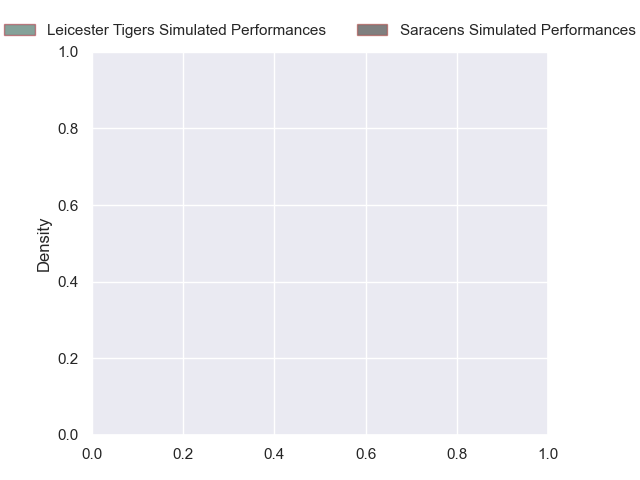
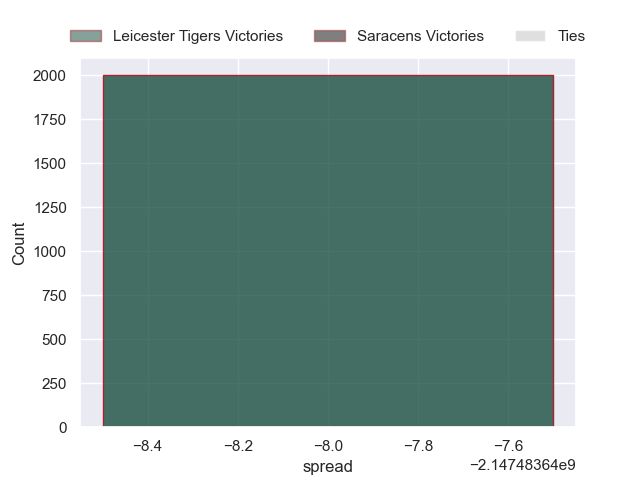

---  
layout: page  
title: Leicester Tigers at Saracens  
date: 2024-10-26 18:00:00 -0500  
categories: "Gallagher Premiership 2024" match projection  
---
# Leicester Tigers at Saracens

# Club Level Predictions

The first set of predictions treats a club as the smallest object, as the club develops its members, organizes a gameplan, and deploys its players as needed for each match. This club model has a prediction of 0.578, which translates to predicting Saracens to win by 5.7.

Our Over/Under is 48.5 - and combined with the spread above, we have a predicted scoreline of 21 to 27

Each club has a rating and a rating deviation (similar to a Glicko rating), and expected performances can be generated. This allows for simulated matches and spreads like the ones below.
## Projected Performances - Club Model

## Projected Spreads - Club Model

## Projected Results - Club Model

# Player Level Predictions

Treating teams instead as an entity made up of the currently active players, I have ratings for each player in an altogether different system. These can be combined to form team ratings once teamsheets are announced, weighting starters a bit higher than the reserves. After the match is played, players can be weighted by their minutes on the field, allowing for an accurate measure of the team's composition. With these compiled team ratings, we can make predictions, measure inaccuracy, and update the individual player ratings.
## Prediction without Player Minutes: Leicester Tigers by nan

Saracens by 8.0 on a neutral pitch

## Projected Performances - Player Model

## Projected Spreads - Player Model

## Projected Results - Player Model

| Away Player           |   Away Percentile |   Number |   Home Percentile | Home Player          |
|:----------------------|------------------:|---------:|------------------:|:---------------------|
| Nicky Smith           |            nan    |        1 |            nan    | Eroni Mawi           |
| Julian Montoya        |            nan    |        2 |            nan    | Kapeli Pifeleti      |
| Joe Heyes             |            nan    |        3 |            nan    | Marco Riccioni       |
| Harry Wells           |            nan    |        4 |            nan    | Theo McFarland       |
| Tom Manz              |            nan    |        5 |            nan    | Hugh Tizard          |
| Hanro Liebenberg      |            nan    |        6 |            nan    | Juan Martin Gonzalez |
| Tommy Reffell         |            nan    |        7 |            nan    | Toby Knight          |
| Olly Cracknell        |            nan    |        8 |            nan    | Tom Willis           |
| Tom Whiteley          |             65.05 |        9 |            nan    | Ivan van Zyl         |
| Handre Pollard        |            nan    |       10 |            nan    | Alex Goode           |
| Ollie Hassell-Collins |            nan    |       11 |            nan    | Rotimi Segun         |
| Joseph Woodward       |            nan    |       12 |            nan    | Nick Tompkins        |
| Izaia Perese          |            nan    |       13 |            nan    | Lucio Cinti          |
| Anthony Watson        |            nan    |       14 |            nan    | Tobias Elliott       |
| Mike Brown            |             97.17 |       15 |             93.99 | Tom Parton           |
| Charlie Clare         |            nan    |       16 |             76.31 | James Hadfield       |
| James Cronin          |             91.81 |       17 |             27.31 | Phil Brantingham     |
| Will Hurd             |            nan    |       18 |             51.44 | Alec Clarey          |
| Come Joussain         |            nan    |       19 |            nan    | Harry Wilson         |
| Matt Rogerson         |             97.92 |       20 |             86.67 | Nathan Michelow      |
| Ben Youngs            |             80.26 |       21 |             34.63 | Gareth Simpson       |
| Jamie Shillcock       |            nan    |       22 |            nan    | Josh Hallett         |
| Will Wand             |            nan    |       23 |            nan    | Tim Swiel            |

