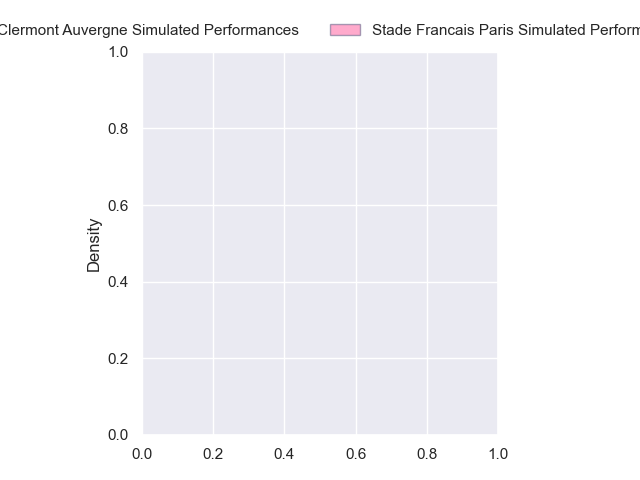
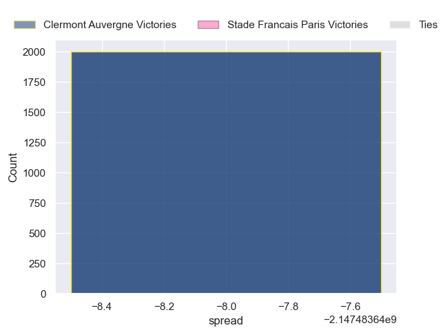

---  
layout: page  
title: Clermont Auvergne at Stade Francais Paris  
date: 2024-10-26 18:00:00 -0500  
categories: "Top 14 2024" match projection  
---
# Clermont Auvergne at Stade Francais Paris

# Club Level Predictions

The first set of predictions treats a club as the smallest object, as the club develops its members, organizes a gameplan, and deploys its players as needed for each match. This club model has a prediction of 0.438, which translates to predicting Clermont Auvergne to win by -1.2.

Our Over/Under is 49.5 - and combined with the spread above, we have a predicted scoreline of 24 to 25

Each club has a rating and a rating deviation (similar to a Glicko rating), and expected performances can be generated. This allows for simulated matches and spreads like the ones below.
## Projected Performances - Club Model

## Projected Spreads - Club Model

## Projected Results - Club Model

# Player Level Predictions

Treating teams instead as an entity made up of the currently active players, I have ratings for each player in an altogether different system. These can be combined to form team ratings once teamsheets are announced, weighting starters a bit higher than the reserves. After the match is played, players can be weighted by their minutes on the field, allowing for an accurate measure of the team's composition. With these compiled team ratings, we can make predictions, measure inaccuracy, and update the individual player ratings.
## Prediction without Player Minutes: Clermont Auvergne by nan

Clermont Auvergne by nan on a neutral pitch

## Projected Performances - Player Model

## Projected Spreads - Player Model

## Projected Results - Player Model

| Away Player          |   Away Percentile |   Number |   Home Percentile | Home Player             |
|:---------------------|------------------:|---------:|------------------:|:------------------------|
| Etienne Falgoux      |            nan    |        1 |            nan    | Moses Alo-Emile         |
| Folau Fainga'a       |            nan    |        2 |            nan    | Giacomo Nicotera        |
| Régis Montagne       |            nan    |        3 |             93.78 | Giorgi Melikidze        |
| Thibaud Lanen        |            nan    |        4 |            nan    | Paul Gabrillagues       |
| Thomas Ceyte         |            nan    |        5 |            nan    | JJ van der Mescht       |
| Killian Tixeront     |            nan    |        6 |            nan    | Tanginoa Halaifonua     |
| Anthime Hemery       |            nan    |        7 |            nan    | Romain Briatte          |
| Fritz Lee            |            nan    |        8 |            nan    | Yoan Tanga              |
| Baptiste Jauneau     |            nan    |        9 |            nan    | Brad Weber              |
| Benjamin Urdapilleta |            nan    |       10 |            nan    | Louis Carbonel          |
| Joris Jurand         |            nan    |       11 |            nan    | Samuel Ezeala           |
| George Moala         |            nan    |       12 |            nan    | Julien Delbouis         |
| Leon Darricarrere    |            nan    |       13 |            nan    | Jeremy Ward             |
| Bautista Delguy      |            nan    |       14 |            nan    | Joe Marchant            |
| Alex Newsome         |            nan    |       15 |            nan    | Leo Barre               |
| Barnabe Massa        |            nan    |       16 |            nan    | Lucas Peyresblanques    |
| Giorgi Akhaladze     |            nan    |       17 |            nan    | Clement Castets         |
| Peceli Yato          |            nan    |       18 |            nan    | Setareki Turagacoke (2) |
| Alexandre Fischer    |            nan    |       19 |            nan    | Ryan Chapuis            |
| Jules Bousquet       |            nan    |       20 |            nan    | Thibaut Motassi         |
| Anthony Belleau      |            nan    |       21 |            nan    | Zack Henry              |
| Pierre Fouyssac      |             19.55 |       22 |            nan    | Peniasi Dakuwaqa        |
| Cristian Ojovan      |            nan    |       23 |            nan    | Francisco Gomez Kodela  |

