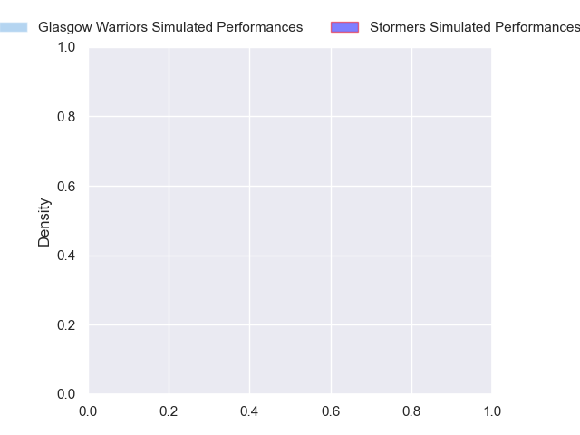
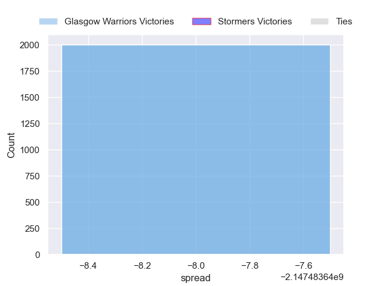

---  
layout: page  
title: Glasgow Warriors at Stormers  
date: 2024-10-26 18:00:00 -0500  
categories: "United Rugby Championship 2024" match projection  
---
# Glasgow Warriors at Stormers

# Club Level Predictions

The first set of predictions treats a club as the smallest object, as the club develops its members, organizes a gameplan, and deploys its players as needed for each match. This club model has a prediction of 0.421, which translates to predicting Glasgow Warriors to win by -0.7.

Our Over/Under is 47.5 - and combined with the spread above, we have a predicted scoreline of 23 to 24

Each club has a rating and a rating deviation (similar to a Glicko rating), and expected performances can be generated. This allows for simulated matches and spreads like the ones below.
## Projected Performances - Club Model

## Projected Spreads - Club Model

## Projected Results - Club Model

# Player Level Predictions

Treating teams instead as an entity made up of the currently active players, I have ratings for each player in an altogether different system. These can be combined to form team ratings once teamsheets are announced, weighting starters a bit higher than the reserves. After the match is played, players can be weighted by their minutes on the field, allowing for an accurate measure of the team's composition. With these compiled team ratings, we can make predictions, measure inaccuracy, and update the individual player ratings.
## Prediction without Player Minutes: Glasgow Warriors by 8.3

Glasgow Warriors by 13.0 on a neutral pitch

## Projected Performances - Player Model

## Projected Spreads - Player Model

## Projected Results - Player Model

| Away Player           |   Away Percentile |   Number |   Home Percentile | Home Player          |
|:----------------------|------------------:|---------:|------------------:|:---------------------|
| Jamie Bhatti          |            nan    |        1 |            nan    | Brok Harris          |
| Johnny Matthews       |            nan    |        2 |            nan    | Andre-Hugo Venter    |
| Sam Talakai           |            nan    |        3 |            nan    | Frans Malherbe       |
| Gregor Brown          |            nan    |        4 |            nan    | JD Schickerling      |
| Richie Gray           |            nan    |        5 |            nan    | Ruben van Heerden    |
| Matt Fagerson         |            nan    |        6 |            nan    | Marcel Theunissen    |
| Rory Darge            |            nan    |        7 |            nan    | Ben-Jason Dixon      |
| Jack Dempsey          |            nan    |        8 |            nan    | Keketso Morabe       |
| George Horne          |            nan    |        9 |            nan    | Paul de Wet          |
| Adam Hastings         |            nan    |       10 |            nan    | Manie Libbok         |
| Kyle Rowe             |            nan    |       11 |            nan    | Leolin Zas           |
| Sione Tuipulotu       |            nan    |       12 |            nan    | Damian Willemse      |
| Huw Jones             |            nan    |       13 |            nan    | Daniel du Plessis    |
| Sebastian Cancelliere |            nan    |       14 |            nan    | Ruhan Nel            |
| Josh McKay            |            nan    |       15 |            nan    | Warrick Gelant       |
| Gregor Hiddleston     |            nan    |       16 |            nan    | Joseph Dweba         |
| Rory Sutherland       |            nan    |       17 |             14.42 | Leon Lyons           |
| Zander Fagerson       |            nan    |       18 |            nan    | Neethling Fouche     |
| Scott Cummings        |            nan    |       19 |            nan    | Adre Smith           |
| Max Williamson        |            nan    |       20 |             80    | Willie Engelbrecht   |
| Henco Venter          |             97.92 |       21 |            nan    | Louw Nel             |
| Jamie Dobie           |            nan    |       22 |             94.17 | Herschel Jantjies    |
| Tom Jordan            |            nan    |       23 |            nan    | Suleiman Hartzenberg |

