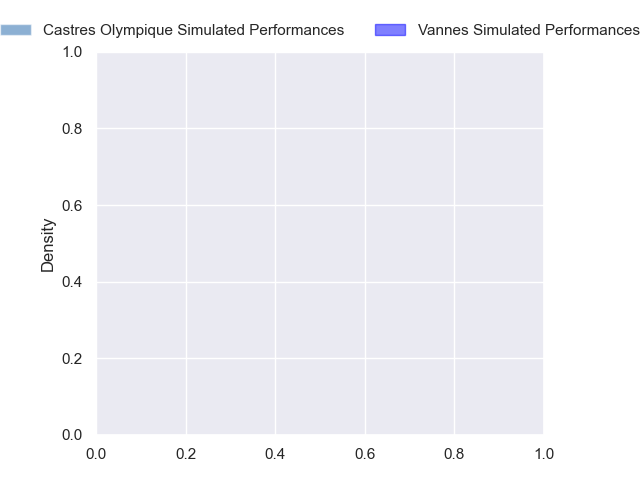
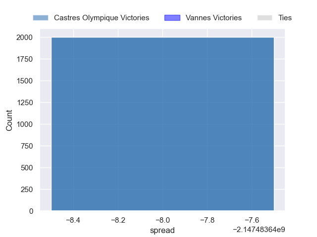

---  
layout: page  
title: Castres Olympique at Vannes  
date: 2024-10-26 18:00:00 -0500  
categories: "Top 14 Orange 2024" match projection  
---
# Castres Olympique at Vannes

# Club Level Predictions

The first set of predictions treats a club as the smallest object, as the club develops its members, organizes a gameplan, and deploys its players as needed for each match. This club model has a prediction of 0.308, which translates to predicting Castres Olympique to win by 3.5.

Our Over/Under is 56.5 - and combined with the spread above, we have a predicted scoreline of 30 to 26

Each club has a rating and a rating deviation (similar to a Glicko rating), and expected performances can be generated. This allows for simulated matches and spreads like the ones below.
## Projected Performances - Club Model

## Projected Spreads - Club Model

## Projected Results - Club Model

# Player Level Predictions

Treating teams instead as an entity made up of the currently active players, I have ratings for each player in an altogether different system. These can be combined to form team ratings once teamsheets are announced, weighting starters a bit higher than the reserves. After the match is played, players can be weighted by their minutes on the field, allowing for an accurate measure of the team's composition. With these compiled team ratings, we can make predictions, measure inaccuracy, and update the individual player ratings.
## Prediction without Player Minutes: Castres Olympique by nan

Castres Olympique by nan on a neutral pitch

## Projected Performances - Player Model

## Projected Spreads - Player Model

## Projected Results - Player Model

| Away Player           |   Away Percentile |   Number |   Home Percentile | Home Player             |
|:----------------------|------------------:|---------:|------------------:|:------------------------|
| Quentin Walcker       |            nan    |        1 |               nan | Mako Vunipola           |
| Gaetan Barlot         |            nan    |        2 |               nan | Theo Beziat             |
| Will Collier          |            nan    |        3 |               nan | Pagakalasio Tafili      |
| Guillaume Ducat       |            nan    |        4 |               nan | Eric Marks              |
| Leone Nakarawa        |            nan    |        5 |               nan | Fabrice Metz            |
| Mathieu Babillot      |            nan    |        6 |               nan | Juan Bautista Pedemonte |
| Baptiste Delaporte    |            nan    |        7 |               nan | Francisco Gorrissen     |
| Abraham Papali'i      |            nan    |        8 |               nan | Sione Kalamafoni        |
| Jeremy Fernandez      |            nan    |        9 |               nan | Michael Ruru            |
| Pierre Popelin        |             77.68 |       10 |               nan | Maxime Lafage           |
| Nathanael Hulleu      |            nan    |       11 |               nan | Filipo Nakosi           |
| Louis Le Brun         |            nan    |       12 |               nan | Alex Arrate             |
| Vilimoni Botitu       |            nan    |       13 |               nan | Francis Saili           |
| Geoffrey Palis        |            nan    |       14 |               nan | Salesi Rayasi           |
| Julien Dumora         |            nan    |       15 |               nan | Gwenael Duplenne        |
| Pierre Colonna        |            nan    |       16 |               nan | Cyril Blanchard         |
| Lois Guerois-Galisson |            nan    |       17 |               nan | Charlesty Berguet       |
| Gauthier Maravat      |            nan    |       18 |               nan | Matteo Desjeux          |
| Baptiste Cope         |            nan    |       19 |               nan | Leon Boulier            |
| Santiago Arata        |            nan    |       20 |               nan | Simon Augry             |
| Adrien Seguret        |            nan    |       21 |               nan | Jules Le Bail           |
| Josaia Raisuqe        |             83.39 |       22 |               nan | Inaki Ayarza            |
| Aurelien Azar         |             49.77 |       23 |               nan | Santiago Medrano        |

