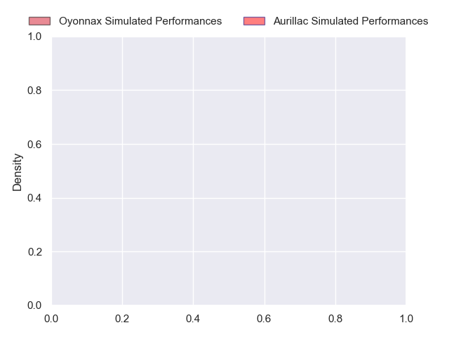
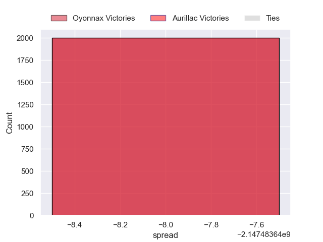

---  
layout: page  
title: Oyonnax at Aurillac  
date: 2024-11-01 18:00:00 -0500  
categories: "Pro D2 2024" match projection  
---
# Oyonnax at Aurillac

# Club Level Predictions

The first set of predictions treats a club as the smallest object, as the club develops its members, organizes a gameplan, and deploys its players as needed for each match. This club model has a prediction of 0.334, which translates to predicting Oyonnax to win by 2.5.

Our Over/Under is 48.5 - and combined with the spread above, we have a predicted scoreline of 25 to 23

Each club has a rating and a rating deviation (similar to a Glicko rating), and expected performances can be generated. This allows for simulated matches and spreads like the ones below.
## Projected Performances - Club Model

## Projected Spreads - Club Model

## Projected Results - Club Model

# Player Level Predictions

Treating teams instead as an entity made up of the currently active players, I have ratings for each player in an altogether different system. These can be combined to form team ratings once teamsheets are announced, weighting starters a bit higher than the reserves. After the match is played, players can be weighted by their minutes on the field, allowing for an accurate measure of the team's composition. With these compiled team ratings, we can make predictions, measure inaccuracy, and update the individual player ratings.
## Prediction without Player Minutes: Oyonnax by nan

Aurillac by 1.8 on a neutral pitch

## Projected Performances - Player Model

## Projected Spreads - Player Model

## Projected Results - Player Model

| Away Player         |   Away Percentile |   Number |   Home Percentile | Home Player             |
|:--------------------|------------------:|---------:|------------------:|:------------------------|
| Adrien Bordenave    |            nan    |        1 |               nan | Robbie Rodgers          |
| Teddy Durand        |            nan    |        2 |               nan | Basa Khonelidze         |
| Christopher Vaotoa  |             18.54 |        3 |               nan | Dominic Robertson-McCoy |
| Manuel Leindekar    |            nan    |        4 |               nan | Martial Rolland         |
| Hugo Fabregue       |            nan    |        5 |               nan | Mehdi Slamani           |
| Kevin Lebreton      |            nan    |        6 |               nan | Eoghan Masterson        |
| Antoine Miquel      |            nan    |        7 |               nan | Théo Cambon             |
| Loic Godener        |            nan    |        8 |               nan | Didier Tison            |
| Yvan David          |            nan    |        9 |               nan | Mikheil Alania          |
| Chris William Smith |             37.61 |       10 |               nan | Tedo Abzhandadze        |
| Daniel Ikpefan      |            nan    |       11 |               nan | Juun Pieters            |
| Chris Farrell       |            nan    |       12 |               nan | Ofa Manuofetoa          |
| Maelan Rabut        |             37.95 |       13 |               nan | Karl Martin             |
| Gavin Stark         |            nan    |       14 |               nan | Axel Bévia              |
| Darren Sweetnam     |            nan    |       15 |               nan | Dachi Papunashvili      |
| Peniami Narisia     |            nan    |       16 |               nan | Luka Nioradze           |
| Oli Kebble          |            nan    |       17 |               nan | Irakli Mchedlidze       |
| Victor Lebas        |            nan    |       18 |               nan | Koen Bloemen            |
| David Odiase (2)    |            nan    |       19 |               nan | Abongile Nonkontwana    |
| Vasil Lobzhanidze   |            nan    |       20 |               nan | Lucas Oudard            |
| Hugo Hermet         |            nan    |       21 |               nan | David Delarue           |
| Eddie Sawailau      |            nan    |       22 |               nan | Hugo Bastard            |
| Paulo Tafili        |            nan    |       23 |               nan | Giorgi Kartvelishvili   |

