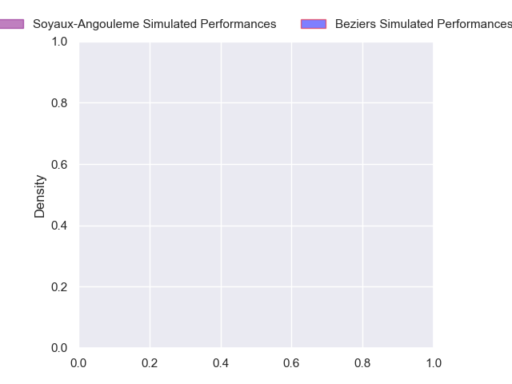
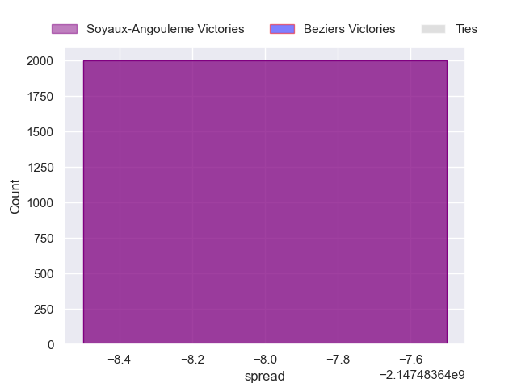

---  
layout: page  
title: Soyaux-Angouleme at Beziers  
date: 2024-11-01 18:00:00 -0500  
categories: "Pro D2 2024" match projection  
---
# Soyaux-Angouleme at Beziers

# Club Level Predictions

The first set of predictions treats a club as the smallest object, as the club develops its members, organizes a gameplan, and deploys its players as needed for each match. This club model has a prediction of 0.525, which translates to predicting Beziers to win by 4.1.

Our Over/Under is 47.5 - and combined with the spread above, we have a predicted scoreline of 22 to 26

Each club has a rating and a rating deviation (similar to a Glicko rating), and expected performances can be generated. This allows for simulated matches and spreads like the ones below.
## Projected Performances - Club Model

## Projected Spreads - Club Model

## Projected Results - Club Model

# Player Level Predictions

Treating teams instead as an entity made up of the currently active players, I have ratings for each player in an altogether different system. These can be combined to form team ratings once teamsheets are announced, weighting starters a bit higher than the reserves. After the match is played, players can be weighted by their minutes on the field, allowing for an accurate measure of the team's composition. With these compiled team ratings, we can make predictions, measure inaccuracy, and update the individual player ratings.
## Prediction without Player Minutes: Soyaux-Angouleme by nan

Beziers by 0.2 on a neutral pitch

## Projected Performances - Player Model

## Projected Spreads - Player Model

## Projected Results - Player Model

| Away Player          |   Away Percentile |   Number |   Home Percentile | Home Player      |
|:---------------------|------------------:|---------:|------------------:|:-----------------|
| Georgy Balakarev (2) |               nan |        1 |            nan    | Youssef Amrouni  |
| Patxi Bidart         |               nan |        2 |            nan    | Wilmar Arnoldi   |
| Seydou Diakité       |               nan |        3 |            nan    | Christian Judge  |
| Enzo Morand-Bruyat   |               nan |        4 |            nan    | Gillian Benoy    |
| Maxence Lemardelet   |               nan |        5 |            nan    | Shahn Eru        |
| Gautier Gibouin      |               nan |        6 |            nan    | Clement Doumenc  |
| Hubert Texier        |               nan |        7 |            nan    | Baptiste Abescat |
| Alex Masibaka (2)    |               nan |        8 |            nan    | Sias Koen        |
| Emmanuel Saubusse    |               nan |        9 |            nan    | Samuel Marques   |
| Ben Botica           |               nan |       10 |            nan    | Charly Malié     |
| Nathan Farissier     |               nan |       11 |            nan    | Paul Réau        |
| Mathis Lafon         |               nan |       12 |             87.42 | Taylor Gontineac |
| Arthur Proult        |               nan |       13 |            nan    | Paul Recor       |
| Matthys Gratien      |               nan |       14 |            nan    | Pierre Courtaud  |
| Rémi Brosset         |               nan |       15 |            nan    | Gabin Lorre      |
| Motu Matu'U          |               nan |       16 |            nan    | Yvann Lalevée    |
| Sami Zouhaïr         |               nan |       17 |            nan    | Marco Trauth     |
| Matt Beukeboom       |               nan |       18 |            nan    | Pierre Gayraud   |
| Samuel Nollet        |               nan |       19 |            nan    | William Van Bost |
| Lucas Zamora         |               nan |       20 |            nan    | Damien Añon      |
| Clément Sentubéry    |               nan |       21 |            nan    | Nicolas Plazy    |
| Ledua Mau            |               nan |       22 |            nan    | Watisoni Votu    |
| Karl Sorin           |               nan |       23 |            nan    | Yannick Arroyo   |

