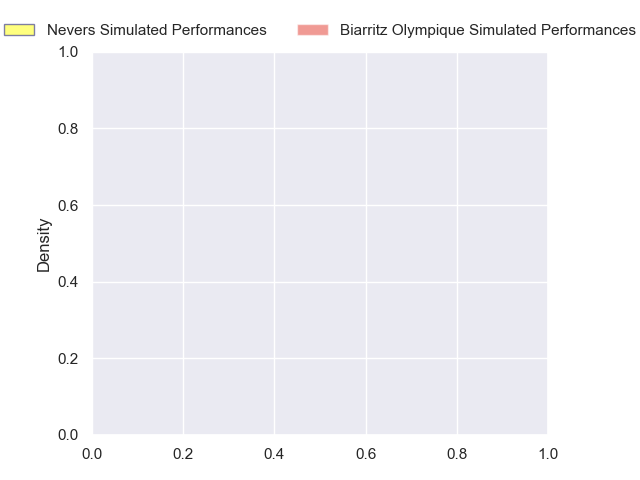
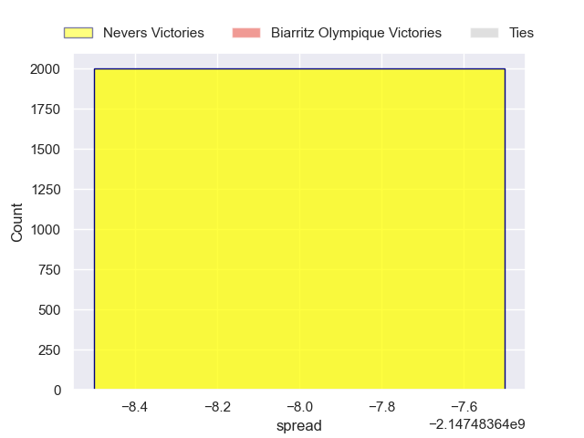

---  
layout: page  
title: Nevers at Biarritz Olympique  
date: 2024-11-01 18:00:00 -0500  
categories: "Pro D2 2024" match projection  
---
# Nevers at Biarritz Olympique

# Club Level Predictions

The first set of predictions treats a club as the smallest object, as the club develops its members, organizes a gameplan, and deploys its players as needed for each match. This club model has a prediction of 0.449, which translates to predicting Nevers to win by -1.7.

Our Over/Under is 44.5 - and combined with the spread above, we have a predicted scoreline of 21 to 23

Each club has a rating and a rating deviation (similar to a Glicko rating), and expected performances can be generated. This allows for simulated matches and spreads like the ones below.
## Projected Performances - Club Model

## Projected Spreads - Club Model

## Projected Results - Club Model

# Player Level Predictions

Treating teams instead as an entity made up of the currently active players, I have ratings for each player in an altogether different system. These can be combined to form team ratings once teamsheets are announced, weighting starters a bit higher than the reserves. After the match is played, players can be weighted by their minutes on the field, allowing for an accurate measure of the team's composition. With these compiled team ratings, we can make predictions, measure inaccuracy, and update the individual player ratings.
## Prediction without Player Minutes: Nevers by nan

Nevers by 0.2 on a neutral pitch

## Projected Performances - Player Model

## Projected Spreads - Player Model

## Projected Results - Player Model

| Away Player         |   Away Percentile |   Number |   Home Percentile | Home Player             |
|:--------------------|------------------:|---------:|------------------:|:------------------------|
| Kamaliele Tufele    |               nan |        1 |               nan | Giorgi Nutsubidze       |
| Jonathan Maïau      |               nan |        2 |               nan | Yohan Beheregaray       |
| Aselo Ikahehegi     |               nan |        3 |               nan | Solomone Tukuafu        |
| Ugo Vignolles       |               nan |        4 |               nan | Charlie Matthews        |
| Kévin Noah          |               nan |        5 |               nan | Piula Fa'asalele        |
| Julien Kazubek      |               nan |        6 |               nan | Jessy Jegerlehner       |
| Luka Plataret       |               nan |        7 |               nan | Thomas Hébert           |
| Steven David        |               nan |        8 |               nan | Nafi Ma'Afu             |
| Hugo Bouyssou       |               nan |        9 |               nan | Kerman Aurrekoetxea     |
| Shaun Reynolds      |               nan |       10 |               nan | Thomas Dolhagaray       |
| Gabin Rocher        |               nan |       11 |               nan | Arthur Bonneval         |
| Rudy Derrieux       |               nan |       12 |               nan | Jonathan Joseph         |
| Paula Walisoliso    |               nan |       13 |               nan | Mathieu Acebes          |
| Johan Wasserman     |               nan |       14 |               nan | Zach Kibirige           |
| Dylan Jaminet       |               nan |       15 |               nan | Kylian Jaminet          |
| Efi Ma'Afu          |               nan |       16 |               nan | Brendan Lebrun          |
| Aitor Kitutu        |               nan |       17 |               nan | Alexandre Plantier      |
| Maxence Barjaud     |               nan |       18 |               nan | Levi Douglas            |
| Wesley Lindor       |               nan |       19 |               nan | Ekain Imaz Agirre       |
| Rati Zazadze (2)    |               nan |       20 |               nan | Imanol Biscay           |
| Guillaume Manevy    |               nan |       21 |               nan | Gervais Cordin          |
| Arthur Mathiron     |               nan |       22 |               nan | François Vergnaud       |
| Lasha Pkhakadze (2) |               nan |       23 |               nan | Giorgi Dzmanashvili (2) |

