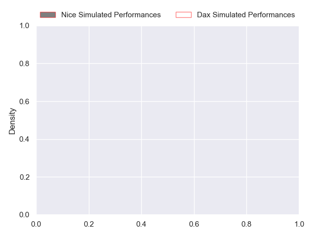
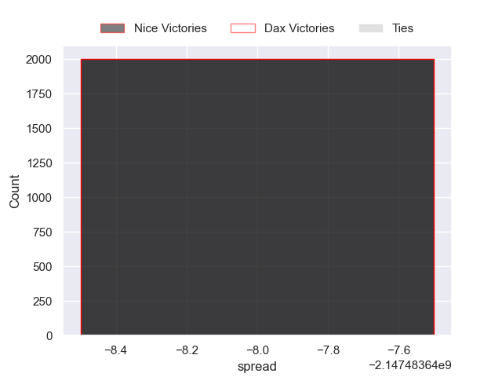

---  
layout: page  
title: Nice at Dax  
date: 2024-11-01 18:00:00 -0500  
categories: "Pro D2 2024" match projection  
---
# Nice at Dax

# Club Level Predictions

The first set of predictions treats a club as the smallest object, as the club develops its members, organizes a gameplan, and deploys its players as needed for each match. This club model has a prediction of 0.546, which translates to predicting Dax to win by 5.2.

Our Over/Under is 46.5 - and combined with the spread above, we have a predicted scoreline of 21 to 26

Each club has a rating and a rating deviation (similar to a Glicko rating), and expected performances can be generated. This allows for simulated matches and spreads like the ones below.
## Projected Performances - Club Model

## Projected Spreads - Club Model

## Projected Results - Club Model

# Player Level Predictions

Treating teams instead as an entity made up of the currently active players, I have ratings for each player in an altogether different system. These can be combined to form team ratings once teamsheets are announced, weighting starters a bit higher than the reserves. After the match is played, players can be weighted by their minutes on the field, allowing for an accurate measure of the team's composition. With these compiled team ratings, we can make predictions, measure inaccuracy, and update the individual player ratings.
## Prediction without Player Minutes: Nice by nan

Dax by 0.1 on a neutral pitch

## Projected Performances - Player Model

## Projected Spreads - Player Model

## Projected Results - Player Model

| Away Player        |   Away Percentile |   Number |   Home Percentile | Home Player           |
|:-------------------|------------------:|---------:|------------------:|:----------------------|
| Fabio Gonzalez     |            nan    |        1 |            nan    | Dino Casadeï          |
| Sione Anga'Aelangi |            nan    |        2 |            nan    | Louis Barrère         |
| Nicolás Ciancio    |            nan    |        3 |            nan    | Diogo Hasse Ferreira  |
| Clément Chartier   |            nan    |        4 |             39.92 | Brice Ferrer          |
| Thibaud Rey        |            nan    |        5 |            nan    | Jean-Baptiste Singer  |
| Joris Simon        |            nan    |        6 |            nan    | Jean-Baptiste Barrère |
| Bastien Berenguel  |            nan    |        7 |            nan    | Théo Trémeau          |
| Ramiha Smiler      |            nan    |        8 |            nan    | Sam Wasley            |
| Jules Solinas      |            nan    |        9 |            nan    | Simon Garrouteigt     |
| Tanguy Ménoret     |            nan    |       10 |            nan    | Romuald Séguy         |
| Andrzej Charlat    |            nan    |       11 |            nan    | Guillaume Bouche      |
| Tom Daly           |            nan    |       12 |            nan    | Noah Nene             |
| Nathan Courtade    |            nan    |       13 |            nan    | Bastien Daguerre      |
| Simon Delas        |            nan    |       14 |            nan    | Hugo Fourquet         |
| Paul Auradou       |            nan    |       15 |            nan    | Maxime Oltmann        |
| Sacha Idoumi       |             47.08 |       16 |            nan    | Iban Hiriart-Urruty   |
| Julien Beaufils    |            nan    |       17 |            nan    | Louis Mary            |
| Louis Suaud        |            nan    |       18 |            nan    | Etienne Loiret        |
| Martin Freytes     |            nan    |       19 |            nan    | Genesis Mamea Lemalu  |
| Arthur Vignolles   |            nan    |       20 |            nan    | Sylvère Réteau        |
| Thibault Dufau     |            nan    |       21 |            nan    | Jale Vatubua          |
| Flavio Asquini     |            nan    |       22 |            nan    | Théo Duprat           |
| Tom Ross           |            nan    |       23 |            nan    | Nephi Leatigaga       |

