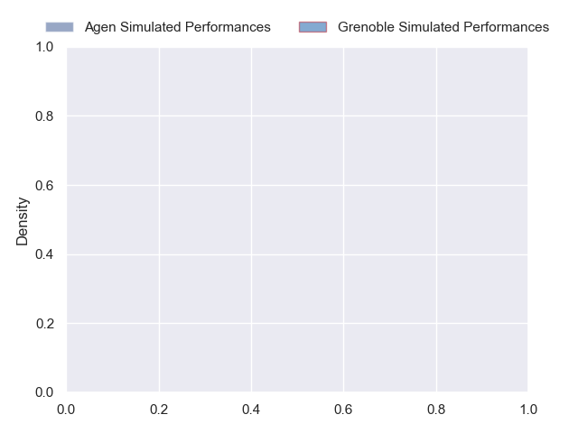
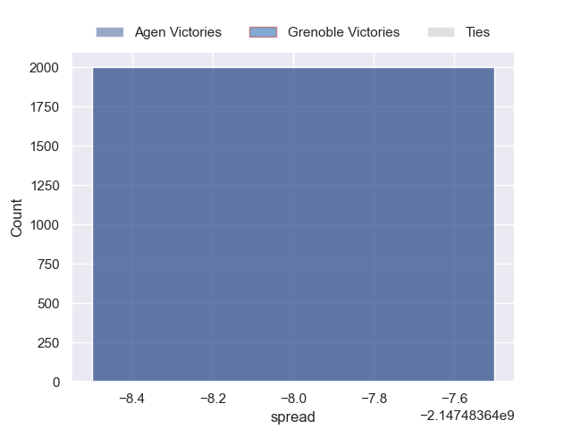

---  
layout: page  
title: Agen at Grenoble  
date: 2024-11-01 18:00:00 -0500  
categories: "Pro D2 2024" match projection  
---
# Agen at Grenoble

# Club Level Predictions

The first set of predictions treats a club as the smallest object, as the club develops its members, organizes a gameplan, and deploys its players as needed for each match. This club model has a prediction of 0.588, which translates to predicting Grenoble to win by 6.3.

Our Over/Under is 51.5 - and combined with the spread above, we have a predicted scoreline of 23 to 29

Each club has a rating and a rating deviation (similar to a Glicko rating), and expected performances can be generated. This allows for simulated matches and spreads like the ones below.
## Projected Performances - Club Model

## Projected Spreads - Club Model

## Projected Results - Club Model

# Player Level Predictions

Treating teams instead as an entity made up of the currently active players, I have ratings for each player in an altogether different system. These can be combined to form team ratings once teamsheets are announced, weighting starters a bit higher than the reserves. After the match is played, players can be weighted by their minutes on the field, allowing for an accurate measure of the team's composition. With these compiled team ratings, we can make predictions, measure inaccuracy, and update the individual player ratings.
## Prediction without Player Minutes: Agen by nan

Grenoble by 0.8 on a neutral pitch

## Projected Performances - Player Model

## Projected Spreads - Player Model

## Projected Results - Player Model

| Away Player             |   Away Percentile |   Number |   Home Percentile | Home Player        |
|:------------------------|------------------:|---------:|------------------:|:-------------------|
| Florent Guion           |            nan    |        1 |               nan | Zack Gauthier      |
| Pierre Jouvin           |            nan    |        2 |               nan | Mathis Sarragallet |
| Beau Farrance           |            nan    |        3 |               nan | Cody Thomas        |
| Mathieu De Giovanni     |            nan    |        4 |               nan | Thomas Lainault    |
| Evan Olmstead           |            nan    |        5 |               nan | Pierce Phillips    |
| Matthieu Bonnet         |             47.44 |        6 |               nan | Richard Hardwick   |
| Tomasi Fineanganofo (2) |            nan    |        7 |               nan | Thibaut Martel     |
| Martin Devergie         |            nan    |        8 |               nan | Pio Muarua         |
| Théo Idjellidaine       |            nan    |        9 |               nan | Barnabé Couilloud  |
| Émile Dayral            |            nan    |       10 |               nan | Marc Palmier       |
| Henry Purdy             |            nan    |       11 |               nan | Gerswin Mouton     |
| Clément Garrigues       |            nan    |       12 |               nan | Giorgi Kveseladze  |
| Ethan Randle            |            nan    |       13 |               nan | Romain Fusier      |
| Inoke Nalaga            |            nan    |       14 |               nan | Wilfried Hulleu    |
| Romain Darchen          |            nan    |       15 |               nan | Hugo Trouilloud    |
| Lucas Malbert           |            nan    |       16 |               nan | Lilian Rossi       |
| Hans Lombard-Buret      |            nan    |       17 |               nan | Tommy Raynaud      |
| Javier Eissmann         |              1.03 |       18 |               nan | Giorgi Javakhia    |
| Valentin Gayraud        |            nan    |       19 |               nan | Jose Madeira       |
| Dorian Bellot           |            nan    |       20 |               nan | Eric Escande       |
| Franck Pourteau         |            nan    |       21 |               nan | Max Clément        |
| Thibaud Mazzoléni       |             50.18 |       22 |               nan | Julien Farnoux     |
| Alex Burin              |            nan    |       23 |               nan | Giorgi Pertaia     |

