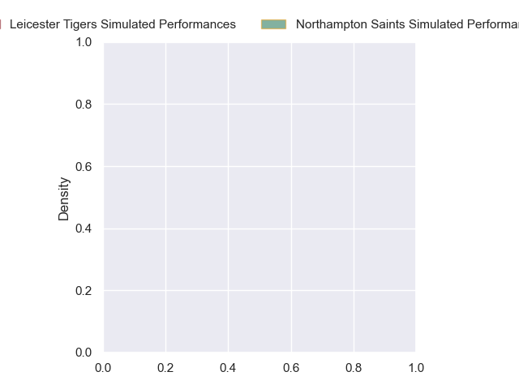
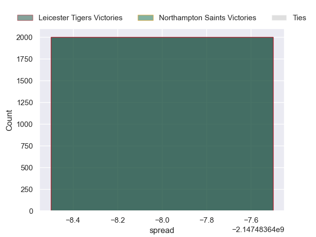

---  
layout: page  
title: Leicester Tigers at Northampton Saints  
date: 2024-11-01 18:00:00 -0500  
categories: "Premiership Rugby Cup 2024" match projection  
---
# Leicester Tigers at Northampton Saints

# Club Level Predictions

The first set of predictions treats a club as the smallest object, as the club develops its members, organizes a gameplan, and deploys its players as needed for each match. This club model has a prediction of 0.488, which translates to predicting Leicester Tigers to win by -2.8.

Our Over/Under is 56.5 - and combined with the spread above, we have a predicted scoreline of 27 to 29

Each club has a rating and a rating deviation (similar to a Glicko rating), and expected performances can be generated. This allows for simulated matches and spreads like the ones below.
## Projected Performances - Club Model

## Projected Spreads - Club Model

## Projected Results - Club Model

# Player Level Predictions

Treating teams instead as an entity made up of the currently active players, I have ratings for each player in an altogether different system. These can be combined to form team ratings once teamsheets are announced, weighting starters a bit higher than the reserves. After the match is played, players can be weighted by their minutes on the field, allowing for an accurate measure of the team's composition. With these compiled team ratings, we can make predictions, measure inaccuracy, and update the individual player ratings.
## Prediction without Player Minutes: Leicester Tigers by nan

Leicester Tigers by 1.3 on a neutral pitch

## Projected Performances - Player Model

## Projected Spreads - Player Model

## Projected Results - Player Model

| Away Player          |   Away Percentile |   Number |   Home Percentile | Home Player             |
|:---------------------|------------------:|---------:|------------------:|:------------------------|
| James Whitcombe      |             75.44 |        1 |            nan    | Tarek Haffar            |
| Finn Theobald-Thomas |             46.75 |        2 |            nan    | Craig Wright            |
| Tim Hoyt             |            nan    |        3 |            nan    | Luke Green              |
| Côme Joussain        |            nan    |        4 |            nan    | Chunya Munga            |
| Tom Manz             |            nan    |        5 |            nan    | Gavin Thornbury         |
| Matt Rogerson        |             97.88 |        6 |            nan    | Fyn Brown               |
| Emeka Ilione         |            nan    |        7 |            nan    | Angus Scott-Young       |
| Kyle Hatherell       |            nan    |        8 |            nan    | Henry Pollock           |
| Tom Whiteley         |            nan    |        9 |            nan    | Archie McParland        |
| Jamie Shillcock      |            nan    |       10 |            nan    | George Makepeace-Cubitt |
| Jack Kinder          |            nan    |       11 |            nan    | Tom Seabrook            |
| Solomone Kata        |            nan    |       12 |             40.37 | Charlie Savala          |
| Will Wand            |            nan    |       13 |            nan    | Tom Litchfield          |
| Malelili Satala      |            nan    |       14 |            nan    | Mitieli Vulikijapani    |
| George Pearson       |            nan    |       15 |            nan    | George Hendy            |
| Archie Vanes         |            nan    |       16 |            nan    | Nathan Langdon          |
| Archie Van Der Flier |            nan    |       17 |            nan    | Emmanuel Iyogun         |
| Henry Mountford      |            nan    |       18 |            nan    | Sonny Tonga'Uiha        |
| Lewis Chessum        |            nan    |       19 |            nan    | Will Spencer            |
| Sam Williams         |            nan    |       20 |            nan    | Josh Kemeny             |
| Charlie Bemand       |            nan    |       21 |            nan    | Jonny Weimann           |
| Charlie Myall        |            nan    |       22 |            nan    | James Ramm              |
| Tom Threlfall        |            nan    |       23 |            nan    | Ewan Baker              |

