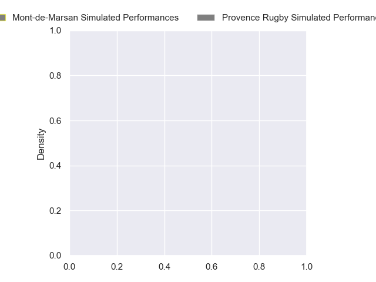
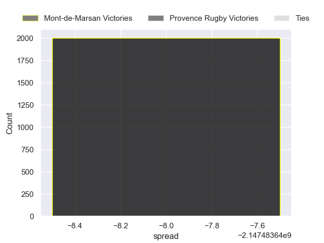

---  
layout: page  
title: Mont-de-Marsan at Provence Rugby  
date: 2024-11-01 18:00:00 -0500  
categories: "Pro D2 2024" match projection  
---
# Mont-de-Marsan at Provence Rugby

# Club Level Predictions

The first set of predictions treats a club as the smallest object, as the club develops its members, organizes a gameplan, and deploys its players as needed for each match. This club model has a prediction of 0.539, which translates to predicting Provence Rugby to win by 4.9.

Our Over/Under is 49.5 - and combined with the spread above, we have a predicted scoreline of 22 to 27

Each club has a rating and a rating deviation (similar to a Glicko rating), and expected performances can be generated. This allows for simulated matches and spreads like the ones below.
## Projected Performances - Club Model

## Projected Spreads - Club Model

## Projected Results - Club Model

# Player Level Predictions

Treating teams instead as an entity made up of the currently active players, I have ratings for each player in an altogether different system. These can be combined to form team ratings once teamsheets are announced, weighting starters a bit higher than the reserves. After the match is played, players can be weighted by their minutes on the field, allowing for an accurate measure of the team's composition. With these compiled team ratings, we can make predictions, measure inaccuracy, and update the individual player ratings.
## Prediction without Player Minutes: Mont-de-Marsan by nan

Mont-de-Marsan by 0.1 on a neutral pitch

## Projected Performances - Player Model

## Projected Spreads - Player Model

## Projected Results - Player Model

| Away Player           |   Away Percentile |   Number |   Home Percentile | Home Player              |
|:----------------------|------------------:|---------:|------------------:|:-------------------------|
| Jean-Luc Innocente    |               nan |        1 |            nan    | Thomas Vernet            |
| Luka Begic            |               nan |        2 |            nan    | Loick Jammes             |
| Mattéo Lalanne        |               nan |        3 |            nan    | Paul Mallez              |
| Jules Dussutour       |               nan |        4 |            nan    | Andrés Zafra             |
| Romain Durand         |               nan |        5 |            nan    | Josh Tyrell              |
| Raphaël Robic         |               nan |        6 |            nan    | Guillaume Piazzoli       |
| Waël Ponpon           |               nan |        7 |            nan    | Bilel Taieb              |
| Ioane Iashagashvili   |               nan |        8 |            nan    | Teimana Harrison         |
| Christophe Loustalot  |               nan |        9 |            nan    | Arthur Coville           |
| Patricio Fernandez    |               nan |       10 |            nan    | Jules Plisson            |
| Eroni Sau             |               nan |       11 |            nan    | Léo Drouet               |
| Baptiste Grulovic     |               nan |       12 |            nan    | Jimmy Gopperth           |
| Gatien Massé          |               nan |       13 |            nan    | Inga Finau               |
| Simao Bento           |               nan |       14 |            nan    | Adrien Lapègue           |
| Yoann Laousse Azpiazu |               nan |       15 |            nan    | Mathias Colombet         |
| Samuel Lagrange       |               nan |       16 |            nan    | Joseph Laget             |
| Luka Goginava         |               nan |       17 |             94.45 | Hayden Thompson-Stringer |
| Myles Edwards         |               nan |       18 |            nan    | Izack Rodda              |
| Nicolas Garrault      |               nan |       19 |             65.5  | Charly Gambini           |
| Nicolas Darquier      |               nan |       20 |            nan    | Kévin Viallard           |
| Théo Cortes           |               nan |       21 |            nan    | Atila Septar             |
| Yann Bréthous         |               nan |       22 |            nan    | Nadir Bouhedjeur         |
| Gheorghe Gajion       |               nan |       23 |            nan    | Enrique Pieretto         |

