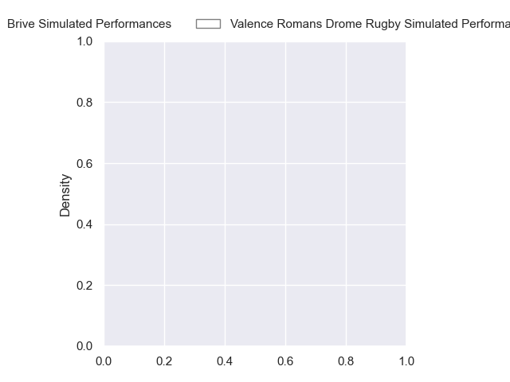
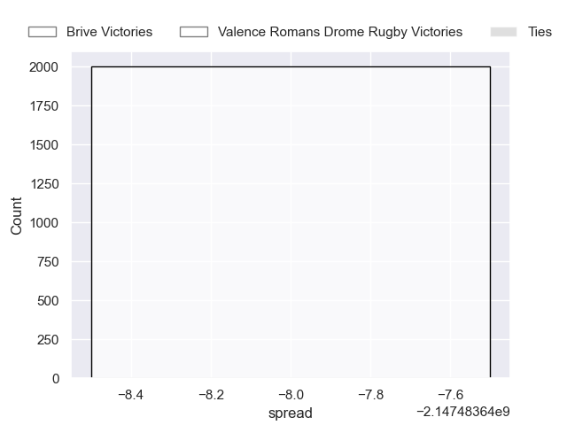
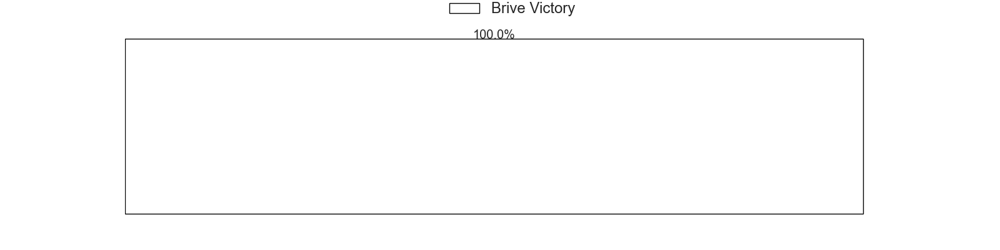

---  
layout: page  
title: Brive at Valence Romans Drome Rugby  
date: 2024-11-01 18:00:00 -0500  
categories: "Pro D2 2024" match projection  
---
# Brive at Valence Romans Drome Rugby

# Club Level Predictions

The first set of predictions treats a club as the smallest object, as the club develops its members, organizes a gameplan, and deploys its players as needed for each match. This club model has a prediction of 0.352, which translates to predicting Brive to win by 1.8.

Our Over/Under is 46.5 - and combined with the spread above, we have a predicted scoreline of 24 to 22

Each club has a rating and a rating deviation (similar to a Glicko rating), and expected performances can be generated. This allows for simulated matches and spreads like the ones below.
## Projected Performances - Club Model

## Projected Spreads - Club Model

## Projected Results - Club Model

# Player Level Predictions

Treating teams instead as an entity made up of the currently active players, I have ratings for each player in an altogether different system. These can be combined to form team ratings once teamsheets are announced, weighting starters a bit higher than the reserves. After the match is played, players can be weighted by their minutes on the field, allowing for an accurate measure of the team's composition. With these compiled team ratings, we can make predictions, measure inaccuracy, and update the individual player ratings.
## Prediction without Player Minutes: Brive by nan

Brive by 0.0 on a neutral pitch

## Projected Performances - Player Model

## Projected Spreads - Player Model

## Projected Results - Player Model

| Away Player               |   Away Percentile |   Number |   Home Percentile | Home Player         |
|:--------------------------|------------------:|---------:|------------------:|:--------------------|
| Simon-Pierre Chauvac      |            nan    |        1 |               nan | Anthony Aléo        |
| Lucas Da Silva            |            nan    |        2 |               nan | Dorian Marco-Pena   |
| Marcel Van Der Merwe      |            nan    |        3 |               nan | Vincent Vial        |
| Courtney Lawes            |            nan    |        4 |               nan | Ryan Mccauley       |
| Tevita Ratuva             |            nan    |        5 |               nan | Florian Goumat      |
| Retief Marais             |            nan    |        6 |               nan | Axel Bruchet        |
| Samuel Maximin            |            nan    |        7 |               nan | Loan Réal           |
| Rahboni Warren-Vosayaco   |            nan    |        8 |               nan | Sven Girlando       |
| Léo Carbonneau            |            nan    |        9 |               nan | Thomas Lhuséro      |
| Curwin Bosch              |            nan    |       10 |               nan | Lucas Méret         |
| Erwan Dridi               |            nan    |       11 |               nan | Mosese Mawalu       |
| Sam Johnson               |            nan    |       12 |               nan | Louis Marrou        |
| Georges Shvelidze         |            nan    |       13 |               nan | Anatole Pauvert     |
| Mathis Ferté              |            nan    |       14 |               nan | Thomas Roziere      |
| Thomas Zénon              |            nan    |       15 |               nan | Joris De Moura      |
| Issam Hamel               |            nan    |       16 |               nan | Cyril Deligny       |
| Nathan Fraissenon         |            nan    |       17 |               nan | Esteban Chouteau    |
| Konstantin Mikautadze     |            nan    |       18 |               nan | Darren O'Shea       |
| Geoffrey Malaterre        |             54.14 |       19 |               nan | Matthieu Vachon     |
| Taniela Sadrugu           |            nan    |       20 |               nan | Mattéo Rodor        |
| Hugo Verdu                |            nan    |       21 |               nan | Ben Neiceru         |
| Benjamin Lefranc          |            nan    |       22 |               nan | Adrien Roux         |
| Francisco Coria Marchetti |            nan    |       23 |               nan | Gareth Milasinovich |

