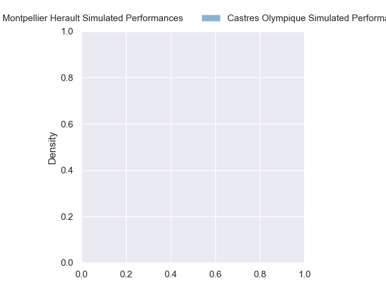
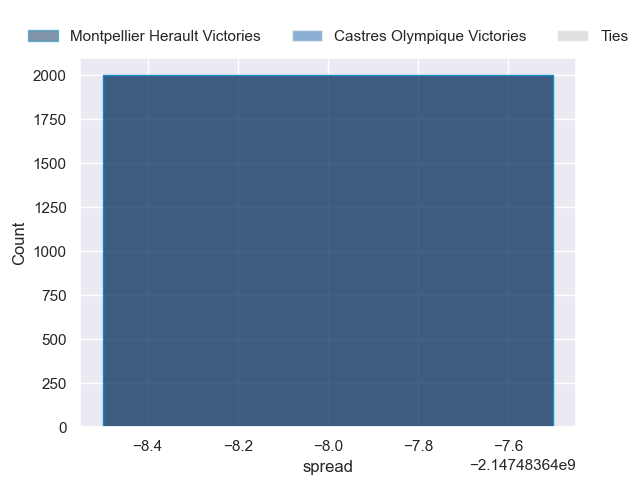

---  
layout: page  
title: Montpellier Herault at Castres Olympique  
date: 2024-11-02 18:00:00 -0500  
categories: "Top 14 Orange 2024" match projection  
---
# Montpellier Herault at Castres Olympique

# Club Level Predictions

The first set of predictions treats a club as the smallest object, as the club develops its members, organizes a gameplan, and deploys its players as needed for each match. This club model has a prediction of 0.529, which translates to predicting Castres Olympique to win by 4.4.

Our Over/Under is 47.5 - and combined with the spread above, we have a predicted scoreline of 22 to 26

Each club has a rating and a rating deviation (similar to a Glicko rating), and expected performances can be generated. This allows for simulated matches and spreads like the ones below.
## Projected Performances - Club Model

## Projected Spreads - Club Model

## Projected Results - Club Model

# Player Level Predictions

Treating teams instead as an entity made up of the currently active players, I have ratings for each player in an altogether different system. These can be combined to form team ratings once teamsheets are announced, weighting starters a bit higher than the reserves. After the match is played, players can be weighted by their minutes on the field, allowing for an accurate measure of the team's composition. With these compiled team ratings, we can make predictions, measure inaccuracy, and update the individual player ratings.
## Prediction without Player Minutes: Montpellier Herault by nan

Montpellier Herault by nan on a neutral pitch

## Projected Performances - Player Model

## Projected Spreads - Player Model

## Projected Results - Player Model

| Away Player                 |   Away Percentile |   Number |   Home Percentile | Home Player         |
|:----------------------------|------------------:|---------:|------------------:|:--------------------|
| Nika Abuladze               |            nan    |        1 |            nan    | Quentin Walcker     |
| Jordan Uelese               |            nan    |        2 |            nan    | Pierre Colonna      |
| Wilfrid Hounkpatin          |            nan    |        3 |            nan    | Will Collier        |
| Yacouba Camara              |            nan    |        4 |            nan    | Guillaume Ducat     |
| Bastien Chalureau           |            nan    |        5 |            nan    | Leone Nakarawa      |
| Nicolaas Janse van Rensburg |            nan    |        6 |            nan    | Mathieu Babillot    |
| Sam Simmonds                |            nan    |        7 |            nan    | Baptiste Cope       |
| Billy Vunipola              |            nan    |        8 |            nan    | Abraham Papali'i    |
| Ryan Louwrens               |             96.03 |        9 |            nan    | Santiago Arata      |
| Thomas Vincent              |            nan    |       10 |            nan    | Pierre Popelin      |
| Madosh Tambwe               |            nan    |       11 |            nan    | Geoffrey Palis      |
| Arthur Vincent              |            nan    |       12 |            nan    | Jack Goodhue        |
| Auguste Cadot               |            nan    |       13 |            nan    | Vilimoni Botitu     |
| Mael Moustin                |            nan    |       14 |            nan    | Christian Ambadiang |
| Julien Tisseron             |            nan    |       15 |            nan    | Julien Dumora       |
| Christopher Tolofua         |            nan    |       16 |            nan    | Loris Zarantonello  |
| Baptiste Erdocio            |            nan    |       17 |            nan    | Antoine Tichit      |
| Tyler Duguid                |            nan    |       18 |            nan    | Gauthier Maravat    |
| Lenni Nouchi                |            nan    |       19 |            nan    | Baptiste Delaporte  |
| Alexis Bernadet             |            nan    |       20 |             54.97 | Gauthier Doubrere   |
| Aurelien Barreau            |            nan    |       21 |            nan    | Louis Le Brun       |
| Gabriel Ngandebe            |            nan    |       22 |            nan    | Theo Chabouni       |
| Mohamed Haouas              |            nan    |       23 |            nan    | Nicolas Corato      |

