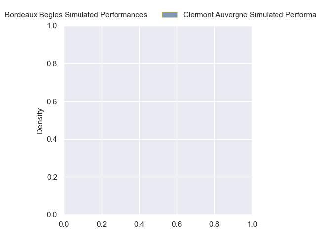
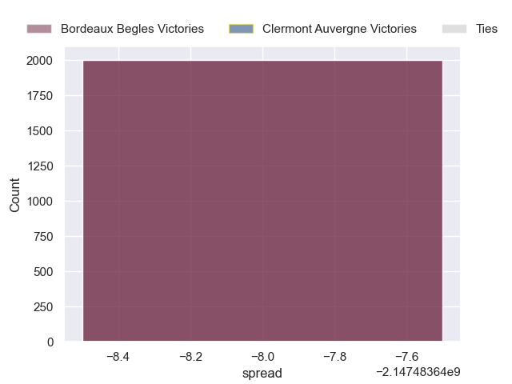

---  
layout: page  
title: Bordeaux Begles at Clermont Auvergne  
date: 2024-11-02 18:00:00 -0500  
categories: "Top 14 Orange 2024" match projection  
---
# Bordeaux Begles at Clermont Auvergne

# Club Level Predictions

The first set of predictions treats a club as the smallest object, as the club develops its members, organizes a gameplan, and deploys its players as needed for each match. This club model has a prediction of 0.373, which translates to predicting Bordeaux Begles to win by 1.1.

Our Over/Under is 75.5 - and combined with the spread above, we have a predicted scoreline of 38 to 37

Each club has a rating and a rating deviation (similar to a Glicko rating), and expected performances can be generated. This allows for simulated matches and spreads like the ones below.
## Projected Performances - Club Model

## Projected Spreads - Club Model

## Projected Results - Club Model

# Player Level Predictions

Treating teams instead as an entity made up of the currently active players, I have ratings for each player in an altogether different system. These can be combined to form team ratings once teamsheets are announced, weighting starters a bit higher than the reserves. After the match is played, players can be weighted by their minutes on the field, allowing for an accurate measure of the team's composition. With these compiled team ratings, we can make predictions, measure inaccuracy, and update the individual player ratings.
## Prediction without Player Minutes: Bordeaux Begles by nan

Bordeaux Begles by nan on a neutral pitch

## Projected Performances - Player Model

## Projected Spreads - Player Model

## Projected Results - Player Model

| Away Player              |   Away Percentile |   Number |   Home Percentile | Home Player          |
|:-------------------------|------------------:|---------:|------------------:|:---------------------|
| Jefferson Poirot         |            nan    |        1 |            nan    | Sacha Lotrian        |
| Connor Sa                |            nan    |        2 |            nan    | Etienne Fourcade     |
| Carlu Sadie              |            nan    |        3 |            nan    | Regis Montagne       |
| Jonny Gray               |            nan    |        4 |            nan    | Thibaud Lanen        |
| Cyril Cazeaux            |            nan    |        5 |            nan    | Thomas Ceyte         |
| Lachlan Swinton          |            nan    |        6 |            nan    | Pita Gus Sowakula    |
| Temo Matiu               |            nan    |        7 |            nan    | Alexandre Fischer    |
| Tevita Tatafu            |            nan    |        8 |            nan    | Fritz Lee            |
| Maxime Lucu              |            nan    |        9 |            nan    | Baptiste Jauneau     |
| Joey Carbery             |            nan    |       10 |            nan    | Benjamin Urdapilleta |
| Enzo Reybier             |            nan    |       11 |            nan    | Joris Jurand         |
| Rohan Janse van Rensburg |             91.82 |       12 |             19.71 | Pierre Fouyssac      |
| Pablo Uberti             |            nan    |       13 |            nan    | Leon Darricarrere    |
| Arthur Retiere           |            nan    |       14 |            nan    | Bautista Delguy      |
| Romain Buros             |            nan    |       15 |            nan    | Alex Newsome         |
| Maxime Lamothe           |            nan    |       16 |            nan    | Barnabe Massa        |
| Matis Perchaud           |            nan    |       17 |            nan    | Etienne Falgoux      |
| Guido Petti              |            nan    |       18 |            nan    | Peceli Yato          |
| Mahamadou Diaby          |            nan    |       19 |            nan    | Anthime Hemery       |
| Marko Gazzotti           |            nan    |       20 |            nan    | Sebastien Bezy       |
| Mateo Garcia             |            nan    |       21 |            nan    | Anthony Belleau      |
| Ben Tapuai               |            nan    |       22 |            nan    | Killian Tixeront     |
| Toma'akino Taufa         |             44.22 |       23 |            nan    | Michael Ala'alatoa   |

