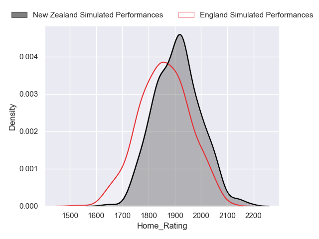
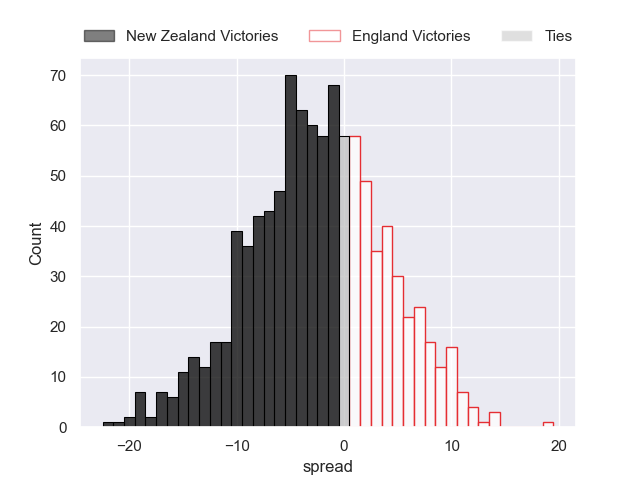
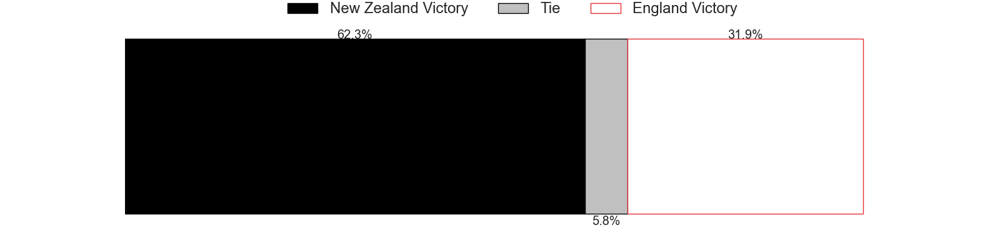
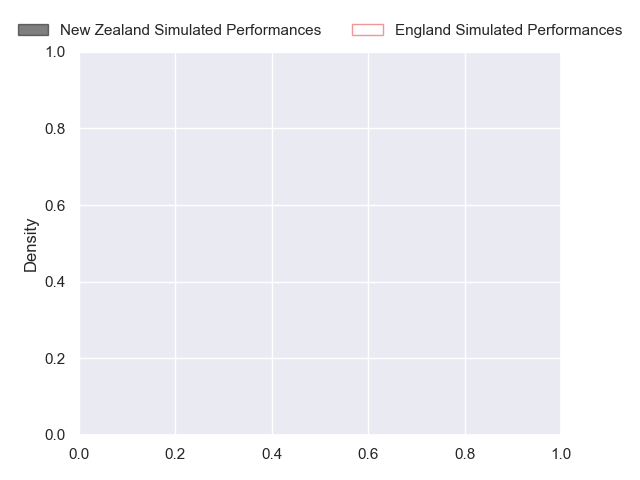
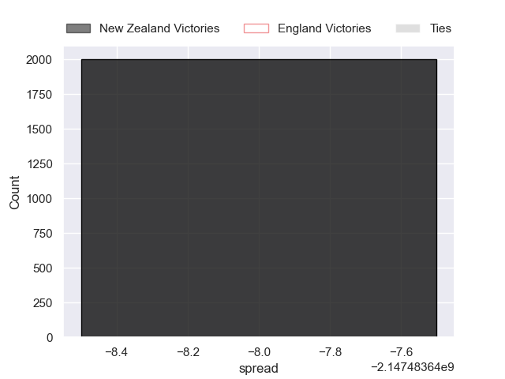

---  
layout: page  
title: New Zealand at England  
date: 2024-11-02 18:00:00 -0500  
categories: "International Test Match 2024" match projection  
---
# New Zealand at England

# Club Level Predictions

The first set of predictions treats a club as the smallest object, as the club develops its members, organizes a gameplan, and deploys its players as needed for each match. This club model has a prediction of 0.331, which translates to predicting New Zealand to win by 2.5.

Our Over/Under is 82.5 - and combined with the spread above, we have a predicted scoreline of 43 to 40

Each club has a rating and a rating deviation (similar to a Glicko rating), and expected performances can be generated. This allows for simulated matches and spreads like the ones below.
## Projected Performances - Club Model

## Projected Spreads - Club Model

## Projected Results - Club Model

# Player Level Predictions

Treating teams instead as an entity made up of the currently active players, I have ratings for each player in an altogether different system. These can be combined to form team ratings once teamsheets are announced, weighting starters a bit higher than the reserves. After the match is played, players can be weighted by their minutes on the field, allowing for an accurate measure of the team's composition. With these compiled team ratings, we can make predictions, measure inaccuracy, and update the individual player ratings.
## Prediction without Player Minutes: New Zealand by nan

New Zealand by nan on a neutral pitch

## Projected Performances - Player Model

## Projected Spreads - Player Model

## Projected Results - Player Model

| Away Player         |   Away Percentile |   Number |   Home Percentile | Home Player               |
|:--------------------|------------------:|---------:|------------------:|:--------------------------|
| Tamaiti Williams    |               nan |        1 |            nan    | Ellis Genge               |
| Codie Taylor        |               nan |        2 |            nan    | Jamie George              |
| Tyrel Lomax         |               nan |        3 |            nan    | Will Stuart               |
| Scott Barrett       |               nan |        4 |            nan    | Maro Itoje                |
| Tupou Vaa'i         |               nan |        5 |            nan    | George Martin             |
| Wallace Sititi      |               nan |        6 |            nan    | Chandler Cunningham-South |
| Sam Cane            |               nan |        7 |            nan    | Tom Curry                 |
| Ardie Savea         |               nan |        8 |            nan    | Ben Earl                  |
| Cortez Ratima       |               nan |        9 |            nan    | Ben Spencer               |
| Beauden Barrett     |               nan |       10 |            nan    | Marcus Smith              |
| Caleb Clarke        |               nan |       11 |            nan    | Tommy Freeman             |
| Jordie Barrett      |               nan |       12 |            nan    | Ollie Lawrence            |
| Rieko Ioane         |               nan |       13 |            nan    | Henry Slade               |
| Mark Tele'a         |               nan |       14 |            nan    | Immanuel Feyi-Waboso      |
| Will Jordan         |               nan |       15 |            nan    | George Furbank            |
| Asafo Aumua         |               nan |       16 |            nan    | Theo Dan                  |
| Ofa Tu'ungafasi     |               100 |       17 |            nan    | Fin Baxter                |
| Pasilio Tosi        |               nan |       18 |             71.63 | Dan Cole                  |
| Patrick Tuipulotu   |               nan |       19 |            nan    | Nick Isiekwe              |
| Samipeni Finau      |               nan |       20 |            nan    | Ben Curry                 |
| Cam Roigard         |               nan |       21 |            nan    | Alex Dombrandt            |
| Anton Lienert-Brown |               nan |       22 |            nan    | Harry Randall             |
| Damian McKenzie     |               nan |       23 |            nan    | George Ford               |

