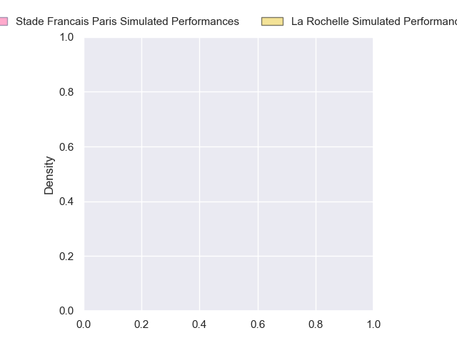
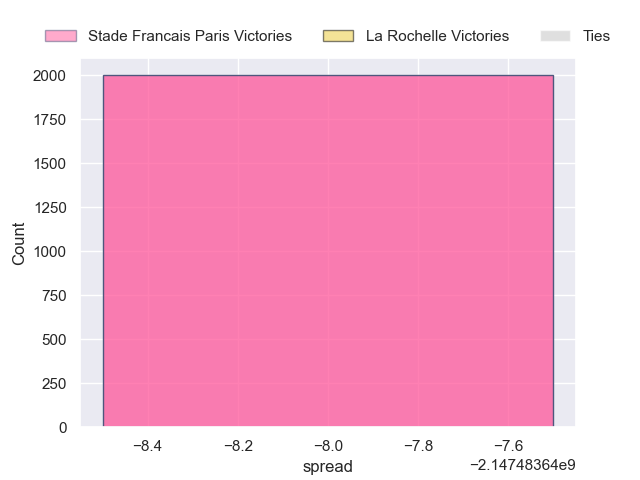
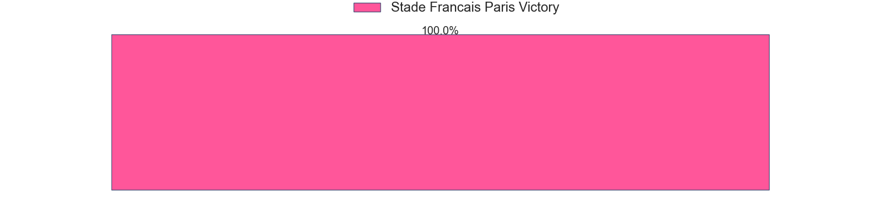

---  
layout: page  
title: Stade Francais Paris at La Rochelle  
date: 2024-11-02 18:00:00 -0500  
categories: "Top 14 2024" match projection  
---
# Stade Francais Paris at La Rochelle

# Club Level Predictions

The first set of predictions treats a club as the smallest object, as the club develops its members, organizes a gameplan, and deploys its players as needed for each match. This club model has a prediction of 0.646, which translates to predicting La Rochelle to win by 8.3.

Our Over/Under is 54.5 - and combined with the spread above, we have a predicted scoreline of 23 to 32

Each club has a rating and a rating deviation (similar to a Glicko rating), and expected performances can be generated. This allows for simulated matches and spreads like the ones below.
## Projected Performances - Club Model

## Projected Spreads - Club Model

## Projected Results - Club Model

# Player Level Predictions

Treating teams instead as an entity made up of the currently active players, I have ratings for each player in an altogether different system. These can be combined to form team ratings once teamsheets are announced, weighting starters a bit higher than the reserves. After the match is played, players can be weighted by their minutes on the field, allowing for an accurate measure of the team's composition. With these compiled team ratings, we can make predictions, measure inaccuracy, and update the individual player ratings.
## Prediction without Player Minutes: Stade Francais Paris by nan

Stade Francais Paris by nan on a neutral pitch

## Projected Performances - Player Model

## Projected Spreads - Player Model

## Projected Results - Player Model

| Away Player            |   Away Percentile |   Number |   Home Percentile | Home Player         |
|:-----------------------|------------------:|---------:|------------------:|:--------------------|
| Moses Alo-Emile        |               nan |        1 |              47.7 | Alexandre Kaddouri  |
| Lucas Peyresblanques   |               nan |        2 |             nan   | Tolu Latu           |
| Francisco Gomez Kodela |               nan |        3 |             nan   | Aleksandre Kuntelia |
| Paul Gabrillagues      |               nan |        4 |             nan   | Kane Douglas        |
| JJ van der Mescht      |               nan |        5 |             nan   | Will Skelton        |
| Tanginoa Halaifonua    |               nan |        6 |             nan   | Ultan Dillane       |
| Romain Briatte         |               nan |        7 |             nan   | nan                 |
| nan                    |               nan |        8 |             nan   | Matthias Haddad     |
| nan                    |               nan |        9 |             nan   | Tawera Kerr-Barlow  |
| nan                    |               nan |       10 |             nan   | Ihaia West          |
| nan                    |               nan |       11 |             nan   | Dillyn Leyds        |
| nan                    |               nan |       12 |             nan   | Jules Favre         |
| nan                    |               nan |       13 |             nan   | Teddy Thomas        |
| nan                    |               nan |       14 |             nan   | Jack Nowell         |
| nan                    |               nan |       15 |             nan   | Brice Dulin         |
| nan                    |               nan |       16 |             nan   | Quentin Lespiaucq   |
| nan                    |               nan |       17 |             nan   | Thierry Païva       |
| nan                    |               nan |       18 |             nan   | Thomas Lavault      |
| nan                    |               nan |       19 |             nan   | Édouard Richer      |
| nan                    |               nan |       20 |             nan   | Thomas Berjon       |
| Zack Henry             |               nan |       21 |             nan   | Antoine Hastoy      |
| Lester Etien           |               nan |       22 |             nan   | Jonathan Danty      |
| Hugo Ndiaye            |               nan |       23 |             nan   | Joel Sclavi         |

