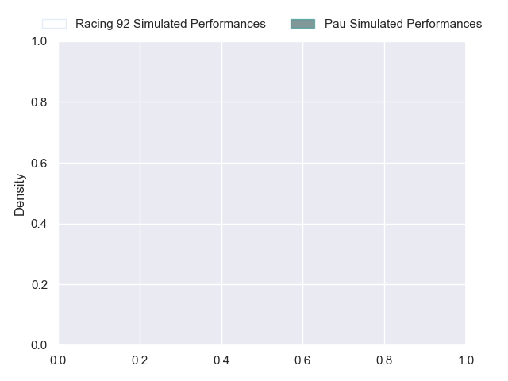
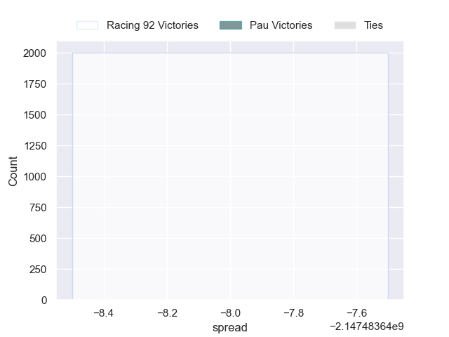

---  
layout: page  
title: Racing 92 at Pau  
date: 2024-11-02 18:00:00 -0500  
categories: "Top 14 2024" match projection  
---
# Racing 92 at Pau

# Club Level Predictions

The first set of predictions treats a club as the smallest object, as the club develops its members, organizes a gameplan, and deploys its players as needed for each match. This club model has a prediction of 0.453, which translates to predicting Racing 92 to win by -1.7.

Our Over/Under is 52.5 - and combined with the spread above, we have a predicted scoreline of 26 to 27

Each club has a rating and a rating deviation (similar to a Glicko rating), and expected performances can be generated. This allows for simulated matches and spreads like the ones below.
## Projected Performances - Club Model

## Projected Spreads - Club Model

## Projected Results - Club Model

# Player Level Predictions

Treating teams instead as an entity made up of the currently active players, I have ratings for each player in an altogether different system. These can be combined to form team ratings once teamsheets are announced, weighting starters a bit higher than the reserves. After the match is played, players can be weighted by their minutes on the field, allowing for an accurate measure of the team's composition. With these compiled team ratings, we can make predictions, measure inaccuracy, and update the individual player ratings.
## Prediction without Player Minutes: Racing 92 by nan

Racing 92 by 16.4 on a neutral pitch

## Projected Performances - Player Model

## Projected Spreads - Player Model

## Projected Results - Player Model

| Away Player         |   Away Percentile |   Number |   Home Percentile | Home Player         |
|:--------------------|------------------:|---------:|------------------:|:--------------------|
| Eddy Ben Arous      |            nan    |        1 |            nan    | Guram Papidze       |
| Janick Tarrit       |             33.77 |        2 |            nan    | Youri Delhommel     |
| Lucio Sordoni       |            nan    |        3 |            nan    | Harry Williams      |
| Boris Palu          |            nan    |        4 |            nan    | Remi Picquette      |
| Fabien Sanconnie    |            nan    |        5 |            nan    | Mickael Capelli     |
| Ibrahim Diallo      |            nan    |        6 |            nan    | Hugo Auradou        |
| Maxime Baudonne     |            nan    |        7 |            nan    | Loic Credoz         |
| Hacjivah Dayimani   |            nan    |        8 |            nan    | Sacha Zegueur       |
| Clovis Le Bail      |             36.09 |        9 |            nan    | Thibault Daubagna   |
| Owen Farrell        |            nan    |       10 |            nan    | Joe Simmonds        |
| Vinaya Habosi       |            nan    |       11 |             28.62 | Elliot Roudil       |
| Dan Lancaster       |            nan    |       12 |            nan    | Tumua Manu          |
| Josua Tuisova       |            nan    |       13 |            nan    | Nathan Decron       |
| Wame Naituvi        |             90.4  |       14 |            nan    | Aaron Grandidier    |
| Sam James           |            nan    |       15 |            nan    | Jack Maddocks       |
| Camille Chat        |            nan    |       16 |            nan    | Romain Ruffenach    |
| Lino Julien         |             54.52 |       17 |            nan    | Ignacio Calles      |
| Will Rowlands       |            nan    |       18 |            nan    | Thomas Jolmes       |
| Cameron Woki        |            nan    |       19 |            nan    | Lekima Tagitagivalu |
| Antoine Gibert      |            nan    |       20 |            nan    | Thibaut Hamonou     |
| Henry Chavancy      |            nan    |       21 |            nan    | Dan Robson          |
| Arthur Roche        |            nan    |       22 |            nan    | Theo Attissogbe     |
| Lee-Marvin Mazibuko |            nan    |       23 |            nan    | Jon Zabala          |

