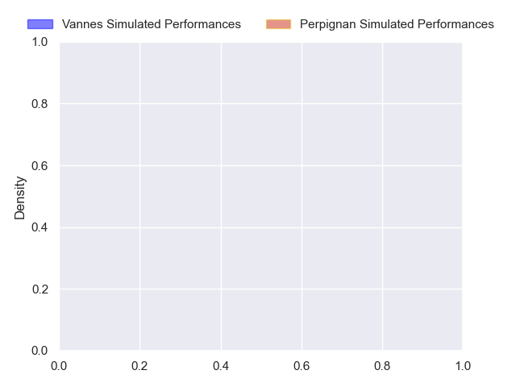
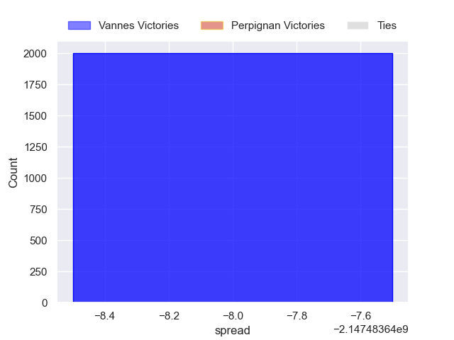

---  
layout: page  
title: Vannes at Perpignan  
date: 2024-11-02 18:00:00 -0500  
categories: "Top 14 Orange 2024" match projection  
---
# Vannes at Perpignan

# Club Level Predictions

The first set of predictions treats a club as the smallest object, as the club develops its members, organizes a gameplan, and deploys its players as needed for each match. This club model has a prediction of 0.573, which translates to predicting Perpignan to win by 5.9.

Our Over/Under is 47.5 - and combined with the spread above, we have a predicted scoreline of 21 to 27

Each club has a rating and a rating deviation (similar to a Glicko rating), and expected performances can be generated. This allows for simulated matches and spreads like the ones below.
## Projected Performances - Club Model

## Projected Spreads - Club Model

## Projected Results - Club Model

# Player Level Predictions

Treating teams instead as an entity made up of the currently active players, I have ratings for each player in an altogether different system. These can be combined to form team ratings once teamsheets are announced, weighting starters a bit higher than the reserves. After the match is played, players can be weighted by their minutes on the field, allowing for an accurate measure of the team's composition. With these compiled team ratings, we can make predictions, measure inaccuracy, and update the individual player ratings.
## Prediction without Player Minutes: Vannes by nan

Vannes by nan on a neutral pitch

## Projected Performances - Player Model

## Projected Spreads - Player Model

## Projected Results - Player Model

| Away Player         |   Away Percentile |   Number |   Home Percentile | Home Player           |
|:--------------------|------------------:|---------:|------------------:|:----------------------|
| Mako Vunipola       |            nan    |        1 |               nan | Giorgi Beria          |
| Theo Beziat         |            nan    |        2 |               nan | Ignacio Ruiz          |
| Pagakalasio Tafili  |            nan    |        3 |               nan | Kieran Brookes        |
| Eric Marks          |            nan    |        4 |               nan | Tristan Labouteley    |
| Fabrice Metz        |            nan    |        5 |               nan | Adrien Warion         |
| Karl Chateau        |             27.35 |        6 |               nan | Alan Brazo            |
| Francisco Gorrissen |            nan    |        7 |               nan | Lucas Velarte         |
| Sione Kalamafoni    |            nan    |        8 |               nan | Joaquin Oviedo        |
| Michael Ruru        |            nan    |        9 |               nan | Tom Ecochard          |
| Maxime Lafage       |            nan    |       10 |               nan | Tommaso Allan         |
| Salesi Rayasi       |            nan    |       11 |               nan | Maxim Granell         |
| Alex Arrate         |            nan    |       12 |               nan | Jeronimo de la Fuente |
| Francis Saili       |            nan    |       13 |               nan | Eneriko Buliruarua    |
| Inaki Ayarza        |            nan    |       14 |               nan | Tavite Veredamu       |
| Gwenael Duplenne    |            nan    |       15 |               nan | Antoine Aucagne       |
| Cyril Blanchard     |            nan    |       16 |               nan | Seilala Lam           |
| Charlesty Berguet   |            nan    |       17 |               nan | Giorgi Tetrashvili    |
| Timothe Mezou       |            nan    |       18 |               nan | So'otala Fa'aso'o     |
| Simon Augry         |            nan    |       19 |               nan | Lucas Bachelier       |
| Leon Boulier        |            nan    |       20 |               nan | Gela Aprasidze        |
| Stephen Varney      |              5.3  |       21 |               nan | Gabin Kretchmann      |
| Thibault Debaes     |            nan    |       22 |               nan | Louis Dupichot        |
| Santiago Medrano    |            nan    |       23 |               nan | Pietro Ceccarelli     |

