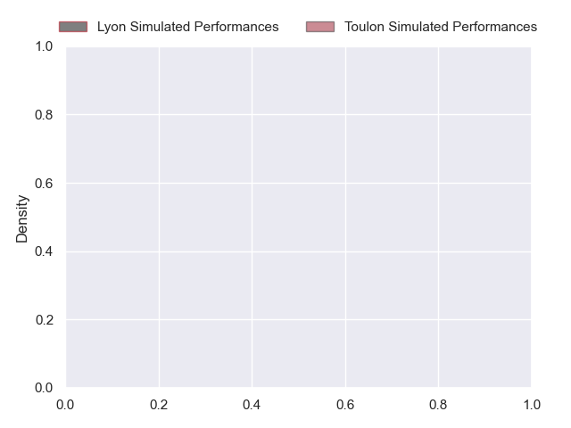
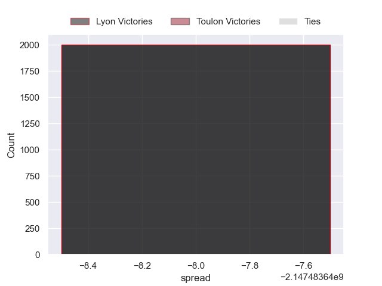

---  
layout: page  
title: Lyon at Toulon  
date: 2024-11-02 18:00:00 -0500  
categories: "Top 14 Orange 2024" match projection  
---
# Lyon at Toulon

# Club Level Predictions

The first set of predictions treats a club as the smallest object, as the club develops its members, organizes a gameplan, and deploys its players as needed for each match. This club model has a prediction of 0.582, which translates to predicting Toulon to win by 6.0.

Our Over/Under is 47.5 - and combined with the spread above, we have a predicted scoreline of 21 to 27

Each club has a rating and a rating deviation (similar to a Glicko rating), and expected performances can be generated. This allows for simulated matches and spreads like the ones below.
## Projected Performances - Club Model

## Projected Spreads - Club Model

## Projected Results - Club Model

# Player Level Predictions

Treating teams instead as an entity made up of the currently active players, I have ratings for each player in an altogether different system. These can be combined to form team ratings once teamsheets are announced, weighting starters a bit higher than the reserves. After the match is played, players can be weighted by their minutes on the field, allowing for an accurate measure of the team's composition. With these compiled team ratings, we can make predictions, measure inaccuracy, and update the individual player ratings.
## Prediction without Player Minutes: Lyon by nan

Lyon by nan on a neutral pitch

## Projected Performances - Player Model

## Projected Spreads - Player Model

## Projected Results - Player Model

| Away Player         |   Away Percentile |   Number |   Home Percentile | Home Player        |
|:--------------------|------------------:|---------:|------------------:|:-------------------|
| Jerome Rey          |            nan    |        1 |            nan    | Dany Priso         |
| Sam Matavesi        |            nan    |        2 |            nan    | Teddy Baubigny     |
| Jermaine Ainsley    |            nan    |        3 |            nan    | Kyle Sinckler      |
| Theo William        |            nan    |        4 |            nan    | David Ribbans      |
| Killian Geraci      |            nan    |        5 |            nan    | Brian Alainu'uese  |
| Steeve Blanc-Mappaz |            nan    |        6 |            nan    | Esteban Abadie     |
| Liam Allen          |             80.89 |        7 |            nan    | Charles Ollivon    |
| Maxime Gouzou       |             42.31 |        8 |            nan    | Facundo Isa        |
| Charlie Cassang     |             88.08 |        9 |            nan    | Baptiste Serin     |
| Leo Berdeu          |            nan    |       10 |            nan    | Paolo Garbisi      |
| Ethan Dumortier     |            nan    |       11 |            nan    | Jiuta Wainiqolo    |
| Semi Radradra       |            nan    |       12 |            nan    | Mathieu Smaili     |
| Alfred Parisien     |            nan    |       13 |            nan    | Antoine Frisch     |
| Xavier Mignot       |            nan    |       14 |            nan    | Seta Tuicuvu       |
| Martin Meliande     |            nan    |       15 |            nan    | Marius Domon       |
| Yanis Charcosset    |             55.52 |       16 |            nan    | Gianmarco Lucchesi |
| Hamza Kaabeche      |            nan    |       17 |            nan    | Daniel Brennan     |
| Alban Roussel       |             68.99 |       18 |            nan    | Yannick Youyoutte  |
| Dylan Cretin        |            nan    |       19 |            nan    | Selevasio Tolofua  |
| Baptiste Couilloud  |            nan    |       20 |            nan    | Enzo Herve         |
| Davit Niniashvili   |            nan    |       21 |             72.19 | Jules Danglot      |
| Beka Shvangiradze   |            nan    |       22 |            nan    | Lewis Ludlam       |
| Irakli Aptsiauri    |            nan    |       23 |            nan    | Emerick Setiano    |

