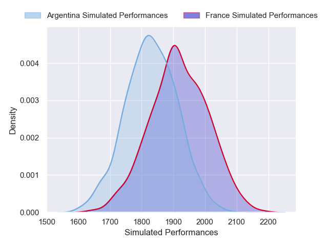
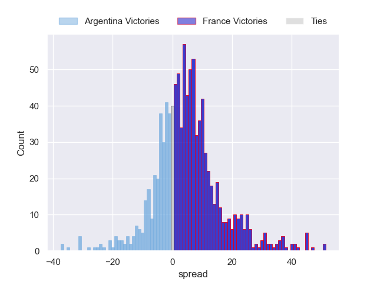
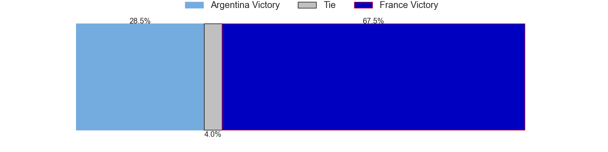
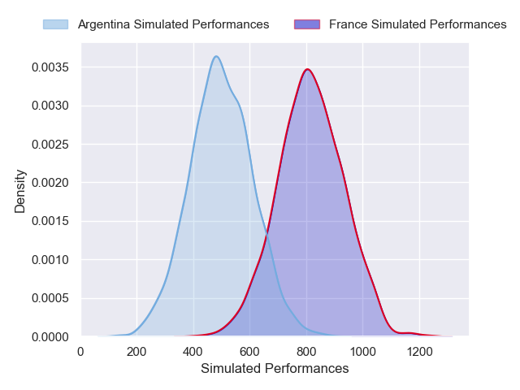
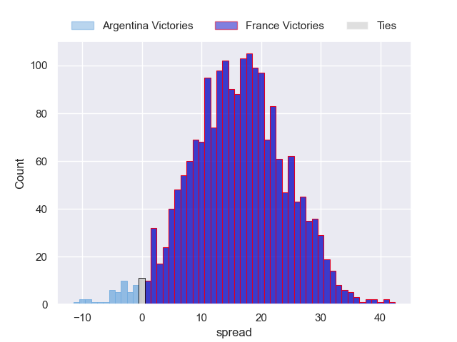
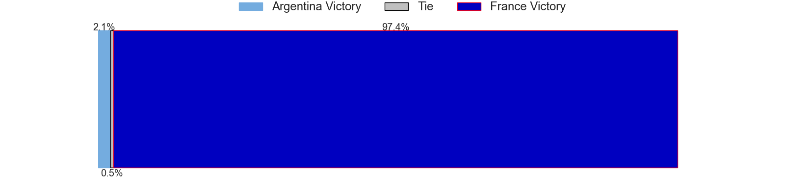

---  
layout: page  
title: Argentina at France  
date: 2024-11-22 18:00:00 -0500  
categories: "Autumn Nations Series 2024" match projection  
---
# Argentina at France

# Club Level Predictions

The first set of predictions treats a club as the smallest object, as the club develops its members, organizes a gameplan, and deploys its players as needed for each match. This club model has a prediction of 0.527, which translates to predicting France to win by 5.1.

Our Over/Under is 57.5 - and combined with the spread above, we have a predicted scoreline of 26 to 31

Each club has a rating and a rating deviation (similar to a Glicko rating), and expected performances can be generated. This allows for simulated matches and spreads like the ones below.
## Projected Performances - Club Model

## Projected Spreads - Club Model

## Projected Results - Club Model

# Player Level Predictions

Treating teams instead as an entity made up of the currently active players, I have ratings for each player in an altogether different system. These can be combined to form team ratings once teamsheets are announced, weighting starters a bit higher than the reserves. After the match is played, players can be weighted by their minutes on the field, allowing for an accurate measure of the team's composition. With these compiled team ratings, we can make predictions, measure inaccuracy, and update the individual player ratings.
## Prediction without Player Minutes: France by 16.3

France by 10.1 on a neutral pitch

## Projected Performances - Player Model

## Projected Spreads - Player Model

## Projected Results - Player Model

| Away Player            |   Away Percentile |   Number |   Home Percentile | Home Player           |
|:-----------------------|------------------:|---------:|------------------:|:----------------------|
| Thomas Gallo           |             94.67 |        1 |             97.15 | Jean-Baptiste Gros    |
| Julian Montoya         |             90.65 |        2 |             90.03 | Peato Mauvaka         |
| Joel Sclavi            |             95.05 |        3 |             97.22 | Uini Atonio           |
| Guido Petti            |             93.38 |        4 |             91.84 | Thibaud Flament       |
| Pedro Rubiolo          |             54.76 |        5 |             85.58 | Emmanuel Meafou       |
| Pablo Matera           |             99.37 |        6 |             95.07 | Francois Cros         |
| Juan Martin Gonzalez   |             95.87 |        7 |              7.35 | Paul Boudehent        |
| Joaquin Oviedo         |             92.04 |        8 |             99.46 | Charles Ollivon       |
| Gonzalo Garcia         |             67.54 |        9 |             99.67 | Antoine Dupont        |
| Tomas Albornoz         |             88.5  |       10 |             96.1  | Thomas Ramos          |
| Bautista Delguy        |             93.3  |       11 |             75.44 | Louis Bielle-Biarrey  |
| Matias Moroni          |             98.65 |       12 |             85.76 | Yoram Moefana         |
| Lucio Cinti            |             75.55 |       13 |             96.34 | Gael Fickou           |
| Rodrigo Isgro          |             92.65 |       14 |             86.11 | Gabin Villiere        |
| Juan Cruz Mallia       |            100    |       15 |             71.86 | Leo Barre             |
| Ignacio Ruiz           |             90.34 |       16 |             95.64 | Julien Marchand       |
| Ignacio Calles         |             40.51 |       17 |             87.92 | Reda Wardi            |
| Francisco Gomez Kodela |             82.22 |       18 |              7.28 | Georges-Henri Colombe |
| Franco Molina          |              7.34 |       19 |             97.94 | Alexandre Roumat      |
| Marcos Kremer          |             93    |       20 |             74.43 | Mickael Guillard      |
| Lautaro Bazan Velez    |             63.93 |       21 |             69.69 | Marko Gazzotti        |
| Santiago Carreras      |             78.24 |       22 |             82.79 | Nolann Le Garrec      |
| Mateo Carreras         |             82.23 |       23 |             65.06 | Emilien Gailleton     |

