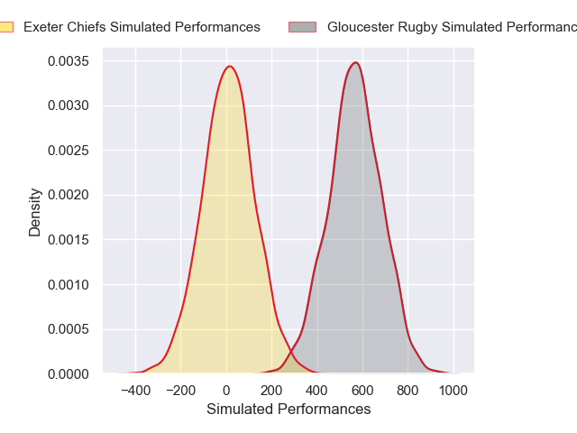
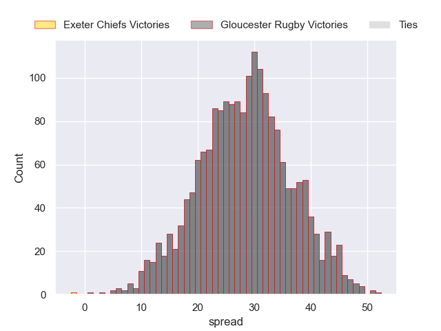

---  
layout: page  
title: Exeter Chiefs at Gloucester Rugby  
date: 2024-11-22 18:00:00 -0500  
categories: "Premiership Rugby Cup 2024" match projection  
---
# Exeter Chiefs at Gloucester Rugby

# Club Level Predictions

The first set of predictions treats a club as the smallest object, as the club develops its members, organizes a gameplan, and deploys its players as needed for each match. This club model has a prediction of 0.458, which translates to predicting Exeter Chiefs to win by -2.7.

Our Over/Under is 63.5 - and combined with the spread above, we have a predicted scoreline of 30 to 33

Each club has a rating and a rating deviation (similar to a Glicko rating), and expected performances can be generated. This allows for simulated matches and spreads like the ones below.
## Projected Performances - Club Model

## Projected Spreads - Club Model

## Projected Results - Club Model

# Player Level Predictions

Treating teams instead as an entity made up of the currently active players, I have ratings for each player in an altogether different system. These can be combined to form team ratings once teamsheets are announced, weighting starters a bit higher than the reserves. After the match is played, players can be weighted by their minutes on the field, allowing for an accurate measure of the team's composition. With these compiled team ratings, we can make predictions, measure inaccuracy, and update the individual player ratings.
## Prediction without Player Minutes: Gloucester Rugby by 28.4

Gloucester Rugby by 12.7 on a neutral pitch

## Projected Performances - Player Model

## Projected Spreads - Player Model

## Projected Results - Player Model

| Away Player          |   Away Percentile |   Number |   Home Percentile | Home Player       |
|:---------------------|------------------:|---------:|------------------:|:------------------|
| Scott Sio            |             92.12 |        1 |              8.25 | Mayco Vivas       |
| Dan Frost            |             85.98 |        2 |             67.6  | Seb Blake         |
| Marcus Street        |             22.21 |        3 |             11.48 | Ciaran Knight     |
| Rusiate Tuima        |             29.56 |        4 |             63.55 | Freddie Clarke    |
| Richard Capstick     |              4.26 |        5 |            nan    | Danny Eite        |
| Ethan Roots          |              5.92 |        6 |             68.7  | Ruan Ackermann    |
| Jacques Vermeulen    |             90.4  |        7 |             20.45 | Lewis Ludlow      |
| Greg Fisilau         |             79.61 |        8 |              9.32 | Zach Mercer       |
| Stu Townsend         |             90.82 |        9 |             80.16 | Caolan Englefield |
| Will Haydon-Wood     |             15.4  |       10 |             85.83 | Charlie Atkinson  |
| Tom Wyatt            |             94.75 |       11 |             24.72 | Ollie Thorley     |
| Will Rigg            |             94.9  |       12 |            nan    | Rory Taylor       |
| Tamati Tua           |             77.96 |       13 |             41.1  | Chris Harris      |
| Ben Hammersley       |             48.47 |       14 |             95.64 | Christian Wade    |
| Josh Hodge           |              1.4  |       15 |             90.82 | Ioan Jones        |
| Jack Innard          |            nan    |       16 |             88.79 | Jack Singleton    |
| Will Goodrick-Clarke |             77.94 |       17 |             85.82 | Val Rapava-Ruskin |
| Jimmy Roots          |            nan    |       18 |             86.2  | Afolabi Fasogban  |
| Lewis Pearson        |             76.88 |       19 |             26.93 | Arthur Clark      |
| Martin Moloney       |            nan    |       20 |             19.82 | Jack Clement      |
| Will Becconsall      |             81.48 |       21 |            nan    | Charlie Chapman   |
| Harvey Skinner       |             15.2  |       22 |            nan    | Max Knight        |
| Zack Wimbush         |             39.85 |       23 |             19.22 | Jack Reeves       |

