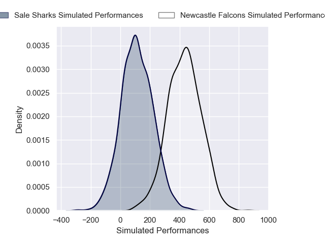
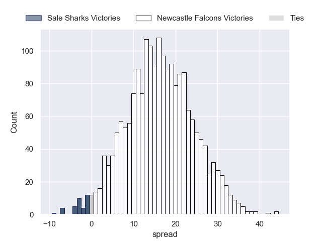
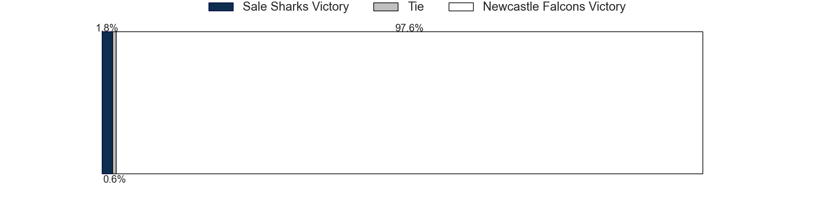

---  
layout: page  
title: Sale Sharks at Newcastle Falcons  
date: 2024-11-22 18:00:00 -0500  
categories: "Premiership Rugby Cup 2024" match projection  
---
# Sale Sharks at Newcastle Falcons

# Club Level Predictions

The first set of predictions treats a club as the smallest object, as the club develops its members, organizes a gameplan, and deploys its players as needed for each match. This club model has a prediction of 0.213, which translates to predicting Sale Sharks to win by 9.0.

Our Over/Under is 83.5 - and combined with the spread above, we have a predicted scoreline of 46 to 37

Each club has a rating and a rating deviation (similar to a Glicko rating), and expected performances can be generated. This allows for simulated matches and spreads like the ones below.
## Projected Performances - Club Model

## Projected Spreads - Club Model

## Projected Results - Club Model

# Player Level Predictions

Treating teams instead as an entity made up of the currently active players, I have ratings for each player in an altogether different system. These can be combined to form team ratings once teamsheets are announced, weighting starters a bit higher than the reserves. After the match is played, players can be weighted by their minutes on the field, allowing for an accurate measure of the team's composition. With these compiled team ratings, we can make predictions, measure inaccuracy, and update the individual player ratings.
## Prediction without Player Minutes: Newcastle Falcons by 16.4

Newcastle Falcons by 2.7 on a neutral pitch

## Projected Performances - Player Model

## Projected Spreads - Player Model

## Projected Results - Player Model

| Away Player       |   Away Percentile |   Number |   Home Percentile | Home Player         |
|:------------------|------------------:|---------:|------------------:|:--------------------|
| Bevan Rodd        |             89.65 |        1 |             68.57 | Murray McCallum     |
| Tadgh McElroy     |             42.92 |        2 |              2.02 | Jamie Blamire       |
| Nic Schonert      |              4.2  |        3 |             68.34 | Richard Palframan   |
| Ernst van Rhyn    |             67.35 |        4 |              4.53 | Sebastian de Chaves |
| Ben Bamber        |              5.08 |        5 |            nan    | Adam Scott          |
| Jean-Luc du Preez |            100    |        6 |             13    | Philip van der Walt |
| Sam Dugdale       |              7.98 |        7 |             99.1  | Tom Gordon          |
| Daniel du Preez   |             78.88 |        8 |             84.57 | Callum Chick        |
| Raffi Quirke      |             74.96 |        9 |              0.49 | Sam Stuart          |
| Tom Curtis        |            nan    |       10 |              2.26 | Brett Connon        |
| Alex Wills        |             37.18 |       11 |             68.15 | Alex Hearle         |
| Sam Bedlow        |              0.38 |       12 |             71.63 | Cameron Hutchison   |
| Luke James        |             51.99 |       13 |             47.98 | Sammy Arnold        |
| Obi Ene           |            nan    |       14 |             59.19 | Ben Stevenson       |
| Will Addison      |             72.5  |       15 |             84.06 | Ethan Grayson       |
| Harry Thompson    |            nan    |       16 |            nan    | Ollie Fletcher      |
| Tumy Onasanya     |              4.65 |       17 |            nan    | Mike Rewcastle      |
| James Harper      |              8.33 |       18 |            nan    | Callum Hancock      |
| Tom Burrow        |            nan    |       19 |            nan    | Finn Baker          |
| Rouban Birch      |              4.07 |       20 |             59.5  | Freddie Lockwood    |
| Nye Thomas        |            nan    |       21 |            nan    | Max Pepper          |
| Joe Bedlow        |            nan    |       22 |            nan    | Oli Spencer         |
| Tristan Woodman   |            nan    |       23 |            nan    | Nathan Greenwood    |

