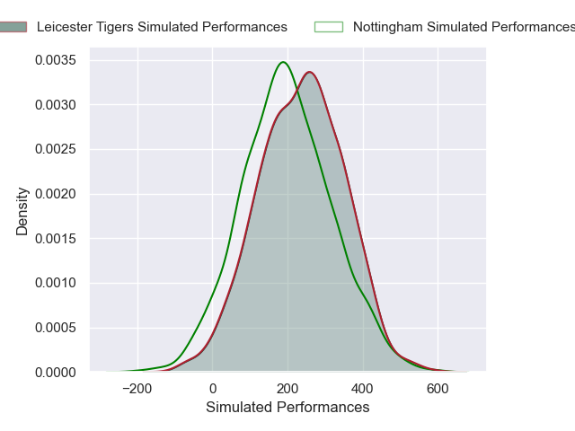
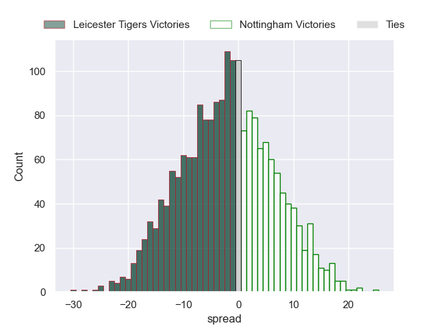

---  
layout: page  
title: Leicester Tigers at Nottingham  
date: 2024-11-22 18:00:00 -0500  
categories: "Premiership Rugby Cup 2024" match projection  
---
# Leicester Tigers at Nottingham

# Club Level Predictions

The first set of predictions treats a club as the smallest object, as the club develops its members, organizes a gameplan, and deploys its players as needed for each match. This club model has a prediction of 0.095, which translates to predicting Leicester Tigers to win by 15.9.

Our Over/Under is 74.5 - and combined with the spread above, we have a predicted scoreline of 45 to 29

Each club has a rating and a rating deviation (similar to a Glicko rating), and expected performances can be generated. This allows for simulated matches and spreads like the ones below.
## Projected Performances - Club Model

## Projected Spreads - Club Model

## Projected Results - Club Model

# Player Level Predictions

Treating teams instead as an entity made up of the currently active players, I have ratings for each player in an altogether different system. These can be combined to form team ratings once teamsheets are announced, weighting starters a bit higher than the reserves. After the match is played, players can be weighted by their minutes on the field, allowing for an accurate measure of the team's composition. With these compiled team ratings, we can make predictions, measure inaccuracy, and update the individual player ratings.
## Prediction without Player Minutes: Leicester Tigers by 1.9

Leicester Tigers by 6.5 on a neutral pitch

## Projected Performances - Player Model

## Projected Spreads - Player Model

## Projected Results - Player Model

| Away Player               |   Away Percentile |   Number |   Home Percentile | Home Player          |
|:--------------------------|------------------:|---------:|------------------:|:---------------------|
| James Whitcombe           |             68.04 |        1 |            nan    | Aniseko Sio          |
| Archie Vanes              |            nan    |        2 |            nan    | Harry Clayton        |
| Tim Hoyt                  |            nan    |        3 |             88.6  | Dan Richardson       |
| Kyle Hatherell            |              0.78 |        4 |             12.06 | Sebastian Ferreira   |
| Lewis Chessum             |            nan    |        5 |            nan    | Jack Shine           |
| Emeka Ilione              |             72.47 |        6 |            nan    | Kody Vereti          |
| Sam Williams              |            nan    |        7 |            nan    | Jacob Wright         |
| Matt Rogerson             |             89.78 |        8 |            nan    | James Cherry         |
| Ollie Allan               |            nan    |        9 |            nan    | Will Yarnell         |
| Tom Whiteley              |             71.15 |       10 |            nan    | Matthew Arden        |
| Josh Bassett              |             85.62 |       11 |            nan    | Harry Graham         |
| Solomone Kata             |             58.04 |       12 |            nan    | Javiah Pohe          |
| Izaia Perese              |             47.26 |       13 |            nan    | Kegan Christian-Goss |
| Jack Kinder               |            nan    |       14 |            nan    | David Williams       |
| Jamie Shillcock           |             63.86 |       15 |            nan    | Jack Stapley         |
| Charlie Clare             |             38.32 |       16 |            nan    | Tj Harris            |
| Bronson Kingsley-Mellowes |            nan    |       17 |            nan    | Ale Loman            |
| Henry Mountford           |            nan    |       18 |            nan    | Xavier Valentine     |
| Côme Joussain             |            nan    |       19 |            nan    | Sam Green            |
| Hanro Liebenberg          |             79.19 |       20 |            nan    | Jack Dickinson       |
| Joseph Woodward           |             59.48 |       21 |            nan    | Josh Goodwin         |
| Dan Kelly                 |             32.34 |       22 |            nan    | Jai Johal            |
| Ollie Hassell-Collins     |             81.34 |       23 |            nan    | Ryan Olowofela       |

