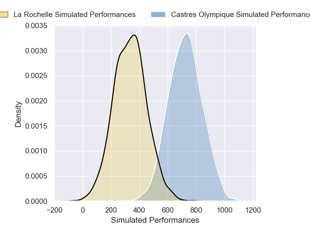
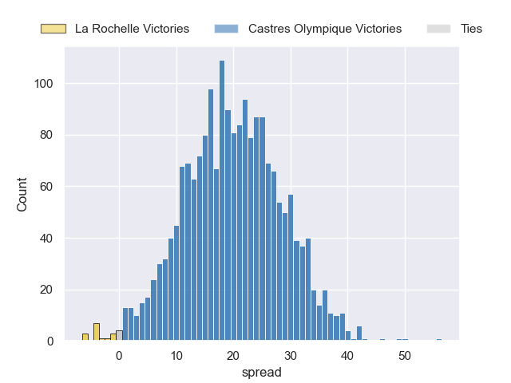
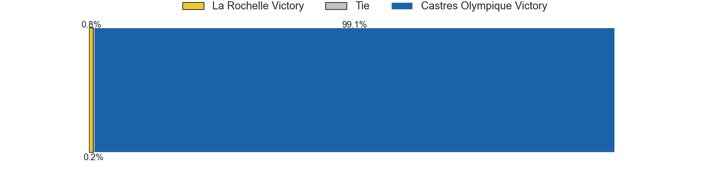

---  
layout: page  
title: La Rochelle at Castres Olympique  
date: 2024-11-23 18:00:00 -0500  
categories: "Top 14 2024" match projection  
---
# La Rochelle at Castres Olympique

# Club Level Predictions

The first set of predictions treats a club as the smallest object, as the club develops its members, organizes a gameplan, and deploys its players as needed for each match. This club model has a prediction of 0.385, which translates to predicting La Rochelle to win by 0.1.

Our Over/Under is 54.5 - and combined with the spread above, we have a predicted scoreline of 27 to 27

Each club has a rating and a rating deviation (similar to a Glicko rating), and expected performances can be generated. This allows for simulated matches and spreads like the ones below.
## Projected Performances - Club Model

## Projected Spreads - Club Model

## Projected Results - Club Model

# Player Level Predictions

Treating teams instead as an entity made up of the currently active players, I have ratings for each player in an altogether different system. These can be combined to form team ratings once teamsheets are announced, weighting starters a bit higher than the reserves. After the match is played, players can be weighted by their minutes on the field, allowing for an accurate measure of the team's composition. With these compiled team ratings, we can make predictions, measure inaccuracy, and update the individual player ratings.
## Prediction without Player Minutes: Castres Olympique by 19.9

Castres Olympique by 5.7 on a neutral pitch

## Projected Performances - Player Model

## Projected Spreads - Player Model

## Projected Results - Player Model

| Away Player         |   Away Percentile |   Number |   Home Percentile | Home Player           |
|:--------------------|------------------:|---------:|------------------:|:----------------------|
| Alexandre Kaddouri  |             64.52 |        1 |             65.64 | Quentin Walcker       |
| Tolu Latu           |             65.47 |        2 |             90.67 | Gaetan Barlot         |
| Karl Sorin          |            nan    |        3 |             87.55 | Will Collier          |
| Thomas Lavault      |             82.14 |        4 |             18.5  | Guillaume Ducat       |
| Kane Douglas        |             69.99 |        5 |             96.19 | Leone Nakarawa        |
| Oscar Jegou         |             75.25 |        6 |             22.96 | Mathieu Babillot      |
| Jonathan Danty      |             70.96 |        7 |             72.38 | Baptiste Cope         |
| Matthias Haddad     |             59.88 |        8 |             27.52 | Abraham Papali'i      |
| Tawera Kerr-Barlow  |             97.22 |        9 |             71.19 | Santiago Arata        |
| Antoine Hastoy      |             36.96 |       10 |             85    | Louis Le Brun         |
| Jules Favre         |             80    |       11 |             91.77 | Remy Baget            |
| Ulupano Seuteni     |             77.12 |       12 |             94.9  | Jack Goodhue          |
| Teddy Thomas        |             73.56 |       13 |             11.06 | Adrien Seguret        |
| Nathan Bollengier   |            nan    |       14 |             98.55 | Geoffrey Palis        |
| Dillyn Leyds        |             97.42 |       15 |             72.11 | Julien Dumora         |
| Quentin Lespiaucq   |             66.72 |       16 |             40.75 | Pierre Colonna        |
| Louis Penverne      |             30.38 |       17 |             92.87 | Lois Guerois-Galisson |
| Simon Huchet        |            nan    |       18 |              7.71 | Gauthier Maravat      |
| Édouard Richer      |            nan    |       19 |             90.22 | Baptiste Delaporte    |
| Tyreese Leupolu     |            nan    |       20 |             69.07 | Jeremy Fernandez      |
| Thomas Berjon       |             88.31 |       21 |             84.33 | Adrea Cocagi          |
| Hugo Reus           |             65.09 |       22 |             58.57 | Theo Chabouni         |
| Aleksandre Kuntelia |             21.38 |       23 |             27.16 | Nicolas Corato        |

