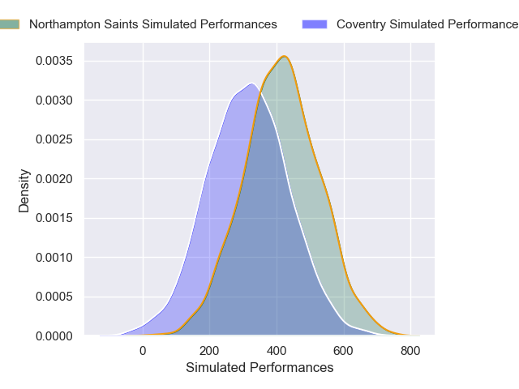
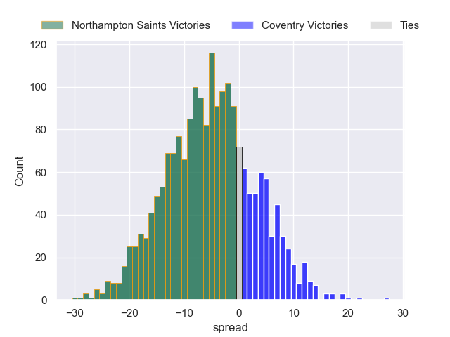

---  
layout: page  
title: Northampton Saints at Coventry  
date: 2024-11-23 18:00:00 -0500  
categories: "Premiership Rugby Cup 2024" match projection  
---
# Northampton Saints at Coventry

# Club Level Predictions

The first set of predictions treats a club as the smallest object, as the club develops its members, organizes a gameplan, and deploys its players as needed for each match. This club model has a prediction of 0.32, which translates to predicting Northampton Saints to win by 4.2.

Our Over/Under is 56.5 - and combined with the spread above, we have a predicted scoreline of 31 to 26

Each club has a rating and a rating deviation (similar to a Glicko rating), and expected performances can be generated. This allows for simulated matches and spreads like the ones below.
## Projected Performances - Club Model

## Projected Spreads - Club Model

## Projected Results - Club Model

# Player Level Predictions

Treating teams instead as an entity made up of the currently active players, I have ratings for each player in an altogether different system. These can be combined to form team ratings once teamsheets are announced, weighting starters a bit higher than the reserves. After the match is played, players can be weighted by their minutes on the field, allowing for an accurate measure of the team's composition. With these compiled team ratings, we can make predictions, measure inaccuracy, and update the individual player ratings.
## Prediction without Player Minutes: Northampton Saints by 5.2

Northampton Saints by 8.7 on a neutral pitch

## Projected Performances - Player Model

## Projected Spreads - Player Model

## Projected Results - Player Model

| Away Player             |   Away Percentile |   Number |   Home Percentile | Home Player        |
|:------------------------|------------------:|---------:|------------------:|:-------------------|
| Tarek Haffar            |            nan    |        1 |               nan | Vilikesa Nairau    |
| Craig Wright            |            nan    |        2 |               nan | Jordon Poole       |
| Luke Green              |             69.58 |        3 |               nan | Matt Johnson       |
| Tom Lockett             |             24.93 |        4 |               nan | Obinna Nkwocha     |
| Chunya Munga            |             85.04 |        5 |               nan | Senitiki Nayalo    |
| Tom Pearson             |             97.58 |        6 |               nan | Tom Ball           |
| Henry Pollock           |             95.7  |        7 |               nan | Aaron Hinkley      |
| Juarno Augustus         |             67.05 |        8 |               nan | Matt Kvesic        |
| Archie McParland        |             91.49 |        9 |               nan | Josh Barton        |
| George Makepeace-Cubitt |             72.07 |       10 |               nan | Tommy Mathews      |
| Tom Seabrook            |             12.66 |       11 |               nan | Ryan Hutler        |
| Rory Hutchinson         |             84.62 |       12 |               nan | Tom Hitchcock      |
| Tom Litchfield          |             78.27 |       13 |               nan | Dafydd-Rhys Tiueti |
| James Ramm              |             83.95 |       14 |               nan | David Opoku        |
| George Hendy            |             94.22 |       15 |               nan | Charlie Robson     |
| Curtis Langdon          |             93.16 |       16 |               nan | Suva Ma'Asi        |
| Emmanuel Iyogun         |             49.81 |       17 |               nan | Jevaughn Warren    |
| Trevor Davison          |             98.72 |       18 |               nan | Eliot Salt         |
| Gavin Thornbury         |             94.83 |       19 |               nan | Rhys Anstey        |
| Angus Scott-Young       |             60.18 |       20 |               nan | James Tyas         |
| Tom James               |              7.04 |       21 |               nan | Will Lane          |
| Charlie Savala          |             27.02 |       22 |               nan | James Martin       |
| Will Glister            |            nan    |       23 |               nan | Chester Owen       |

