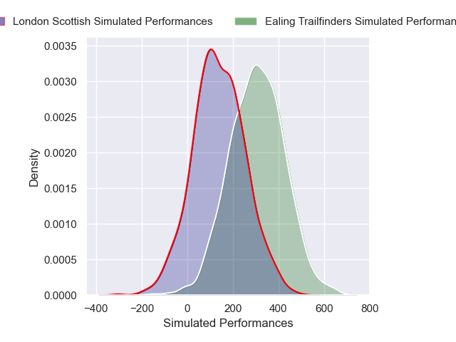
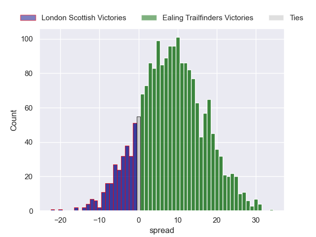
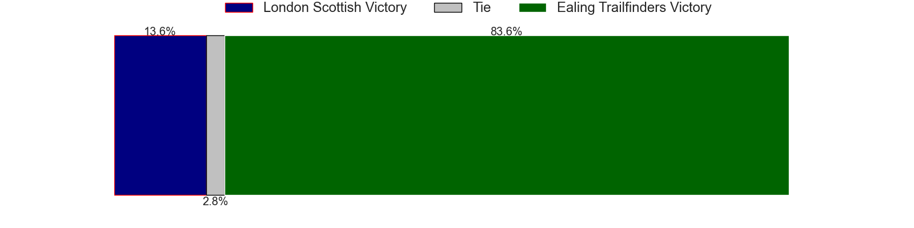

---  
layout: page  
title: London Scottish at Ealing Trailfinders  
date: 2024-11-23 18:00:00 -0500  
categories: "Premiership Rugby Cup 2024" match projection  
---
# London Scottish at Ealing Trailfinders

# Club Level Predictions

The first set of predictions treats a club as the smallest object, as the club develops its members, organizes a gameplan, and deploys its players as needed for each match. This club model has a prediction of 0.907, which translates to predicting Ealing Trailfinders to win by 24.5.

Our Over/Under is 69.5 - and combined with the spread above, we have a predicted scoreline of 23 to 47

Each club has a rating and a rating deviation (similar to a Glicko rating), and expected performances can be generated. This allows for simulated matches and spreads like the ones below.
## Projected Performances - Club Model

## Projected Spreads - Club Model

## Projected Results - Club Model

# Player Level Predictions

Treating teams instead as an entity made up of the currently active players, I have ratings for each player in an altogether different system. These can be combined to form team ratings once teamsheets are announced, weighting starters a bit higher than the reserves. After the match is played, players can be weighted by their minutes on the field, allowing for an accurate measure of the team's composition. With these compiled team ratings, we can make predictions, measure inaccuracy, and update the individual player ratings.
## Prediction without Player Minutes: Ealing Trailfinders by 9.0

Ealing Trailfinders by 4.8 on a neutral pitch

## Projected Performances - Player Model

## Projected Spreads - Player Model

## Projected Results - Player Model

| Away Player        |   Away Percentile |   Number |   Home Percentile | Home Player         |
|:-------------------|------------------:|---------:|------------------:|:--------------------|
| Tom Osborne        |               nan |        1 |            nan    | Lefty Zigiriadis    |
| Austin Wallis      |               nan |        2 |             72.32 | Matt Cornish        |
| Ntinga Mpiko       |               nan |        3 |             30.61 | Biyi Alo            |
| Matt Wilkinson     |               nan |        4 |            nan    | Matas Jurevicius    |
| Harry Browne       |               nan |        5 |            nan    | Danny Cutmore       |
| Will Trenholm      |               nan |        6 |            nan    | Josh Taylor         |
| Jack Ingall        |               nan |        7 |             67.89 | Jordy Reid          |
| Zach Carr          |               nan |        8 |             62.79 | Rayn Smid           |
| Stephen Kerins     |               nan |        9 |            nan    | Michael Stronge     |
| Josh Bellamy       |               nan |       10 |            nan    | Craig Willis        |
| Will Brown         |               nan |       11 |            nan    | Ben Harris          |
| Will Simonds       |               nan |       12 |             78.65 | Jordan Holgate      |
| Hayden Hyde        |               nan |       13 |            nan    | Francis Moore       |
| Roma Zheng         |               nan |       14 |            nan    | Angus Kernohan      |
| Will Talbot-Davies |               nan |       15 |             75.5  | Max Bodilly         |
| Jack Musk          |               nan |       16 |            nan    | Henry Walker        |
| D'Arcy Mulrooney   |               nan |       17 |            nan    | James Kenny         |
| Ash Challenger     |               nan |       18 |            nan    | Kabous Bezuidenhout |
| Jake Spurway       |               nan |       19 |             75.16 | Bobby De Wee        |
| Ioan Rhys-Davies   |               nan |       20 |            nan    | Will Montgomery     |
| Jonny Law          |               nan |       21 |             73.32 | Craig Hampson       |
| Alec Lloyd-Seed    |               nan |       22 |            nan    | George Worboys      |
| Robbie Mccallum    |               nan |       23 |            nan    | Michael Dykes       |

