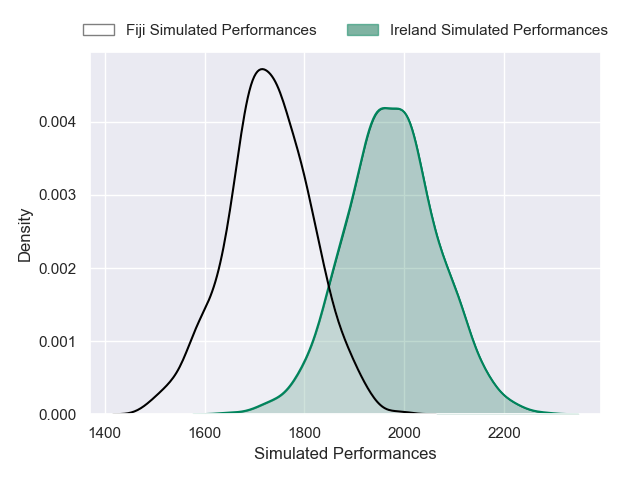
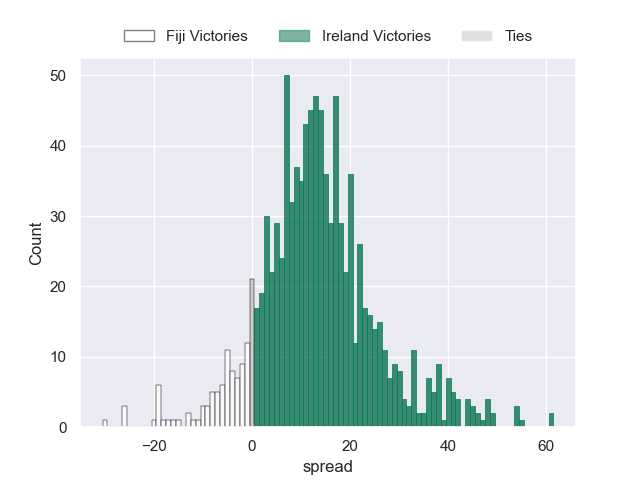
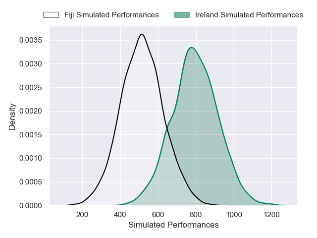
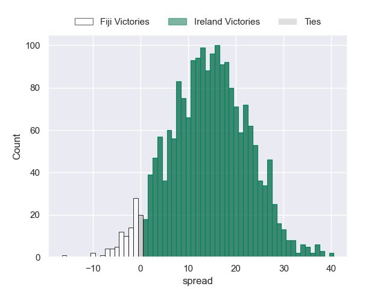

---  
layout: page  
title: Fiji at Ireland  
date: 2024-11-23 18:00:00 -0500  
categories: "Autumn Nations Series 2024" match projection  
---
# Fiji at Ireland

# Club Level Predictions

The first set of predictions treats a club as the smallest object, as the club develops its members, organizes a gameplan, and deploys its players as needed for each match. This club model has a prediction of 0.738, which translates to predicting Ireland to win by 13.5.

Our Over/Under is 47.5 - and combined with the spread above, we have a predicted scoreline of 17 to 30

Each club has a rating and a rating deviation (similar to a Glicko rating), and expected performances can be generated. This allows for simulated matches and spreads like the ones below.
## Projected Performances - Club Model

## Projected Spreads - Club Model

## Projected Results - Club Model

# Player Level Predictions

Treating teams instead as an entity made up of the currently active players, I have ratings for each player in an altogether different system. These can be combined to form team ratings once teamsheets are announced, weighting starters a bit higher than the reserves. After the match is played, players can be weighted by their minutes on the field, allowing for an accurate measure of the team's composition. With these compiled team ratings, we can make predictions, measure inaccuracy, and update the individual player ratings.
## Prediction without Player Minutes: Ireland by 14.3

Ireland by 8.7 on a neutral pitch

## Projected Performances - Player Model

## Projected Spreads - Player Model

## Projected Results - Player Model

| Away Player                    |   Away Percentile |   Number |   Home Percentile | Home Player        |
|:-------------------------------|------------------:|---------:|------------------:|:-------------------|
| Eroni Mawi                     |             95.72 |        1 |             90.85 | Andrew Porter      |
| Tevita Ikanivere               |             92.69 |        2 |            100    | Gus McCarthy       |
| Luke Tagi                      |             79.82 |        3 |             70.22 | Finlay Bealham     |
| Mesake Vocevoce                |             83.86 |        4 |             40.25 | Joe McCarthy       |
| Temo Mayanavanua               |             98.55 |        5 |             92.65 | Tadhg Beirne       |
| Meli Derenalagi                |             73.72 |        6 |             74.08 | Cormac Izuchukwu   |
| Kitione Salawa                 |             28.16 |        7 |             97.31 | Josh van der Flier |
| Elia Canakaivata               |             74.22 |        8 |             88.95 | Caelan Doris       |
| Frank Lomani                   |             91.33 |        9 |              6.55 | Craig Casey        |
| Caleb Muntz                    |             87.68 |       10 |             22.59 | Sam Prendergast    |
| Ponipate Loganimasi            |             65.81 |       11 |             84.11 | Jacob Stockdale    |
| Josua Tuisova                  |             95.1  |       12 |             96.25 | Bundee Aki         |
| Waisea Nayacalevu Vuidravuwalu |             85.48 |       13 |             87.5  | Robbie Henshaw     |
| Jiuta Wainiqolo                |             95.16 |       14 |             65.73 | Mack Hansen        |
| Vuate Karawalevu               |             61.95 |       15 |             94.52 | Jamie Osborne      |
| Sam Matavesi                   |             84.29 |       16 |             85.23 | Ronan Kelleher     |
| Haereiti Hetet                 |             96.4  |       17 |             48.31 | Tom O'Toole        |
| Samu Tawake                    |             14.1  |       18 |             83.65 | Thomas Clarkson    |
| Setareki Turagacoke            |            nan    |       19 |            nan    | nan                |
| Albert Tuisue                  |             98.84 |       20 |             15.7  | Cian Prendergast   |
| Peni Matawalu                  |             71.69 |       21 |             97.71 | Conor Murray       |
| Vilimoni Botitu                |             32.69 |       22 |             53.8  | Ciaran Frawley     |
| Sireli Maqala                  |             63.65 |       23 |             85.29 | Stuart McCloskey   |

