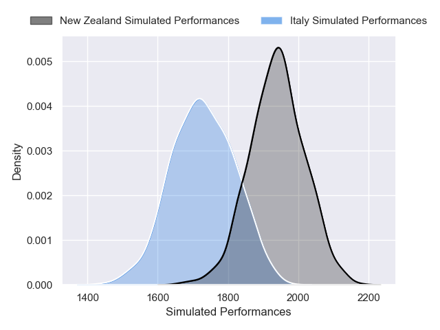
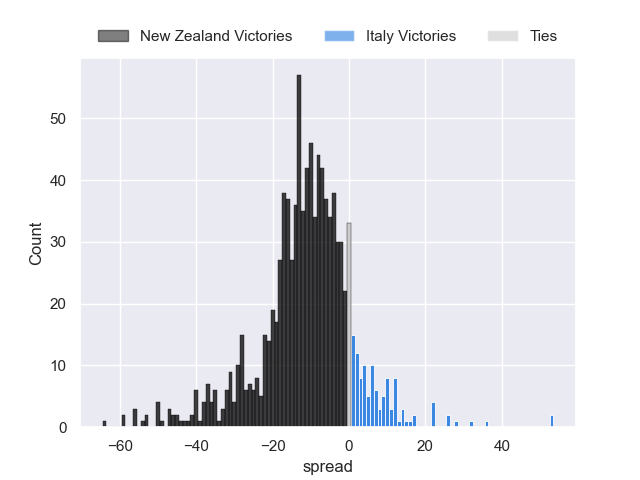
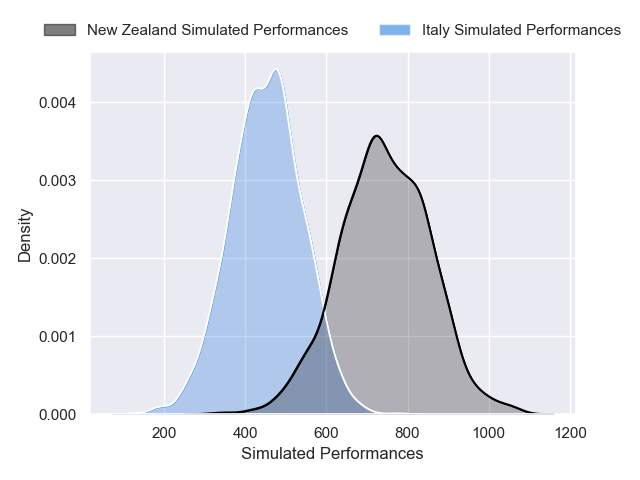
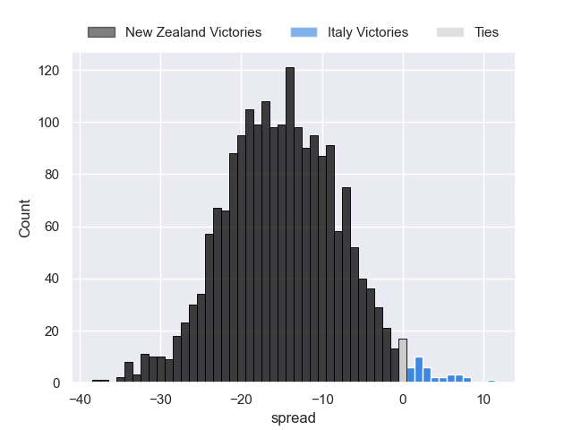

---  
layout: page  
title: New Zealand at Italy  
date: 2024-11-23 18:00:00 -0500  
categories: "Autumn Nations Series 2024" match projection  
---
# New Zealand at Italy

# Club Level Predictions

The first set of predictions treats a club as the smallest object, as the club develops its members, organizes a gameplan, and deploys its players as needed for each match. This club model has a prediction of 0.165, which translates to predicting New Zealand to win by 11.3.

Our Over/Under is 48.5 - and combined with the spread above, we have a predicted scoreline of 30 to 19

Each club has a rating and a rating deviation (similar to a Glicko rating), and expected performances can be generated. This allows for simulated matches and spreads like the ones below.
## Projected Performances - Club Model

## Projected Spreads - Club Model

## Projected Results - Club Model

# Player Level Predictions

Treating teams instead as an entity made up of the currently active players, I have ratings for each player in an altogether different system. These can be combined to form team ratings once teamsheets are announced, weighting starters a bit higher than the reserves. After the match is played, players can be weighted by their minutes on the field, allowing for an accurate measure of the team's composition. With these compiled team ratings, we can make predictions, measure inaccuracy, and update the individual player ratings.
## Prediction without Player Minutes: New Zealand by 15.1

New Zealand by 20.4 on a neutral pitch

## Projected Performances - Player Model

## Projected Spreads - Player Model

## Projected Results - Player Model

| Away Player         |   Away Percentile |   Number |   Home Percentile | Home Player        |
|:--------------------|------------------:|---------:|------------------:|:-------------------|
| Ethan de Groot      |             78.32 |        1 |            nan    | nan                |
| Codie Taylor        |             96.57 |        2 |            nan    | nan                |
| Tyrel Lomax         |             94    |        3 |            nan    | nan                |
| Scott Barrett       |             96.1  |        4 |            nan    | nan                |
| Patrick Tuipulotu   |             97.55 |        5 |            nan    | nan                |
| Wallace Sititi      |             94.56 |        6 |            nan    | nan                |
| Sam Cane            |             99.73 |        7 |            nan    | nan                |
| Ardie Savea         |             99.55 |        8 |            nan    | nan                |
| Cam Roigard         |             72.46 |        9 |             47.21 | Martin Page-Relo   |
| Beauden Barrett     |             99.59 |       10 |             79.26 | Paolo Garbisi      |
| Caleb Clarke        |             94.51 |       11 |             95.56 | Monty Ioane        |
| Anton Lienert-Brown |             95.57 |       12 |             87.87 | Tommaso Menoncello |
| Rieko Ioane         |             86.91 |       13 |             92.69 | Juan Ignacio Brex  |
| Mark Tele'a         |             98.38 |       14 |             18.58 | Jacopo Trulla      |
| Will Jordan         |             99.4  |       15 |             97.41 | Ange Capuozzo      |
| Asafo Aumua         |             94.55 |       16 |             95.17 | Giacomo Nicotera   |
| Ofa Tu'ungafasi     |             98.2  |       17 |             40.59 | Mirco Spagnolo     |
| Fletcher Newell     |              2.48 |       18 |             91.15 | Simone Ferrari     |
| Tupou Vaa'i         |             97.91 |       19 |             68.81 | Niccolo Cannone    |
| Peter Lakai         |             95.15 |       20 |             49.06 | Alessandro Izekor  |
| TJ Perenara         |             98.03 |       21 |             46.07 | Alessandro Garbisi |
| David Havili        |             91.82 |       22 |            nan    | nan                |
| Damian McKenzie     |             97.33 |       23 |             68.72 | Marco Zanon        |

