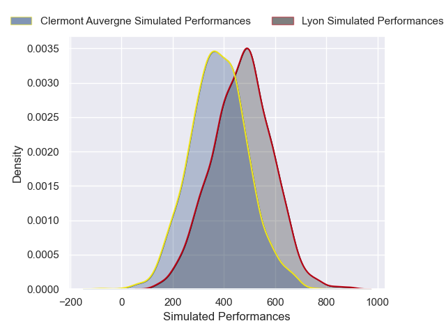
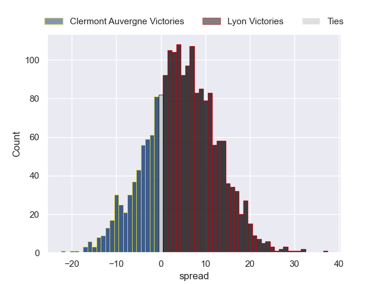
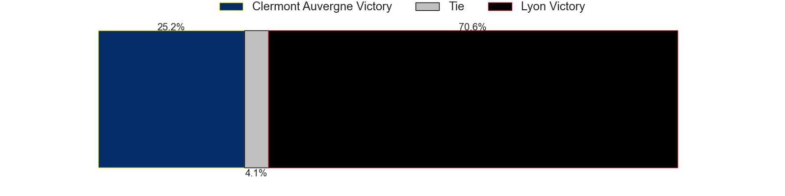

---  
layout: page  
title: Clermont Auvergne at Lyon  
date: 2024-11-23 18:00:00 -0500  
categories: "Top 14 2024" match projection  
---
# Clermont Auvergne at Lyon

# Club Level Predictions

The first set of predictions treats a club as the smallest object, as the club develops its members, organizes a gameplan, and deploys its players as needed for each match. This club model has a prediction of 0.474, which translates to predicting Clermont Auvergne to win by -3.0.

Our Over/Under is 57.5 - and combined with the spread above, we have a predicted scoreline of 27 to 30

Each club has a rating and a rating deviation (similar to a Glicko rating), and expected performances can be generated. This allows for simulated matches and spreads like the ones below.
## Projected Performances - Club Model

## Projected Spreads - Club Model

## Projected Results - Club Model

# Player Level Predictions

Treating teams instead as an entity made up of the currently active players, I have ratings for each player in an altogether different system. These can be combined to form team ratings once teamsheets are announced, weighting starters a bit higher than the reserves. After the match is played, players can be weighted by their minutes on the field, allowing for an accurate measure of the team's composition. With these compiled team ratings, we can make predictions, measure inaccuracy, and update the individual player ratings.
## Prediction without Player Minutes: Lyon by 4.8

Clermont Auvergne by 7.6 on a neutral pitch

## Projected Performances - Player Model

## Projected Spreads - Player Model

## Projected Results - Player Model

| Away Player          |   Away Percentile |   Number |   Home Percentile | Home Player          |
|:---------------------|------------------:|---------:|------------------:|:---------------------|
| Sacha Lotrian        |             25.28 |        1 |             16.2  | Jerome Rey           |
| Etienne Fourcade     |             73.72 |        2 |             48.99 | Yanis Charcosset     |
| Cristian Ojovan      |             37.66 |        3 |             26.48 | Jermaine Ainsley     |
| Thibaud Lanen        |             87.31 |        4 |             72.98 | Felix Lambey         |
| Thomas Ceyte         |             44.42 |        5 |             93.74 | Tomas Lavanini       |
| Pita Gus Sowakula    |             87.35 |        6 |             65.29 | Dylan Cretin         |
| Alexandre Fischer    |             74.17 |        7 |             79.19 | Liam Allen           |
| Fritz Lee            |             88.37 |        8 |             58.33 | Beka Shvangiradze    |
| Baptiste Jauneau     |             73    |        9 |             91.98 | Baptiste Couilloud   |
| Benjamin Urdapilleta |             71.87 |       10 |              7.37 | Martin Meliande      |
| Joris Jurand         |             86.37 |       11 |             90.08 | Vincent Rattez       |
| George Moala         |             89.42 |       12 |              3.94 | Josiah Maraku        |
| Pierre Fouyssac      |             10.58 |       13 |             69.13 | Alfred Parisien      |
| Lucas Tauzin         |             79.81 |       14 |             74.44 | Xavier Mignot        |
| Alex Newsome         |             62.75 |       15 |             54.98 | Alexandre Tchaptchet |
| Barnabe Massa        |             71.7  |       16 |            nan    | Baptiste Narmand     |
| Etienne Falgoux      |             78.92 |       17 |             15.83 | Hamza Kaabeche       |
| Peceli Yato          |             36.41 |       18 |             11.24 | Theo William         |
| Anthime Hemery       |             79.64 |       19 |             42.87 | Marvin Okuya         |
| Sebastien Bezy       |             75.45 |       20 |             84.45 | Charlie Cassang      |
| Anthony Belleau      |             95.28 |       21 |            nan    | Fletcher Smith       |
| Leon Darricarrere    |             80.48 |       22 |             41.77 | Ethan Dumortier      |
| Michael Ala'alatoa   |             89.2  |       23 |             69.02 | Cedate Gomes Sa      |

