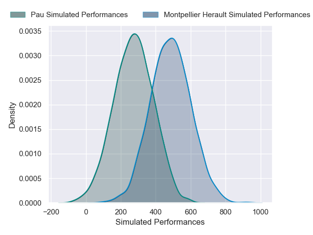
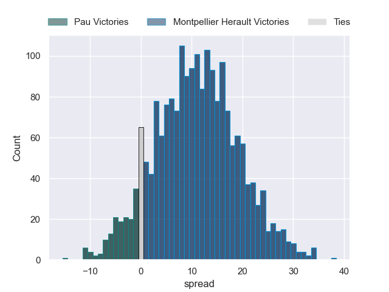
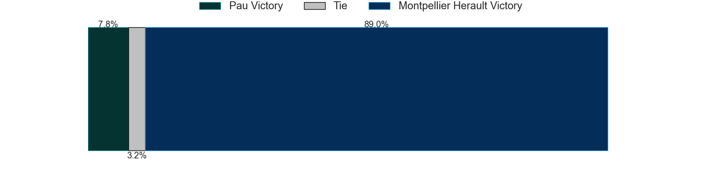

---  
layout: page  
title: Pau at Montpellier Herault  
date: 2024-11-23 18:00:00 -0500  
categories: "Top 14 2024" match projection  
---
# Pau at Montpellier Herault

# Club Level Predictions

The first set of predictions treats a club as the smallest object, as the club develops its members, organizes a gameplan, and deploys its players as needed for each match. This club model has a prediction of 0.531, which translates to predicting Montpellier Herault to win by 4.5.

Our Over/Under is 43.5 - and combined with the spread above, we have a predicted scoreline of 20 to 24

Each club has a rating and a rating deviation (similar to a Glicko rating), and expected performances can be generated. This allows for simulated matches and spreads like the ones below.
## Projected Performances - Club Model

## Projected Spreads - Club Model

## Projected Results - Club Model

# Player Level Predictions

Treating teams instead as an entity made up of the currently active players, I have ratings for each player in an altogether different system. These can be combined to form team ratings once teamsheets are announced, weighting starters a bit higher than the reserves. After the match is played, players can be weighted by their minutes on the field, allowing for an accurate measure of the team's composition. With these compiled team ratings, we can make predictions, measure inaccuracy, and update the individual player ratings.
## Prediction without Player Minutes: Montpellier Herault by 10.6

Pau by 1.5 on a neutral pitch

## Projected Performances - Player Model

## Projected Spreads - Player Model

## Projected Results - Player Model

| Away Player        |   Away Percentile |   Number |   Home Percentile | Home Player                 |
|:-------------------|------------------:|---------:|------------------:|:----------------------------|
| Lekso Kaulashvili  |             88.82 |        1 |              3    | Baptiste Erdocio            |
| Romain Ruffenach   |             69.83 |        2 |             16.33 | Jordan Uelese               |
| Guram Papidze      |             15.75 |        3 |             43.59 | Wilfrid Hounkpatin          |
| Hugo Auradou       |             33    |        4 |             90.84 | Yacouba Camara              |
| Remi Picquette     |             37.26 |        5 |             71.26 | Bastien Chalureau           |
| Joel Kpoku         |             61.97 |        6 |             86.64 | Nicolaas Janse van Rensburg |
| Loic Credoz        |             17.04 |        7 |             47.26 | Alexandre Becognee          |
| Sacha Zegueur      |             25.58 |        8 |             99.03 | Billy Vunipola              |
| Thibault Daubagna  |             87.73 |        9 |             23.61 | Leo Coly                    |
| Joe Simmonds       |             65.5  |       10 |              5.54 | Thomas Vincent              |
| Aymeric Luc        |             26.53 |       11 |             93.71 | Madosh Tambwe               |
| Nathan Decron      |             59.81 |       12 |             70.29 | Jan Serfontein              |
| Olivier Klemenczak |              3.75 |       13 |             20.58 | Auguste Cadot               |
| Clement Laporte    |             97.82 |       14 |             19.19 | Mael Moustin                |
| Jack Maddocks      |             78.09 |       15 |             80.68 | Julien Tisseron             |
| Youri Delhommel    |             63.76 |       16 |             86.78 | Christopher Tolofua         |
| Daniel Bibi Biziwu |              5.03 |       17 |             64.29 | Enzo Forletta               |
| Thomas Jolmes      |             17.23 |       18 |             60.29 | Tyler Duguid                |
| Reece Hewat        |             79.82 |       19 |             88.43 | Lenni Nouchi                |
| Thomas Souverbie   |            nan    |       20 |             95.42 | Ryan Louwrens               |
| Axel Desperes      |             89.53 |       21 |             11.35 | Arthur Vincent              |
| Fabien Brau-Boirie |             46.44 |       22 |             82.67 | Joshua Moorby               |
| Jon Zabala         |             58.29 |       23 |            nan    | Mohamed Haouas              |

