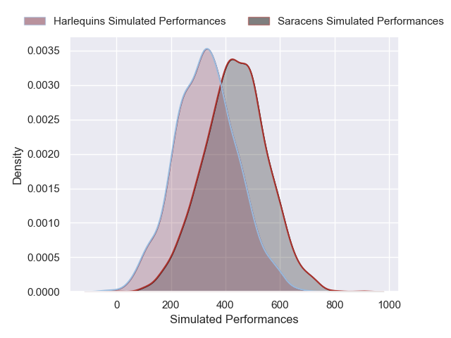
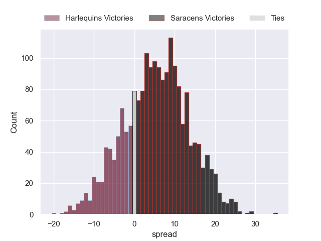

---  
layout: page  
title: Harlequins at Saracens  
date: 2024-11-23 18:00:00 -0500  
categories: "Premiership Rugby Cup 2024" match projection  
---
# Harlequins at Saracens

# Club Level Predictions

The first set of predictions treats a club as the smallest object, as the club develops its members, organizes a gameplan, and deploys its players as needed for each match. This club model has a prediction of 0.555, which translates to predicting Saracens to win by 5.7.

Our Over/Under is 54.5 - and combined with the spread above, we have a predicted scoreline of 24 to 30

Each club has a rating and a rating deviation (similar to a Glicko rating), and expected performances can be generated. This allows for simulated matches and spreads like the ones below.
## Projected Performances - Club Model

## Projected Spreads - Club Model

## Projected Results - Club Model

# Player Level Predictions

Treating teams instead as an entity made up of the currently active players, I have ratings for each player in an altogether different system. These can be combined to form team ratings once teamsheets are announced, weighting starters a bit higher than the reserves. After the match is played, players can be weighted by their minutes on the field, allowing for an accurate measure of the team's composition. With these compiled team ratings, we can make predictions, measure inaccuracy, and update the individual player ratings.
## Prediction without Player Minutes: Saracens by 5.3

Harlequins by 5.7 on a neutral pitch

## Projected Performances - Player Model

## Projected Spreads - Player Model

## Projected Results - Player Model

| Away Player      |   Away Percentile |   Number |   Home Percentile | Home Player        |
|:-----------------|------------------:|---------:|------------------:|:-------------------|
| Jordan Els       |             45.31 |        1 |             41.26 | Rhys Carre         |
| Jack Walker      |             15.86 |        2 |             82.74 | James Hadfield     |
| Dillon Lewis     |             94.9  |        3 |             78.54 | Alec Clarey        |
| Irne Herbst      |             28.38 |        4 |            nan    | Harry Wilson       |
| Stephan Lewies   |             76.7  |        5 |            nan    | Kennedy Sylvester  |
| Jack Kenningham  |             92.11 |        6 |            nan    | Max Eke            |
| Tom Lawday       |            nan    |        7 |             66.46 | Toby Knight        |
| James Chisholm   |             93.6  |        8 |            nan    | Nathan Michelow    |
| Lucas Friday     |            nan    |        9 |            nan    | Charlie Bracken    |
| Jamie Benson     |            nan    |       10 |             10.06 | Tiff Eden          |
| Nick David       |             87.98 |       11 |             73.87 | Rotimi Segun       |
| Lennox Anyanwu   |             79.62 |       12 |             36.83 | Olly Hartley       |
| Sean Kerr        |            nan    |       13 |             35.48 | Sam Spink          |
| Cameron Anderson |             62.9  |       14 |             73.23 | Tobias Elliott     |
| Tyrone Green     |             55.58 |       15 |             88.65 | Tom Parton         |
| Nathan Jibulu    |             57.7  |       16 |            nan    | James Isaacs       |
| Wyn Jones        |             86.87 |       17 |             79.44 | Sam Crean          |
| Simon Kerrod     |            nan    |       18 |             10.2  | Fraser Balmain     |
| Joe Launchbury   |             98.46 |       19 |             38.08 | Theo McFarland     |
| Lucas Schmid     |            nan    |       20 |             73.27 | Izaiha Moore-Aiono |
| Lewis Gjaltema   |            nan    |       21 |             88.05 | Ivan van Zyl       |
| Will Joseph      |             49.23 |       22 |            nan    | Josh Hallett       |
| Bryn Bradley     |            nan    |       23 |            nan    | Brandon Jackson    |

