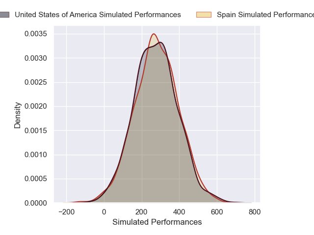
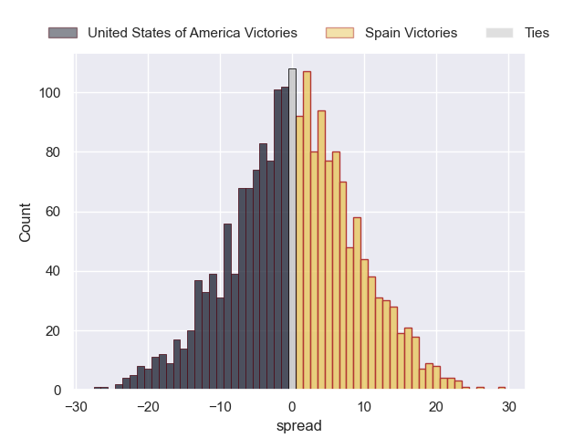

---  
layout: page  
title: United States of America at Spain  
date: 2024-11-23 18:00:00 -0500  
categories: "International Test Match 2024" match projection  
---
# United States of America at Spain

# Club Level Predictions

The first set of predictions treats a club as the smallest object, as the club develops its members, organizes a gameplan, and deploys its players as needed for each match. This club model has a prediction of 0.377, which translates to predicting United States of America to win by 1.3.

Our Over/Under is 61.5 - and combined with the spread above, we have a predicted scoreline of 31 to 30

Each club has a rating and a rating deviation (similar to a Glicko rating), and expected performances can be generated. This allows for simulated matches and spreads like the ones below.
## Projected Performances - Club Model

## Projected Spreads - Club Model

## Projected Results - Club Model

# Player Level Predictions

Treating teams instead as an entity made up of the currently active players, I have ratings for each player in an altogether different system. These can be combined to form team ratings once teamsheets are announced, weighting starters a bit higher than the reserves. After the match is played, players can be weighted by their minutes on the field, allowing for an accurate measure of the team's composition. With these compiled team ratings, we can make predictions, measure inaccuracy, and update the individual player ratings.
## Prediction without Player Minutes: Spain by 0.3

United States of America by 3.5 on a neutral pitch

## Projected Performances - Player Model

## Projected Spreads - Player Model

## Projected Results - Player Model

| Away Player     |   Away Percentile |   Number |   Home Percentile | Home Player            |
|:----------------|------------------:|---------:|------------------:|:-----------------------|
| Jake Turnbull   |             44.19 |        1 |             78.24 | Bernardo Vazquez       |
| Kapeli Pifeleti |              4.2  |        2 |            nan    | Santiago Ovejero       |
| Paul Mullen     |             11.25 |        3 |            nan    | Lucas Santamaria       |
| Jason Damm      |            nan    |        4 |            nan    | Brice Ferrer           |
| Greg Peterson   |             14.51 |        5 |            nan    | Asier Usarraga         |
| Vili Helu       |             82.42 |        6 |            nan    | Ignacio Pineiro        |
| Cory Daniel     |            nan    |        7 |            nan    | Alex Saleta            |
| Paddy Ryan      |             78.29 |        8 |            nan    | Raphael Nieto          |
| Ruben de Haas   |            nan    |        9 |             21.93 | Estanislao Bay         |
| AJ MacGinty     |             97.74 |       10 |            nan    | Gonzalo Vinuesa        |
| Nate Augspurger |             98.87 |       11 |             89.35 | Martiniano Cian        |
| Tavite Lopeti   |             73.94 |       12 |            nan    | Alvar Gimeno           |
| Dominic Besag   |            nan    |       13 |             32.98 | Alejandro Alonso       |
| Mark O'Keeffe   |            nan    |       14 |            nan    | Gauthier Minguillon    |
| Erich Storti    |            nan    |       15 |            nan    | Alberto Carmona        |
| Sean McNulty    |            nan    |       16 |            nan    | Vicente del Hoyo       |
| Jack Iscaro     |            nan    |       17 |            nan    | Thierry Futeu          |
| Pono Davis      |            nan    |       18 |            nan    | Hugo Pirlet            |
| Tomas Casares   |            nan    |       19 |            nan    | Matheo Triki           |
| Moni Tonga'uiha |            nan    |       20 |            nan    | Ekain Imaz             |
| Ethan McVeigh   |            nan    |       21 |            nan    | Kerman Aurrekoetxea    |
| Noah Brown      |            nan    |       22 |            nan    | Gonzalo Lopez Bontempo |
| Luke Carty      |             46.41 |       23 |            nan    | Pau Aira               |

