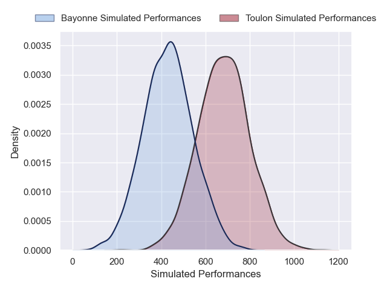
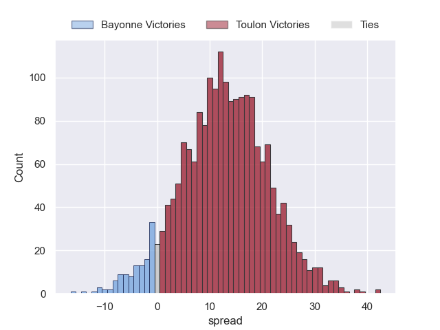
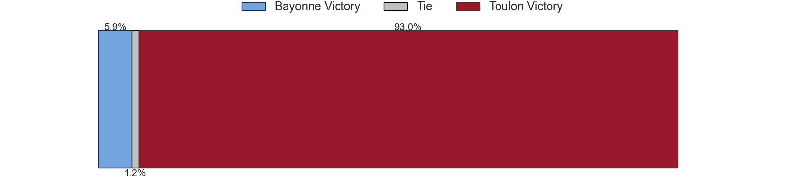

---  
layout: page  
title: Bayonne at Toulon  
date: 2024-11-23 18:00:00 -0500  
categories: "Top 14 2024" match projection  
---
# Bayonne at Toulon

# Club Level Predictions

The first set of predictions treats a club as the smallest object, as the club develops its members, organizes a gameplan, and deploys its players as needed for each match. This club model has a prediction of 0.583, which translates to predicting Toulon to win by 7.3.

Our Over/Under is 47.5 - and combined with the spread above, we have a predicted scoreline of 20 to 27

Each club has a rating and a rating deviation (similar to a Glicko rating), and expected performances can be generated. This allows for simulated matches and spreads like the ones below.
## Projected Performances - Club Model

## Projected Spreads - Club Model

## Projected Results - Club Model

# Player Level Predictions

Treating teams instead as an entity made up of the currently active players, I have ratings for each player in an altogether different system. These can be combined to form team ratings once teamsheets are announced, weighting starters a bit higher than the reserves. After the match is played, players can be weighted by their minutes on the field, allowing for an accurate measure of the team's composition. With these compiled team ratings, we can make predictions, measure inaccuracy, and update the individual player ratings.
## Prediction without Player Minutes: Toulon by 13.0

Toulon by 1.4 on a neutral pitch

## Projected Performances - Player Model

## Projected Spreads - Player Model

## Projected Results - Player Model

| Away Player             |   Away Percentile |   Number |   Home Percentile | Home Player       |
|:------------------------|------------------:|---------:|------------------:|:------------------|
| Swan Cormenier          |             80.42 |        1 |             91.6  | Dany Priso        |
| Lucas Martin            |             93.93 |        2 |             87.87 | Teddy Baubigny    |
| Pascal Cotet            |             12.45 |        3 |             94.37 | Kyle Sinckler     |
| Denis Marchois          |             95.1  |        4 |             82.86 | David Ribbans     |
| Lucas Paulos            |             20.94 |        5 |             71.44 | Brian Alainu'uese |
| Giovanni Habel-Kueffner |             91.09 |        6 |             62.15 | Lewis Ludlam      |
| Baptiste Heguy          |             88.79 |        7 |             82.33 | Esteban Abadie    |
| Uzair Cassiem           |             70.16 |        8 |             90.5  | Facundo Isa       |
| Baptiste Germain        |             59.25 |        9 |             99.35 | Baptiste Serin    |
| Joris Segonds           |             78.03 |       10 |             85.83 | Enzo Herve        |
| Arnaud Erbinartegaray   |             26.85 |       11 |             83.71 | Seta Tuicuvu      |
| Manu Tuilagi            |             97.88 |       12 |             53.08 | Jeremy Sinzelle   |
| Guillaume Martocq       |             57.98 |       13 |             16.15 | Mathieu Smaili    |
| Aurelien Callandret     |             88.71 |       14 |             36.37 | Gael Drean        |
| Yohan Orabe             |             17.33 |       15 |             54.58 | Marius Domon      |
| Facundo Bosch           |             90.51 |       16 |             88.02 | Mickael Ivaldi    |
| Andy Bordelai           |             93.47 |       17 |            nan    | Daniel Brennan    |
| Baptiste Chouzenoux     |             94.44 |       18 |             51.59 | Matthias Halagahu |
| Esteban Capilla         |             26.19 |       19 |             65.47 | Jules Coulon      |
| Guillaume Rouet         |             27    |       20 |             98.56 | Dan Biggar        |
| Camille Lopez           |             89.73 |       21 |             71.52 | Jules Danglot     |
| Tom Spring              |             17.42 |       22 |             32.74 | Rayan Rebbadj     |
| Pieter Scholtz          |              4.5  |       23 |             95.27 | Emerick Setiano   |

