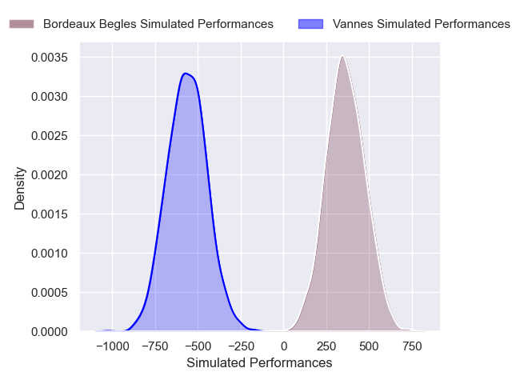
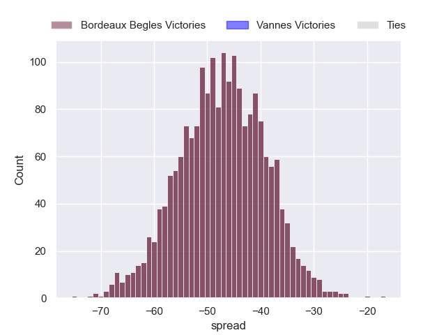

---  
layout: page  
title: Bordeaux Begles at Vannes  
date: 2024-11-23 18:00:00 -0500  
categories: "Top 14 2024" match projection  
---
# Bordeaux Begles at Vannes

# Club Level Predictions

The first set of predictions treats a club as the smallest object, as the club develops its members, organizes a gameplan, and deploys its players as needed for each match. This club model has a prediction of 0.227, which translates to predicting Bordeaux Begles to win by 8.7.

Our Over/Under is 65.5 - and combined with the spread above, we have a predicted scoreline of 37 to 28

Each club has a rating and a rating deviation (similar to a Glicko rating), and expected performances can be generated. This allows for simulated matches and spreads like the ones below.
## Projected Performances - Club Model

## Projected Spreads - Club Model

## Projected Results - Club Model

# Player Level Predictions

Treating teams instead as an entity made up of the currently active players, I have ratings for each player in an altogether different system. These can be combined to form team ratings once teamsheets are announced, weighting starters a bit higher than the reserves. After the match is played, players can be weighted by their minutes on the field, allowing for an accurate measure of the team's composition. With these compiled team ratings, we can make predictions, measure inaccuracy, and update the individual player ratings.
## Prediction without Player Minutes: Bordeaux Begles by 47.2

Bordeaux Begles by 52.7 on a neutral pitch

## Projected Performances - Player Model

## Projected Spreads - Player Model

## Projected Results - Player Model

| Away Player              |   Away Percentile |   Number |   Home Percentile | Home Player              |
|:-------------------------|------------------:|---------:|------------------:|:-------------------------|
| Jefferson Poirot         |             80.65 |        1 |             98.27 | Mako Vunipola            |
| Connor Sa                |             39.66 |        2 |             21    | Theo Beziat              |
| Carlu Sadie              |             75.99 |        3 |              0.3  | Santiago Medrano         |
| Cyril Cazeaux            |             92.93 |        4 |              6.8  | Eric Marks               |
| Adam Coleman             |             98.64 |        5 |             60.56 | Fabrice Metz             |
| Mahamadou Diaby          |             74.44 |        6 |             19.28 | Juan Bautista Pedemonte  |
| Temo Matiu               |              8.88 |        7 |             94.98 | Francisco Gorrissen      |
| Pete Samu                |             84.5  |        8 |              9.69 | Sione Kalamafoni         |
| Yann Lesgourgues         |              9.66 |        9 |             93.45 | Michael Ruru             |
| Matthieu Jalibert        |             97.13 |       10 |             88.71 | Maxime Lafage            |
| Arthur Retiere           |             97.58 |       11 |             79.84 | Salesi Rayasi            |
| Rohan Janse van Rensburg |             81.15 |       12 |              1.15 | Francis Saili            |
| Ben Tapuai               |             43.46 |       13 |             75.38 | Robin Taccola            |
| Pablo Uberti             |              3.65 |       14 |             19.52 | Inaki Ayarza             |
| Mateo Garcia             |             55.24 |       15 |             24.3  | Paul Surano              |
| Romain Latterrade        |             32.5  |       16 |             31.73 | Cyril Blanchard          |
| Matis Perchaud           |             14.7  |       17 |             69.69 | Charlesty Berguet        |
| Alexandre Ricard         |             76.79 |       18 |              4.99 | Christiaan van der Merwe |
| Pierre Bochaton          |             90.76 |       19 |             50.23 | Timothe Mezou            |
| Lachlan Swinton          |             10.22 |       20 |             88.88 | Kitione Kamikamica       |
| Joey Carbery             |             78.44 |       21 |              2.95 | Stephen Varney           |
| Enzo Reybier             |             70.89 |       22 |             29.52 | Tani Vili                |
| Toma'akino Taufa         |             40.66 |       23 |             28.73 | Simon Bourgeois          |

