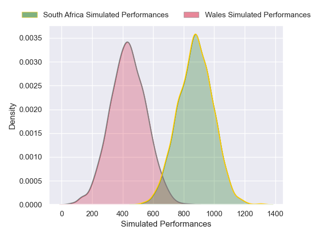
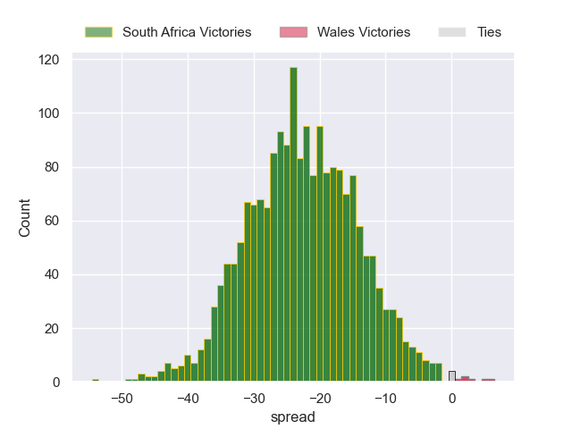

---  
layout: page  
title: South Africa at Wales  
date: 2024-11-23 18:00:00 -0500  
categories: "Autumn Nations Series 2024" match projection  
---
# South Africa at Wales

# Club Level Predictions

The first set of predictions treats a club as the smallest object, as the club develops its members, organizes a gameplan, and deploys its players as needed for each match. This club model has a prediction of 0.083, which translates to predicting South Africa to win by 16.7.

Our Over/Under is 52.5 - and combined with the spread above, we have a predicted scoreline of 35 to 18

Each club has a rating and a rating deviation (similar to a Glicko rating), and expected performances can be generated. This allows for simulated matches and spreads like the ones below.
## Projected Performances - Club Model

## Projected Spreads - Club Model

## Projected Results - Club Model

# Player Level Predictions

Treating teams instead as an entity made up of the currently active players, I have ratings for each player in an altogether different system. These can be combined to form team ratings once teamsheets are announced, weighting starters a bit higher than the reserves. After the match is played, players can be weighted by their minutes on the field, allowing for an accurate measure of the team's composition. With these compiled team ratings, we can make predictions, measure inaccuracy, and update the individual player ratings.
## Prediction without Player Minutes: South Africa by 22.2

South Africa by 29.2 on a neutral pitch

## Projected Performances - Player Model

## Projected Spreads - Player Model

## Projected Results - Player Model

| Away Player        |   Away Percentile |   Number |   Home Percentile | Home Player      |
|:-------------------|------------------:|---------:|------------------:|:-----------------|
| Thomas du Toit     |             96.62 |        1 |             30.23 | Gareth Thomas    |
| Johan Grobbelaar   |             91.74 |        2 |             16.98 | Dewi Lake        |
| Wilco Louw         |             98.35 |        3 |             41.71 | Archie Griffin   |
| Jean Kleyn         |             95.83 |        4 |             24.21 | Will Rowlands    |
| Franco Mostert     |             94.92 |        5 |             71.44 | Christ Tshiunza  |
| Siya Kolisi        |             91.3  |        6 |             57.58 | James Botham     |
| Elrigh Louw        |             97.4  |        7 |             84.04 | Jac Morgan       |
| Jasper Wiese       |             87.38 |        8 |             85.2  | Taine Plumtree   |
| Jaden Hendrikse    |             94.43 |        9 |             35.41 | Ellis Bevan      |
| Jordan Hendrikse   |             84.8  |       10 |             71.25 | Sam Costelow     |
| Kurt-Lee Arendse   |             99.27 |       11 |             29.73 | Rio Dyer         |
| Damian de Allende  |             97.5  |       12 |             41.29 | Ben Thomas       |
| Jesse Kriel        |             96.82 |       13 |             71.8  | Max Llewellyn    |
| Cheslin Kolbe      |             99.76 |       14 |             50.32 | Tom Rogers       |
| Aphelele Fassi     |             96.21 |       15 |             26.98 | Blair Murray     |
| Malcolm Marx       |             97.51 |       16 |             93.61 | Ryan Elias       |
| Gerhard Steenekamp |             92.72 |       17 |             82.45 | Nicky Smith      |
| Vincent Koch       |             79.59 |       18 |              1.88 | Keiron Assiratti |
| Eben Etzebeth      |             99.82 |       19 |             27.38 | Freddie Thomas   |
| nan                |            nan    |       20 |             73.81 | Tommy Reffell    |
| nan                |            nan    |       21 |             88.69 | Rhodri Williams  |
| nan                |            nan    |       22 |             45.81 | Eddie James      |
| nan                |            nan    |       23 |             79.64 | Josh Hathaway    |

