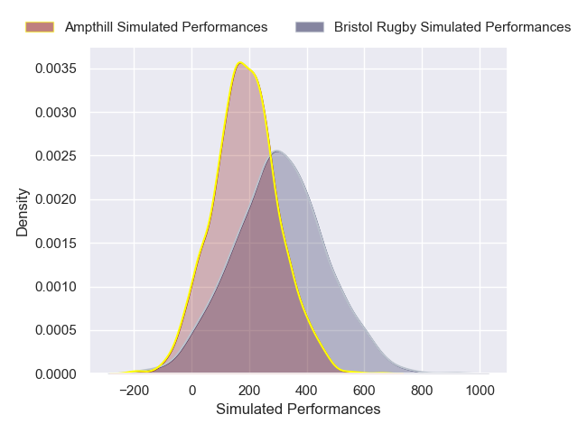
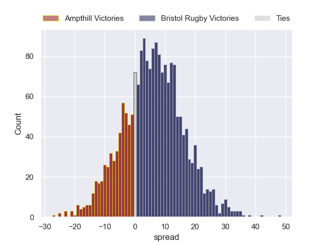

---  
layout: page  
title: Ampthill at Bristol Rugby  
date: 2024-11-24 18:00:00 -0500  
categories: "Premiership Rugby Cup 2024" match projection  
---
# Ampthill at Bristol Rugby

# Club Level Predictions

The first set of predictions treats a club as the smallest object, as the club develops its members, organizes a gameplan, and deploys its players as needed for each match. This club model has a prediction of 0.94, which translates to predicting Bristol Rugby to win by 28.9.

Our Over/Under is 68.5 - and combined with the spread above, we have a predicted scoreline of 20 to 49

Each club has a rating and a rating deviation (similar to a Glicko rating), and expected performances can be generated. This allows for simulated matches and spreads like the ones below.
## Projected Performances - Club Model

## Projected Spreads - Club Model

## Projected Results - Club Model

# Player Level Predictions

Treating teams instead as an entity made up of the currently active players, I have ratings for each player in an altogether different system. These can be combined to form team ratings once teamsheets are announced, weighting starters a bit higher than the reserves. After the match is played, players can be weighted by their minutes on the field, allowing for an accurate measure of the team's composition. With these compiled team ratings, we can make predictions, measure inaccuracy, and update the individual player ratings.
## Prediction without Player Minutes: Bristol Rugby by 6.1

Ampthill by 1.1 on a neutral pitch

## Projected Performances - Player Model

## Projected Spreads - Player Model

## Projected Results - Player Model

| Away Player        |   Away Percentile |   Number |   Home Percentile | Home Player       |
|:-------------------|------------------:|---------:|------------------:|:------------------|
| Harrison Courtney  |               nan |        1 |             82.3  | Yann Thomas       |
| Luke Thompson      |               nan |        2 |             72.63 | Will Capon        |
| Callum Norrie      |               nan |        3 |            nan    | Lovejoy Chawatama |
| Jake Parkinson     |               nan |        4 |            nan    | Kenzie Jenkins    |
| Aidan King         |               nan |        5 |            nan    | Paddy Pearce      |
| Karl Main          |               nan |        6 |            nan    | Aaron Tull        |
| Charles Rylands    |               nan |        7 |            nan    | Ed Timpson        |
| Lekima Ravuvu      |               nan |        8 |             69.77 | Benjamin Grondona |
| Rory Morgan        |               nan |        9 |             19.97 | Oscar Lennon      |
| Josh Barton        |               nan |       10 |            nan    | nan               |
| Vereimi Qorowale   |               nan |       11 |            nan    | nan               |
| Sione Va'Enuku     |               nan |       12 |            nan    | nan               |
| Byron Sharwood     |               nan |       13 |            nan    | nan               |
| Kerr Johnston      |               nan |       14 |            nan    | nan               |
| Finl Parker        |               nan |       15 |            nan    | nan               |
| Syd Blackmore      |               nan |       16 |            nan    | nan               |
| Richard Barrington |               nan |       17 |            nan    | nan               |
| James Johnston     |               nan |       18 |            nan    | nan               |
| Oskar Hicks        |               nan |       19 |            nan    | nan               |
| Arthur Thomas      |               nan |       20 |            nan    | nan               |
| Charlie West       |               nan |       21 |            nan    | Sam Edwards       |
| Declan Murphy      |               nan |       22 |            nan    | nan               |

