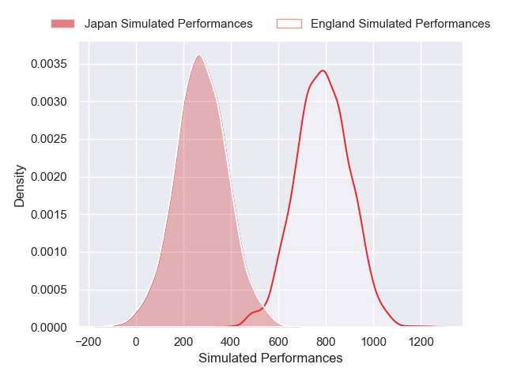
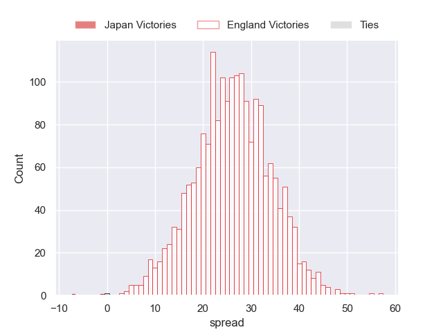
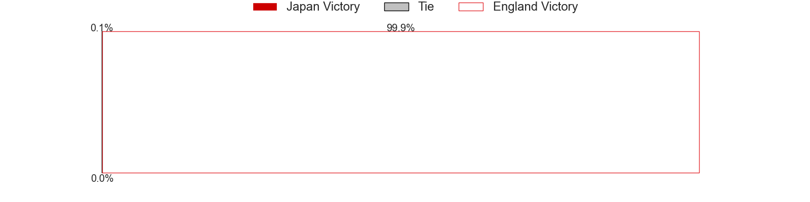

---  
layout: page  
title: Japan at England  
date: 2024-11-24 18:00:00 -0500  
categories: "International Test Match 2024" match projection  
---
# Japan at England

# Club Level Predictions

The first set of predictions treats a club as the smallest object, as the club develops its members, organizes a gameplan, and deploys its players as needed for each match. This club model has a prediction of 0.788, which translates to predicting England to win by 14.7.

Our Over/Under is 63.5 - and combined with the spread above, we have a predicted scoreline of 24 to 39

Each club has a rating and a rating deviation (similar to a Glicko rating), and expected performances can be generated. This allows for simulated matches and spreads like the ones below.
## Projected Performances - Club Model

## Projected Spreads - Club Model

## Projected Results - Club Model

# Player Level Predictions

Treating teams instead as an entity made up of the currently active players, I have ratings for each player in an altogether different system. These can be combined to form team ratings once teamsheets are announced, weighting starters a bit higher than the reserves. After the match is played, players can be weighted by their minutes on the field, allowing for an accurate measure of the team's composition. With these compiled team ratings, we can make predictions, measure inaccuracy, and update the individual player ratings.
## Prediction without Player Minutes: England by 26.1

England by 20.0 on a neutral pitch

## Projected Performances - Player Model

## Projected Spreads - Player Model

## Projected Results - Player Model

| Away Player      |   Away Percentile |   Number |   Home Percentile | Home Player               |
|:-----------------|------------------:|---------:|------------------:|:--------------------------|
| Takato Okabe     |             53.94 |        1 |             78.17 | Ellis Genge               |
| Mamoru Harada    |             88.65 |        2 |             97.05 | Jamie George              |
| Shuhei Takeuchi  |             72.92 |        3 |             56.94 | Will Stuart               |
| Sanaila Waqa     |             62.1  |        4 |             99    | Maro Itoje                |
| Epineri Uluiviti |            nan    |        5 |             95.01 | George Martin             |
| Kanji Shimokawa  |            nan    |        6 |             90.4  | Tom Curry                 |
| Kazuki Himeno    |            nan    |        7 |             95.96 | Sam Underhill             |
| Faulua Makisi    |             83.53 |        8 |             99.81 | Ben Earl                  |
| Naoto Saito      |              9.98 |        9 |             70.54 | Jack van Poortvliet       |
| Nik McCurran     |             49.13 |       10 |             59.96 | Marcus Smith              |
| Jone Naikabula   |             72.26 |       11 |             93.15 | Ollie Sleightholme        |
| Siosaia Fifita   |            nan    |       12 |             95.29 | Henry Slade               |
| Dylan Riley      |             96.92 |       13 |             85.77 | Ollie Lawrence            |
| Tomoki Osada     |             39.44 |       14 |             98.23 | Tommy Freeman             |
| Takuro Matsunaga |            nan    |       15 |             97.81 | George Furbank            |
| Seungsin Lee     |              3.78 |       16 |              1.4  | Luke Cowan-Dickie         |
| Yukio Morikawa   |            nan    |       17 |             14.55 | Fin Baxter                |
| Keijiro Tamefusa |            nan    |       18 |             73.67 | Asher Opoku-Fordjour      |
| Daichi Akiyama   |            nan    |       19 |             95.47 | Nick Isiekwe              |
| Tevita Tatafu    |             89.87 |       20 |             39.73 | Chandler Cunningham-South |
| Ben Gunter       |            nan    |       21 |             97.87 | Harry Randall             |
| Shinobu Fujiwara |             52.7  |       22 |             81.52 | Fin Smith                 |
| Yusuke Kajimura  |             94.81 |       23 |             29.92 | Tom Roebuck               |

