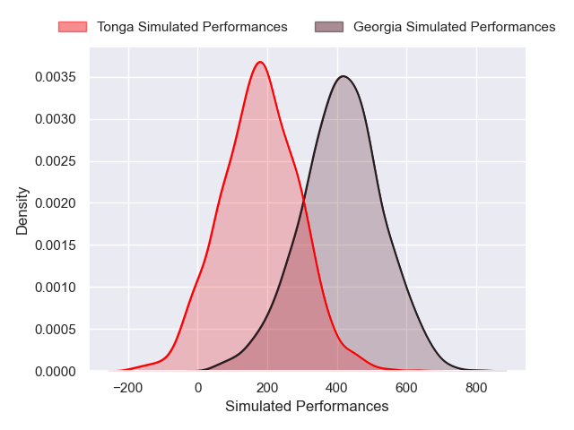
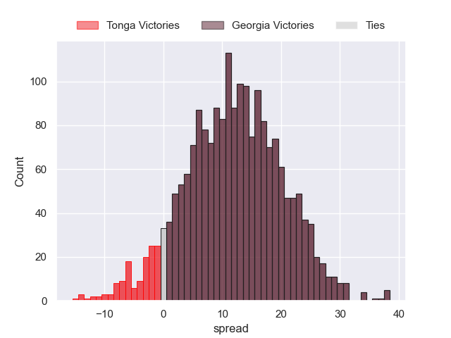

---  
layout: page  
title: Tonga at Georgia  
date: 2024-11-24 18:00:00 -0500  
categories: "International Test Match 2024" match projection  
---
# Tonga at Georgia

# Club Level Predictions

The first set of predictions treats a club as the smallest object, as the club develops its members, organizes a gameplan, and deploys its players as needed for each match. This club model has a prediction of 0.826, which translates to predicting Georgia to win by 18.1.

Our Over/Under is 53.5 - and combined with the spread above, we have a predicted scoreline of 18 to 36

Each club has a rating and a rating deviation (similar to a Glicko rating), and expected performances can be generated. This allows for simulated matches and spreads like the ones below.
## Projected Performances - Club Model

## Projected Spreads - Club Model

## Projected Results - Club Model

# Player Level Predictions

Treating teams instead as an entity made up of the currently active players, I have ratings for each player in an altogether different system. These can be combined to form team ratings once teamsheets are announced, weighting starters a bit higher than the reserves. After the match is played, players can be weighted by their minutes on the field, allowing for an accurate measure of the team's composition. With these compiled team ratings, we can make predictions, measure inaccuracy, and update the individual player ratings.
## Prediction without Player Minutes: Georgia by 12.2

Georgia by 8.1 on a neutral pitch

## Projected Performances - Player Model

## Projected Spreads - Player Model

## Projected Results - Player Model

| Away Player          |   Away Percentile |   Number |   Home Percentile | Home Player          |
|:---------------------|------------------:|---------:|------------------:|:---------------------|
| Salesi Tuifua        |            nan    |        1 |             89.27 | Nika Abuladze        |
| Samiuela Moli        |              2.95 |        2 |             51.48 | Vano Karkadze        |
| Ben Tameifuna        |             96.25 |        3 |             63.99 | Irakli Aptsiauri     |
| Kelemete Finau       |             29.01 |        4 |             84.77 | Mikheil Babunashvili |
| Justin Mataele       |            nan    |        5 |             86.67 | Giorgi Javakhia      |
| Semisi Paea          |             56.66 |        6 |            nan    | Ilia Spanderashvili  |
| Sione Havili Talitui |             15.78 |        7 |             82.96 | Giorgi Tsutskiridze  |
| Lotu Inisi           |              3.1  |        8 |              7.56 | Tornike Jalagonia    |
| Siaosi Nginingini    |             77.09 |        9 |             12.44 | Vasil Lobzhanidze    |
| William Havili       |             26.89 |       10 |             82.14 | Luka Matkava         |
| John Tapueluelu      |            nan    |       11 |             92.34 | Sandro Todua         |
| Fetuli Paea          |             25.19 |       12 |            nan    | Tornike Kakhoidze    |
| Tima Fainga'anuku    |              9.68 |       13 |             92.31 | Giorgi Kveseladze    |
| Taniela Filimone     |             76.53 |       14 |             87.18 | Aka Tabutsadze       |
| Josiah Unga          |            nan    |       15 |             70.52 | Davit Niniashvili    |
| Sekope Lopeti-Moli   |             38.41 |       16 |            nan    | Luka Nioradze        |
| Tau Koloamatangi     |            nan    |       17 |             16.58 | Giorgi Akhaladze     |
| Paula Latu           |            nan    |       18 |             80.05 | Luka Japaridze       |
| Tevita Ahokovi       |            nan    |       19 |             21.12 | Lado Chachanidze     |
| Tupou Ma'afu-Afungia |             51.21 |       20 |             60.63 | Luka Ivanishvili     |
| John Ika             |            nan    |       21 |             29.62 | Gela Aprasidze       |
| Patrick Pellegrini   |            nan    |       22 |             46.2  | Tedo Abzhandadze     |
| Lolesio Sailosi      |            nan    |       23 |             84.52 | Demur Tapladze       |

