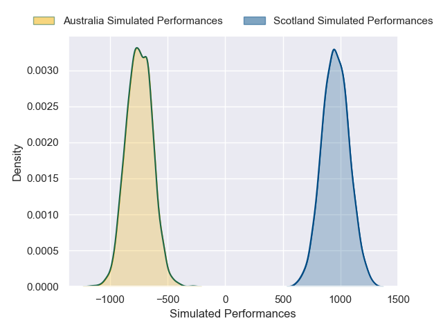
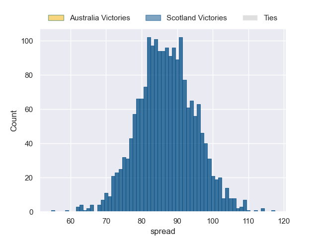

---  
layout: page  
title: Australia at Scotland  
date: 2024-11-24 18:00:00 -0500  
categories: "International Test Match 2024" match projection  
---
# Australia at Scotland

# Club Level Predictions

The first set of predictions treats a club as the smallest object, as the club develops its members, organizes a gameplan, and deploys its players as needed for each match. This club model has a prediction of 0.647, which translates to predicting Scotland to win by 9.9.

Our Over/Under is 55.5 - and combined with the spread above, we have a predicted scoreline of 23 to 33

Each club has a rating and a rating deviation (similar to a Glicko rating), and expected performances can be generated. This allows for simulated matches and spreads like the ones below.
## Projected Performances - Club Model

## Projected Spreads - Club Model

## Projected Results - Club Model

# Player Level Predictions

Treating teams instead as an entity made up of the currently active players, I have ratings for each player in an altogether different system. These can be combined to form team ratings once teamsheets are announced, weighting starters a bit higher than the reserves. After the match is played, players can be weighted by their minutes on the field, allowing for an accurate measure of the team's composition. With these compiled team ratings, we can make predictions, measure inaccuracy, and update the individual player ratings.
## Prediction without Player Minutes: Scotland by 87.0

Scotland by 80.9 on a neutral pitch

## Projected Performances - Player Model

## Projected Spreads - Player Model

## Projected Results - Player Model

| Away Player           |   Away Percentile |   Number |   Home Percentile | Home Player         |
|:----------------------|------------------:|---------:|------------------:|:--------------------|
| Angus Bell            |              0.38 |        1 |             88.75 | Pierre Schoeman     |
| Matt Faessler         |             78.69 |        2 |             80.87 | Ewan Ashman         |
| Allan Alaalatoa       |             95.95 |        3 |             98.57 | Zander Fagerson     |
| Jeremy Williams       |             16.23 |        4 |             93.56 | Grant Gilchrist     |
| Will Skelton          |              0.09 |        5 |             99.64 | Scott Cummings      |
| Rob Valetini          |             97.29 |        6 |             99.91 | Jamie Ritchie       |
| Carlo Tizzano         |             10.49 |        7 |             94.08 | Rory Darge          |
| Harry Wilson          |             15.12 |        8 |             97.94 | Matt Fagerson       |
| Jake Gordon           |             42.23 |        9 |             86.09 | Ben White           |
| Noah Lolesio          |             86.65 |       10 |             99.79 | Finn Russell        |
| Harry Potter          |             50    |       11 |             81.45 | Duhan van der Merwe |
| Len Ikitau            |             63.56 |       12 |             91.49 | Sione Tuipulotu     |
| Joseph-Aukuso Suaalii |             53.85 |       13 |             81.73 | Huw Jones           |
| Andrew Kellaway       |             40.56 |       14 |             45.65 | Darcy Graham        |
| Tom Wright            |             88.25 |       15 |            100    | Blair Kinghorn      |
| Brandon Paenga-Amosa  |             73.56 |       16 |             62.36 | Dylan Richardson    |
| Isaac Kailea          |             43.74 |       17 |             79.37 | Rory Sutherland     |
| Zane Nonggorr         |             78.69 |       18 |             73.59 | Will Hurd           |
| Lukhan Salakaia-Loto  |             12.24 |       19 |             59.38 | Alex Craig          |
| Langi Gleeson         |             61.05 |       20 |             54.84 | Josh Bayliss        |
| Tate McDermott        |             80.69 |       21 |            100    | George Horne        |
| Ben Donaldson         |             18.28 |       22 |             74.1  | Tom Jordan          |
| Max Jorgensen         |             71.94 |       23 |             89.64 | Kyle Rowe           |

