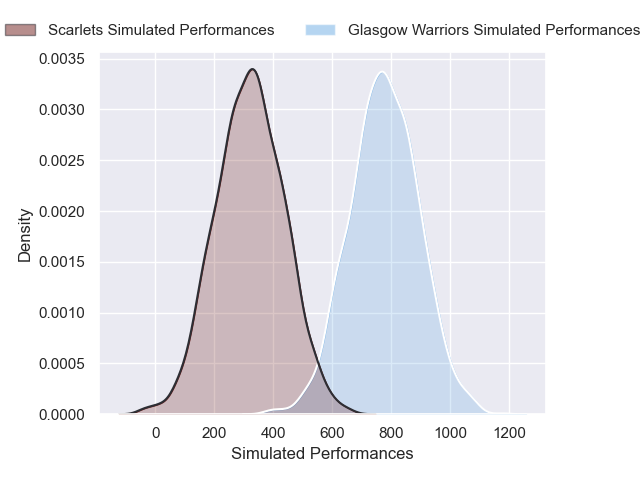
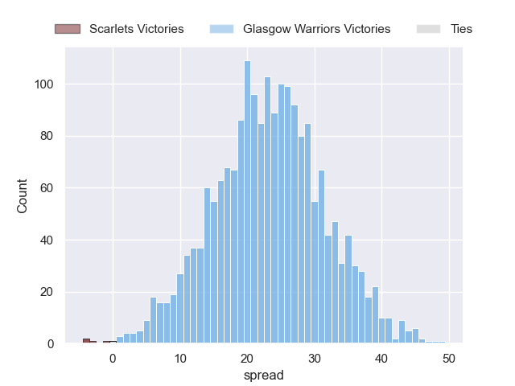
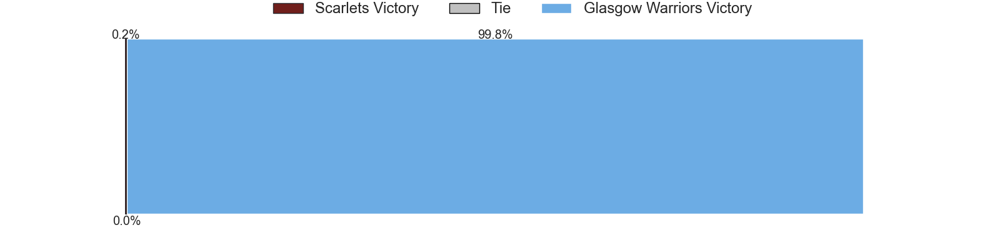

---  
layout: page  
title: Scarlets at Glasgow Warriors  
date: 2024-11-29 18:00:00 -0500  
categories: "United Rugby Championship 2024" match projection  
---
# Scarlets at Glasgow Warriors

# Club Level Predictions

The first set of predictions treats a club as the smallest object, as the club develops its members, organizes a gameplan, and deploys its players as needed for each match. This club model has a prediction of 0.808, which translates to predicting Glasgow Warriors to win by 16.2.

Our Over/Under is 50.5 - and combined with the spread above, we have a predicted scoreline of 17 to 33

Each club has a rating and a rating deviation (similar to a Glicko rating), and expected performances can be generated. This allows for simulated matches and spreads like the ones below.
## Projected Performances - Club Model

## Projected Spreads - Club Model

## Projected Results - Club Model

# Player Level Predictions

Treating teams instead as an entity made up of the currently active players, I have ratings for each player in an altogether different system. These can be combined to form team ratings once teamsheets are announced, weighting starters a bit higher than the reserves. After the match is played, players can be weighted by their minutes on the field, allowing for an accurate measure of the team's composition. With these compiled team ratings, we can make predictions, measure inaccuracy, and update the individual player ratings.
## Prediction without Player Minutes: Glasgow Warriors by 23.4

Glasgow Warriors by 13.8 on a neutral pitch

## Projected Performances - Player Model

## Projected Spreads - Player Model

## Projected Results - Player Model

| Away Player          |   Away Percentile |   Number |   Home Percentile | Home Player           |
|:---------------------|------------------:|---------:|------------------:|:----------------------|
| Alec Hepburn         |             87.17 |        1 |            nan    | Patrick Schickerling  |
| Marnus van der Merwe |             91.56 |        2 |             76.99 | Johnny Matthews       |
| Henry Thomas         |             62.02 |        3 |            nan    | Fin Richardson        |
| Max Douglas          |             86.19 |        4 |            nan    | Olujare Oguntibeju    |
| Sam Lousi            |             87.48 |        5 |             81.88 | Alex Samuel           |
| Josh MacLeod         |             72.47 |        6 |             54.62 | Ally Miller           |
| Dan Davis            |             79.86 |        7 |             99.05 | Henco Venter          |
| Vaea Fifita          |             94.69 |        8 |            nan    | Jack Mann             |
| Gareth Davies        |             30.19 |        9 |            100    | George Horne          |
| Ioan Lloyd           |             10.35 |       10 |             98.6  | Adam Hastings         |
| Blair Murray         |             27.83 |       11 |             89.45 | Kyle Rowe             |
| Johnny Williams      |             85.57 |       12 |             73.44 | Tom Jordan            |
| Macs Page            |             25.19 |       13 |             91.51 | Stafford McDowall     |
| Ellis Mee            |             33.49 |       14 |             99.6  | Sebastian Cancelliere |
| Ioan Nicholas        |             11.91 |       15 |             86.91 | Josh McKay            |
| Ryan Elias           |             93.87 |       16 |             10.28 | Grant Stewart         |
| Kemsley Mathias      |             77.95 |       17 |             82.37 | Allan Dell            |
| Sam Wainwright       |             25.44 |       18 |             62.09 | Sam Talakai           |
| Alex Craig           |             61.28 |       19 |            nan    | Macenzzie Duncan      |
| Taine Plumtree       |             86.1  |       20 |             80.98 | Gregor Hiddleston     |
| Efan Jones           |             33.55 |       21 |             41.26 | Angus Fraser          |
| Charlie Titcombe     |            nan    |       22 |             33.87 | Ben Afshar            |
| Eddie James          |             47.64 |       23 |             84.77 | Duncan Weir           |

