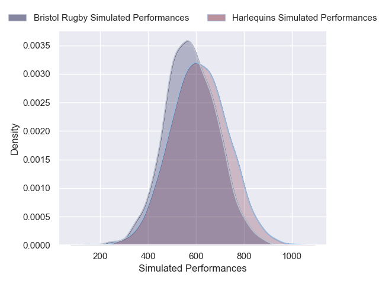
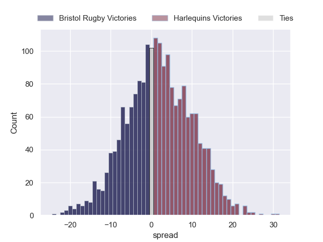

---  
layout: page  
title: Bristol Rugby at Harlequins  
date: 2024-11-29 18:00:00 -0500  
categories: "Premiership 2024" match projection  
---
# Bristol Rugby at Harlequins

# Club Level Predictions

The first set of predictions treats a club as the smallest object, as the club develops its members, organizes a gameplan, and deploys its players as needed for each match. This club model has a prediction of 0.495, which translates to predicting Bristol Rugby to win by -3.5.

Our Over/Under is 70.5 - and combined with the spread above, we have a predicted scoreline of 34 to 37

Each club has a rating and a rating deviation (similar to a Glicko rating), and expected performances can be generated. This allows for simulated matches and spreads like the ones below.
## Projected Performances - Club Model

## Projected Spreads - Club Model

## Projected Results - Club Model

# Player Level Predictions

Treating teams instead as an entity made up of the currently active players, I have ratings for each player in an altogether different system. These can be combined to form team ratings once teamsheets are announced, weighting starters a bit higher than the reserves. After the match is played, players can be weighted by their minutes on the field, allowing for an accurate measure of the team's composition. With these compiled team ratings, we can make predictions, measure inaccuracy, and update the individual player ratings.
## Prediction without Player Minutes: Harlequins by 1.8

Bristol Rugby by 11.9 on a neutral pitch

## Projected Performances - Player Model

## Projected Spreads - Player Model

## Projected Results - Player Model

| Away Player                |   Away Percentile |   Number |   Home Percentile | Home Player     |
|:---------------------------|------------------:|---------:|------------------:|:----------------|
| Jake Woolmore              |             93.07 |        1 |             96.17 | Joe Marler      |
| Gabriel Oghre              |             87.73 |        2 |             10.43 | Jack Walker     |
| Max Lahiff                 |             83.85 |        3 |            nan    | Simon Kerrod    |
| James Dun                  |             94.49 |        4 |             29.66 | Irne Herbst     |
| Joe Owen                   |            nan    |        5 |             69.18 | Dino Lamb       |
| Santiago Grondona          |             97.63 |        6 |             92.61 | Jack Kenningham |
| Fitz Harding               |             96.39 |        7 |             69.31 | Will Evans      |
| Viliame Mata               |             69.64 |        8 |             85.01 | Alex Dombrandt  |
| Kieran Marmion             |             95.05 |        9 |             17.57 | Will Porter     |
| AJ MacGinty                |             97.6  |       10 |             70.74 | Jarrod Evans    |
| Gabriel Ibitoye            |             98.64 |       11 |             41.79 | Cadan Murley    |
| Benhard Janse van Rensburg |             96.04 |       12 |             79.15 | Luke Northmore  |
| Kalaveti Ravouvou          |             77.36 |       13 |             24.06 | Oscar Beard     |
| Jack Bates                 |             12.83 |       14 |             94.58 | Rodrigo Isgro   |
| Richard Lane               |             73.75 |       15 |             59.96 | Tyrone Green    |
| Harry Thacker              |             84.36 |       16 |             58.13 | Nathan Jibulu   |
| Yann Thomas                |             87.98 |       17 |             15.12 | Fin Baxter      |
| Lovejoy Chawatama          |             57.89 |       18 |             66.3  | Titi Lamositele |
| Steven Luatua              |             99.74 |       19 |             98.4  | Joe Launchbury  |
| Benjamin Grondona          |             72.68 |       20 |             93.55 | James Chisholm  |
| Oscar Lennon               |             20.61 |       21 |             99.2  | Danny Care      |
| Joe Jenkins                |             58.49 |       22 |             59.92 | Jamie Benson    |
| Benjamín Elizalde          |             66.21 |       23 |             88.92 | Nick David      |

