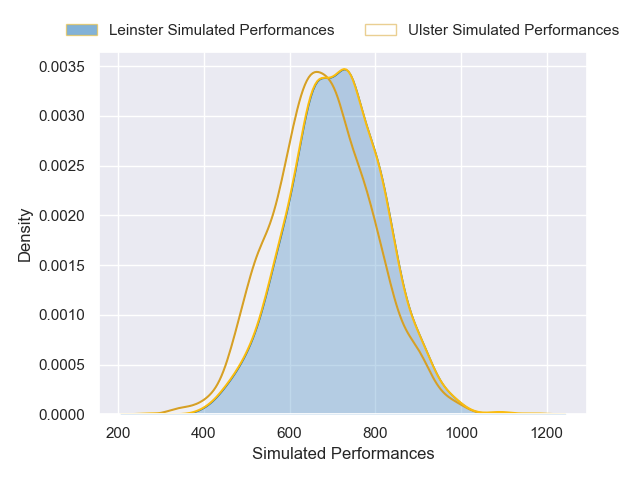
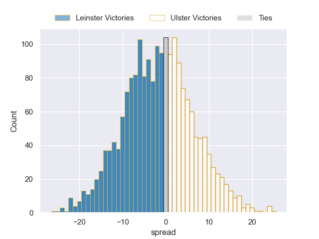

---  
layout: page  
title: Leinster at Ulster  
date: 2024-11-29 18:00:00 -0500  
categories: "United Rugby Championship 2024" match projection  
---
# Leinster at Ulster

# Club Level Predictions

The first set of predictions treats a club as the smallest object, as the club develops its members, organizes a gameplan, and deploys its players as needed for each match. This club model has a prediction of 0.245, which translates to predicting Leinster to win by 6.6.

Our Over/Under is 59.5 - and combined with the spread above, we have a predicted scoreline of 33 to 27

Each club has a rating and a rating deviation (similar to a Glicko rating), and expected performances can be generated. This allows for simulated matches and spreads like the ones below.
## Projected Performances - Club Model

## Projected Spreads - Club Model

## Projected Results - Club Model

# Player Level Predictions

Treating teams instead as an entity made up of the currently active players, I have ratings for each player in an altogether different system. These can be combined to form team ratings once teamsheets are announced, weighting starters a bit higher than the reserves. After the match is played, players can be weighted by their minutes on the field, allowing for an accurate measure of the team's composition. With these compiled team ratings, we can make predictions, measure inaccuracy, and update the individual player ratings.
## Prediction without Player Minutes: Leinster by 1.6

Leinster by 11.3 on a neutral pitch

## Projected Performances - Player Model

## Projected Spreads - Player Model

## Projected Results - Player Model

| Away Player     |   Away Percentile |   Number |   Home Percentile | Home Player        |
|:----------------|------------------:|---------:|------------------:|:-------------------|
| Jack Boyle      |             81.42 |        1 |             88.72 | Eric O'Sullivan    |
| John McKee      |             72.09 |        2 |             30.21 | James McCormick    |
| Rabah Slimani   |             99.71 |        3 |             72.12 | Scott Wilson       |
| Diarmuid Mangan |             37.55 |        4 |             88.54 | Alan O'Connor      |
| Brian Deeny     |             64.56 |        5 |             78.33 | Kieran Treadwell   |
| Max Deegan      |             98.24 |        6 |              8.88 | James McNabney     |
| Will Connors    |             91.56 |        7 |             89.62 | Nick Timoney       |
| Jack Conan      |             99.3  |        8 |             92.41 | David McCann       |
| Luke McGrath    |             99.52 |        9 |             53.83 | Nathan Doak        |
| Ross Byrne      |             95.19 |       10 |             75.15 | Aidan Morgan       |
| Andrew Osborne  |             74.48 |       11 |             59.89 | Mike Lowry         |
| Charlie Tector  |             40.66 |       12 |            100    | Jude Postlethwaite |
| Liam Turner     |             79.43 |       13 |             63.11 | Ben Carson         |
| Jordan Larmour  |             86.12 |       14 |             76.95 | Werner Kok         |
| Jimmy O'Brien   |             94.26 |       15 |             98.68 | Stewart Moore      |
| Lee Barron      |             73.93 |       16 |              1.99 | Tom Stewart        |
| Michael Milne   |             68.81 |       17 |             65.41 | Andrew Warwick     |
| Rory Mcguire    |            nan    |       18 |             13.13 | Corrie Barrett     |
| RG Snyman       |             99.91 |       19 |             83.3  | Harry Sheridan     |
| James Culhane   |             75.52 |       20 |             95.25 | Marcus Rea         |
| Fintan Gunne    |            nan    |       21 |             96.33 | John Cooney        |
| Harry Byrne     |             90.38 |       22 |            nan    | James Humphreys    |
| Scott Penny     |             89.01 |       23 |            nan    | Ben Moxham         |

