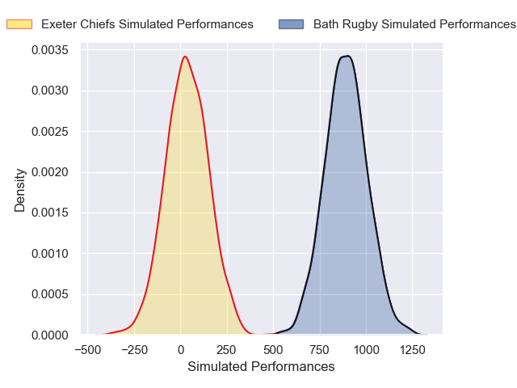
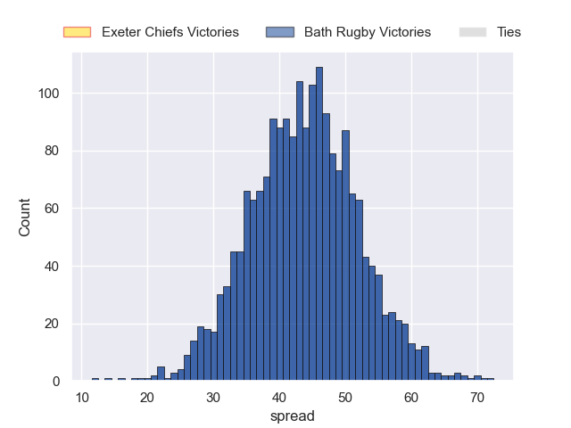

---  
layout: page  
title: Exeter Chiefs at Bath Rugby  
date: 2024-11-30 18:00:00 -0500  
categories: "Premiership 2024" match projection  
---
# Exeter Chiefs at Bath Rugby

# Club Level Predictions

The first set of predictions treats a club as the smallest object, as the club develops its members, organizes a gameplan, and deploys its players as needed for each match. This club model has a prediction of 0.637, which translates to predicting Bath Rugby to win by 9.6.

Our Over/Under is 53.5 - and combined with the spread above, we have a predicted scoreline of 22 to 32

Each club has a rating and a rating deviation (similar to a Glicko rating), and expected performances can be generated. This allows for simulated matches and spreads like the ones below.
## Projected Performances - Club Model

## Projected Spreads - Club Model

## Projected Results - Club Model

# Player Level Predictions

Treating teams instead as an entity made up of the currently active players, I have ratings for each player in an altogether different system. These can be combined to form team ratings once teamsheets are announced, weighting starters a bit higher than the reserves. After the match is played, players can be weighted by their minutes on the field, allowing for an accurate measure of the team's composition. With these compiled team ratings, we can make predictions, measure inaccuracy, and update the individual player ratings.
## Prediction without Player Minutes: Bath Rugby by 43.3

Bath Rugby by 29.3 on a neutral pitch

## Projected Performances - Player Model

## Projected Spreads - Player Model

## Projected Results - Player Model

| Away Player          |   Away Percentile |   Number |   Home Percentile | Home Player      |
|:---------------------|------------------:|---------:|------------------:|:-----------------|
| Scott Sio            |             92.42 |        1 |             96.76 | Thomas du Toit   |
| Dan Frost            |             86.54 |        2 |             96.64 | Tom Dunn         |
| Marcus Street        |             21.93 |        3 |             54.6  | Will Stuart      |
| Rusiate Tuima        |             29.14 |        4 |             97.17 | Quinn Roux       |
| Richard Capstick     |              4.07 |        5 |             86.09 | Charlie Ewels    |
| Ethan Roots          |              5.8  |        6 |             96.75 | Ted Hill         |
| Jacques Vermeulen    |             90.69 |        7 |             21.44 | Guy Pepper       |
| Greg Fisilau         |             80.3  |        8 |             95.83 | Miles Reid       |
| Stu Townsend         |             91.07 |        9 |             90.43 | Ben Spencer      |
| Henry Slade          |             95.1  |       10 |             99.8  | Finn Russell     |
| Tom Wyatt            |             94.91 |       11 |             32.54 | Will Muir        |
| Will Rigg            |             94.82 |       12 |             81.07 | Will Butt        |
| Tamati Tua           |             77.4  |       13 |             84.46 | Ollie Lawrence   |
| Immanuel Feyi-Waboso |             42.24 |       14 |             97.3  | Joe Cokanasiga   |
| Josh Hodge           |              1.37 |       15 |             52.54 | Tom de Glanville |
| Jack Innard          |            nan    |       16 |             63.3  | Niall Annett     |
| Will Goodrick-Clarke |             78.44 |       17 |             89.33 | Francois van Wyk |
| Jimmy Roots          |            nan    |       18 |             35.91 | Kieran Verden    |
| Franco Molina        |              8.06 |       19 |             93.98 | Ross Molony      |
| Ross Vintcent        |             23.86 |       20 |             56.82 | Josh Bayliss     |
| Will Becconsall      |             81.82 |       21 |             81.34 | Louis Schreuder  |
| Will Haydon-Wood     |             15.4  |       22 |              8.66 | Cameron Redpath  |
| Ben Hammersley       |             49.88 |       23 |             86.74 | Alfie Barbeary   |

